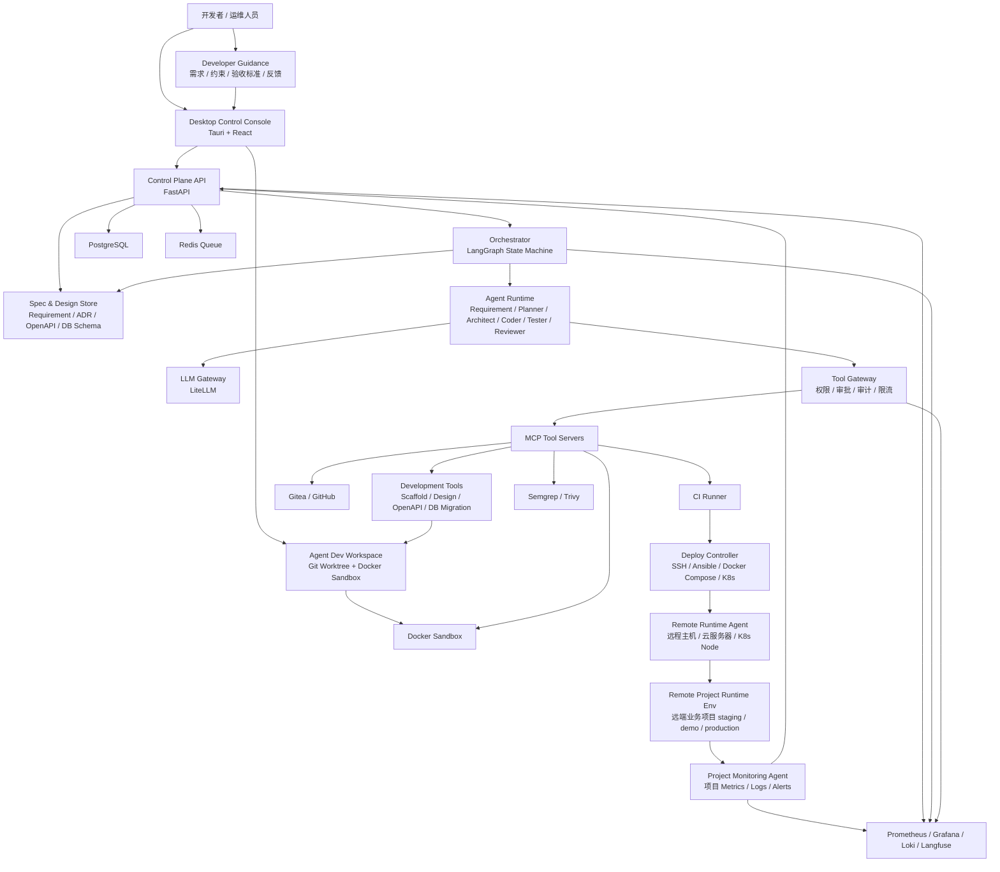

# 总体架构

> 来源：[设计书 6.1](../../云舵 CloudHelm 毕设设计书.md)  
> 目的：定义系统组件、数据流和控制流。
## 架构分层

1. 用户入口：Desktop Control Console。
2. 控制平面：FastAPI、Orchestrator、Tool Gateway、PostgreSQL、Redis。
3. Agent 运行层：Requirement / Planner / Architect / Coder / Tester / Reviewer / Release / SRE。
4. 工具层：MCP Tool Servers、Sandbox、Git、CI、Deploy、Remote、Monitoring、Security。
5. 远端业务运行层：Remote Agent、Docker Compose/K8s、业务服务。
6. 观测层：Prometheus、Grafana、Loki、Langfuse、Alertmanager。

## 设计书摘录

### 6.1 架构图

