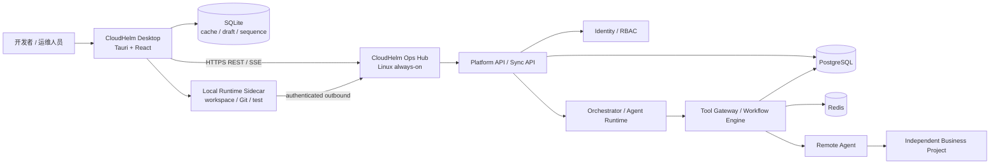
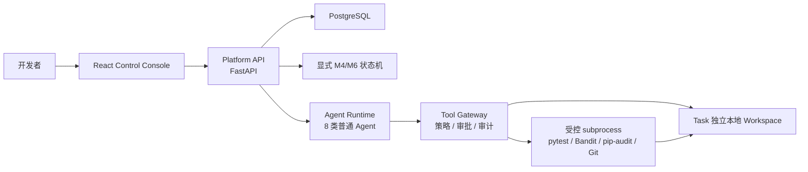
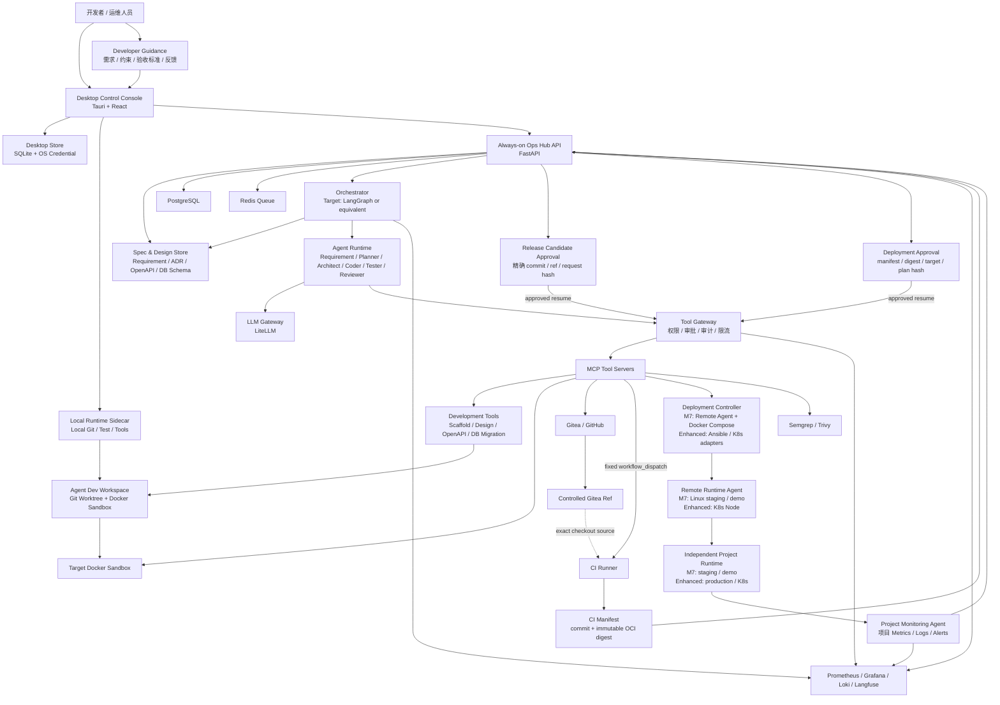

# 总体架构

> 来源：[设计书 6.1](../../云舵 CloudHelm 毕设设计书.md)  
> 目的：定义系统组件、数据流和控制流。
## 架构分层

以下分层是完整 MVP 目标，不等同于 M1-M6 当前全部已实现：

1. 用户入口：Windows/Linux CloudHelm Desktop。
2. 本地执行层：Desktop SQLite、OS credential store、Local Runtime sidecar、
   workspace/worktree。
3. 常在线 Ops Hub：FastAPI、Orchestrator、Agent Runtime、Tool Gateway、
   Workflow Engine、PostgreSQL、Redis。
4. Agent 运行层：Requirement / Planner / Architect / Coder / Tester / Reviewer /
   Release / SRE。
5. 工具层：MCP Tool Servers、Sandbox、Git、CI、Deploy、Remote、Monitoring、
   Security；M7 的 CI Tool 只触发固定 `workflow_dispatch` 并收集制品，不部署。
6. 远端业务运行层：M7 为 Remote Agent + Docker Compose + Linux staging /
   demo；Kubernetes 与 production 属于增强版或生产扩展版。
7. 观测层：M8 远端观测使用 Prometheus、Grafana、Loki、Alertmanager；Langfuse
   用于 Agent 观测。

Desktop 不保存远端权威状态，也不要求 Docker/PostgreSQL/Redis。正式产品的
Platform API 和 Agents 运维能力部署在持续运行的 Linux Ops Hub；本地
Docker Compose 只保留为 contributor development 或单机 demo profile。

## M7-M10 目标部署拓扑



- Desktop 关闭只暂停依赖本机 workspace 的步骤。
- Ops Hub 继续执行已持久化且不需要新审批的 CI、部署、监控和 SRE 工作。
- 多个 Desktop 用户通过 Ops Hub user/session/RBAC 访问同一权威状态；不同
  project/environment scope 获得不同功能。
- 业务项目不依赖 Desktop、Ops Hub 数据库或 CloudHelm SDK 才能运行。
- 详细边界见
  [Desktop、Ops Hub 与业务项目边界](04-desktop-ops-hub-project-boundary.md)。

## M1-M6 当前实现拓扑



- Orchestrator 当前使用 Python dataclass/Enum 显式状态机，不使用 LangGraph 或
  Redis worker。
- `sandbox.*` 当前运行于 allowlist 本地目录和受控 `subprocess`，不具备
  Docker CPU/内存/PID/网络隔离。
- MCP 独立 Tool Server、真实远端 PR/CI、部署、Remote Agent、监控/SRE
  尚未进入 M1-M6 生产路径。

## M7 固定控制流

M7 在上述 M1-M6 基础上增加真实 CI 与远端部署，但不把 CI 变成部署执行器：

```text
精确 commit
  -> release candidate approval
  -> 受控 Gitea ref
  -> Platform API 调用固定 workflow_dispatch
  -> CI test / security / build / artifact
  -> commit 绑定的不可变 OCI digest
  -> ReleasePlan
  -> deployment approval
  -> Tool Gateway / Deploy Tool / Deployment Controller
  -> Remote Agent / Docker Compose / Linux staging-demo
  -> health verification / Monitoring
```

两道审批分别绑定 release candidate 发布和 deployment 远端副作用，不能合并或
互相复用。SSH 只保留为单独审批的固定只读诊断；CI workflow 内禁止 SSH、远端
Compose、Remote Agent 调用、部署 API 或服务重启。

CloudHelm 中心设施先通过独立 Ops Hub installation/bootstrap 安装/验证 TLS
ingress、Platform/Workers、PostgreSQL/Redis、Gitea/registry、服务凭据、持久卷
和备份；M7 不创建真实用户/device/session，M9 再执行 identity bootstrap。每台
受管 Linux 目标通过 Remote Target / Environment bootstrap 安装
Docker/Compose、Remote Agent、采集器和 machine credential，并注册到既有
Ops Hub。日常项目部署只发布独立业务 Compose project，不重复执行任一 bootstrap。

## 设计书目标架构

### 6.1 架构图



- `ControlledRef` 只是 CI 检出的精确来源，不通过 push 自动触发 workflow。
- CI 返回 run/job/report/manifest/digest 证据到控制平面，不连接部署执行链。
- Deployment Controller 只接受第二道审批绑定的不可变 OCI digest，并通过
  服务端登记的 Remote Agent endpoint 执行。
- PostgreSQL/Redis 位于 Ops Hub；Desktop SQLite 只保存非权威缓存、草稿和事件
  sequence。
- Project Runtime 使用独立源码、数据库、Compose project 和可选
  `cloudhelm.project.yaml`，不得把 CloudHelm 平台作为业务启动依赖。
- production、Kubernetes、GitOps、自动回滚和交互式远程终端不属于 M7。
