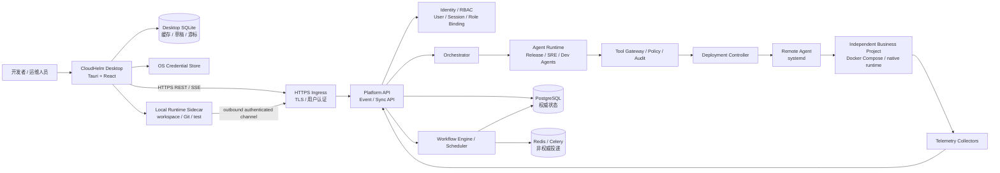

# Desktop、Ops Hub 与业务项目边界

> 目的：冻结可安装桌面端、常在线 Agents 运维系统和可独立交付业务项目的目标架构。
> 适用范围：M7-M10。
> 参考资料：
> [桌面发行、常驻运维控制面与本地数据边界参考](../../informations/m7-desktop-ops-architecture/official-references.md)

## 1. 修订结论

CloudHelm 不再把“Windows 桌面 App + Docker Desktop 中的完整平台”作为正式产品
拓扑。目标架构固定为：

1. **CloudHelm Desktop** 是可安装的交互客户端，不是权威调度器或数据库宿主。
2. **CloudHelm Ops Hub** 部署在持续运行的 Linux 主机，承载 Platform API、
   Orchestrator、Agent Runtime、Tool Gateway、Workflow Engine、Deployment
   Controller、PostgreSQL 和 Redis。
3. **Local Runtime** 是随 Desktop 分发的本机受控执行 sidecar，负责本地
   workspace、Git、测试和工具执行；Desktop 关闭后本地开发任务可以暂停。
4. **Remote Agent** 安装在受管 Linux 目标上，负责部署和状态采集，不承担
   Platform API、审批和全局编排。
5. **业务项目** 与 CloudHelm Ops Hub、Remote Agent 的生命周期分离；项目可以由
   CloudHelm 管理，也可以完全脱离 CloudHelm 独立部署运行。

Docker PostgreSQL 继续服务于开发环境和远端 Ops Hub，不再是桌面安装器的依赖。

## 2. 目标拓扑



## 3. Desktop 边界

Desktop 负责：

- 服务器 profile、登录、项目/任务浏览、需求输入、审批、diff、日志和状态展示。
- 根据 Ops Hub effective permissions 对页面、按钮、快捷键和批量操作做功能门禁。
- 保存非权威缓存、草稿、UI 设置和最后已应用事件 sequence。
- 启动或连接本机 Local Runtime。
- 断线重连后执行 snapshot + incremental events 补齐。

Desktop 不负责：

- 保存远端 Task、Approval、WorkflowJob 或 Deployment 的唯一权威状态。
- 直接连接 PostgreSQL、Redis、Remote Agent 或 Docker socket。
- 在离线恢复后静默重放审批、部署、取消、回滚等高风险命令。
- 仅凭 UI 隐藏按钮实现授权；用户可执行能力必须由 Ops Hub API 决定。
- 要求最终用户安装 Docker Desktop、PostgreSQL、Redis 或 Python 开发环境。

## 4. Local Runtime 边界

`modules/local-runtime` 是后续新增的跨平台 sidecar：

- 由 Desktop 启动；增强版可配置用户级自动启动。
- 只访问用户显式选择并加入 allowlist 的 workspace。
- 执行本地 Git/worktree、依赖检查、测试、安全扫描和受控工具。
- 使用独立 device identity 与 Ops Hub 通信。
- 所有服务端已接受的工具请求、结果和审计仍写入 Ops Hub PostgreSQL。
- 本机或 Desktop 离线时，本地开发步骤允许暂停；不影响远端 CI、部署、监控和
  SRE 工作流。

Local Runtime 不是 Remote Agent。前者面向本地源码开发，后者面向远端已部署
业务项目。

## 5. Ops Hub 常在线边界

Ops Hub 是既有模块的部署形态，不等同于增强版
`modules/remote-control-plane`。最小常驻组件：

```text
TLS ingress
platform-api
orchestrator
agent-runtime workers
tool-gateway / policy / audit
workflow-engine scheduler/workers
deployment-controller
postgresql
redis
artifact storage
identity / user / session / RBAC
```

M8 再加入：

```text
monitoring-collector
prometheus
loki
alertmanager
sre-agent workers
```

Desktop 退出后：

- 已提交并持久化的 CI、部署、健康检查、监控和低风险 Agent 分析继续执行。
- 需要新人工决策的步骤保持 `waiting_approval`，不越权推进。
- EventLog、WorkflowJob、Remote Agent heartbeat 和审计继续写入 PostgreSQL。
- 用户重新登录后通过 sequence/cursor 补齐离线期间状态。

## 5.1 用户与分层权限

Ops Hub 支持多个用户从不同 Desktop 登录，并按 system/project/environment
作用域获得权限。预置角色包括：

```text
system_owner
project_developer
project_reviewer
environment_operator
deployment_approver
auditor
viewer
```

角色只是一组 permission 模板。服务端授权还必须结合：

```text
user + session/device + scope + resource version + domain separation-of-duty
```

- Developer 可以创建任务和运行本地开发，但不能批准自己的设计或 release。
- Reviewer 可以决定设计/release candidate，但不能修改代码后再自批。
- Operator 可以请求或执行已批准部署，Deployment Approver 独立决定部署审批。
- Auditor/Viewer 只读范围不同。
- System Owner 管理用户和 role binding，但也不能绕过自批门禁。

Desktop 从 Ops Hub 读取 effective permissions；权限变化通过 EventLog/SSE 触发 UI
更新和缓存清理。详细契约见
[Ops Hub 身份、用户与分层权限细化](../15-detailed-design/11-identity-access-control.md)。

正常流程不得依赖用户反复点击 `run-next`。`run-next` 只保留为开发调试、答辩
手动演示或故障恢复入口；生产式推进由服务端 Workflow Engine 完成。

## 6. 三类数据库边界

|数据域|存储|权威性|说明|
|---|---|---|---|
|Desktop profile、UI 设置、草稿、缓存、事件游标|SQLite|非权威|单机嵌入式数据；可重建|
|CloudHelm 任务、Agent、审批、事件、WorkflowJob、部署、审计|PostgreSQL|权威|Ops Hub 多客户端、多 worker 并发写|
|业务项目自身用户/订单/配置等数据|由业务项目自行选择|项目权威|不得复用 CloudHelm 平台数据库|

三类 schema、migration 和备份策略独立。Desktop SQLite 不复制 PostgreSQL 表，
也不执行双向数据库同步；客户端只通过版本化 API 和 Event/Sync 契约通信。

## 7. 事件与离线同步

服务端事件必须支持可靠补齐：

- EventLog 后续增加单调 `sequence`、`stream_kind`、`project_id`、
  `aggregate_type`、`aggregate_id`、`aggregate_version`、`schema_version`、
  user/device/session actor 和 `subject_user_id`。
- Desktop 按 `ops_hub_id + user_id + stream_kind + scope_id` 保存最后成功应用的
  sequence；用户控制流按 subject user 过滤，不把 actor 当受众。
- 重连先读取 project snapshot 及 high-watermark，再拉取缺失事件并打开 SSE。
- 事件按 `event_id` 去重，按 `aggregate_version` 防止旧事件覆盖新状态。
- sequence 超出保留期时返回 `event_cursor_reset_required`，客户端重新获取完整
  snapshot。

计划接口：

```text
GET /api/me/security-snapshot
GET /api/me/events?after_sequence=<n>&limit=<n>
GET /api/me/events/stream

GET /api/projects/{project_id}/sync-snapshot
GET /api/projects/{project_id}/events?after_sequence=<n>&limit=<n>
GET /api/projects/{project_id}/events/stream
```

写命令继续使用资源化 API，并统一携带：

```text
Idempotency-Key
If-Match / expected_resource_version
认证上下文中的 user/device identity
```

## 8. Ops Hub、Remote Target 与业务项目是三个生命周期

### 8.1 Ops Hub installation/bootstrap

每套 CloudHelm 中心设施只执行一次：

1. 安装或升级 TLS ingress、Platform API、Orchestrator/Workers、Tool Gateway、
   Workflow Engine、Deployment Controller、PostgreSQL、Redis 和 artifact storage。
2. 安装或受控外接 Gitea、runner 与 OCI registry。
3. 创建服务凭据、持久卷和备份/恢复目录。
4. 验证 Platform `/health`、`/ready`、worker/scheduler heartbeat、持久化和备份。

M7 安装只沿用当前受控网络/认证边界，不创建真实用户、Desktop device 或 session。
M9 实现 Auth API 后，再由 identity bootstrap 使用一次性 token 创建首个
`system_owner`、Desktop device 和 session；M10 安装向导负责串联该已实现流程。

### 8.2 Remote Target / Environment bootstrap

每台受管 Linux 目标独立执行，并注册到已经在线的 Ops Hub：

1. 安装或验证 Docker Engine/Compose。
2. 安装 `cloudhelm-remote-agent.service` 和采集器。
3. 写入独立 machine credential、TLS trust 与目标注册信息。
4. 验证 Remote Agent heartbeat、版本和 capabilities。
5. 不安装 Platform API、PostgreSQL、Redis、用户管理或 Ops Hub 备份体系。

### 8.3 日常业务项目发布

1. 只验证 Ops Hub 与 Remote Agent 版本/能力满足要求。
2. 以独立 Compose project 部署业务项目。
3. 不重复执行 Ops Hub installation 或 Remote Target bootstrap。
4. 卸载业务项目不得删除 Ops Hub、Remote Agent、审计和备份数据。

`demo-all-in-one` 允许 Ops Hub、Remote Agent 和业务项目位于同一 Linux 主机，但
前两条 bootstrap 仍使用独立 manifest、credential、服务单元、数据目录和卸载入口；
业务项目继续使用独立 Compose project、network、volume 和升级流程。

## 9. 业务项目可剥离边界

Agent 生成或修改的业务项目必须同时满足：

- 完整源码、锁文件、README、测试、Dockerfile、standalone Compose 和
  `.env.example` 自包含。
- 不 import CloudHelm SDK，不连接 CloudHelm PostgreSQL，不要求 Platform API
  在线才能启动。
- 标准化提供 health、stdout/stderr 日志和可选 metrics。
- 根目录 `cloudhelm.project.yaml` 与 `cloudhelm.env.schema.json` 只作为可删除的
 受管适配契约。
- CloudHelm integration 被移除后，项目仍能按 README 独立构建、测试、启动、
  停止、升级和保留数据。

详细字段与验收见
[Desktop、Ops Hub 与可独立项目细化契约](../15-detailed-design/10-desktop-ops-hub-standalone-project.md)。

## 10. 当前实现边界

截至 2026-07-16：

- `apps/control-console` 是 React + TypeScript + Vite Web 控制台，尚无
  `src-tauri`、安装器、运行时 server profile、桌面 SQLite 或用户认证。
- Platform API/PostgreSQL/Redis 当前已在 Ubuntu 24.04 WSL2 原生 Docker 中形成
  仓库开发基线，但尚无满足 M7 安装验收的正式 Ops Hub installation profile。
- M7-1 Remote Agent heartbeat 已实现，但完整远端部署和常驻运维闭环未交付。
- M7-2A migration/ORM 数据底座已完成往返与回归；M7-2B/C API、领域事务和
  durable Workflow Engine 正在按 `PROJECT_PLAN.md` 继续实现。

任何文档、答辩材料或完成判定都不得把上述目标架构描述为已实现。
