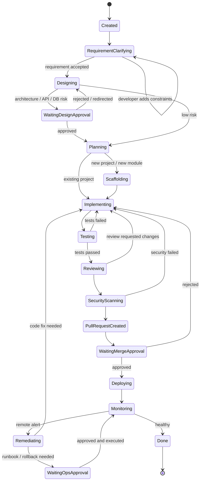

# Agent 协作状态机

> 来源：[设计书 8.2](../../云舵 CloudHelm 毕设设计书.md)  
> 目的：定义任务从创建到完成的状态迁移。
## 状态机实现要求

- 每次状态迁移必须写入 `event_logs`。
- 等待审批、测试失败、安全失败、远端告警都必须有可恢复路径。
- `Done` 只表示当前任务健康完成，不表示项目生命周期结束。

## 设计书摘录

### 8.2 Agent 协作状态机

