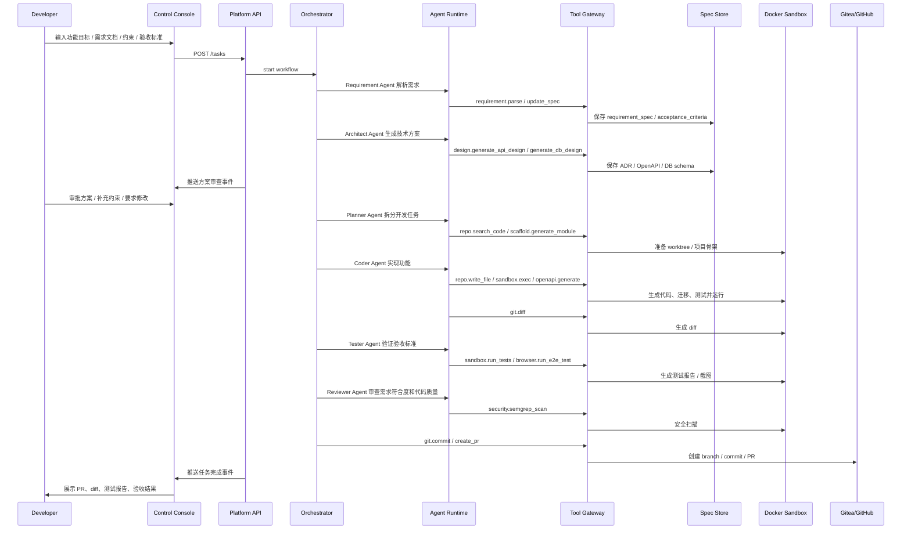

# 开发者指导 Agents 完成功能开发到 PR 流程

> 来源：[设计书 10 章](../../云舵 CloudHelm 毕设设计书.md)  
> 目的：定义端到端业务流程、参与模块和关键产物。
## 实现检查点

- 入口 API 是否存在。
- Orchestrator 状态迁移是否完整。
- Agent 输出是否结构化保存。
- Tool Gateway 是否记录工具调用和审批。
- 控制台是否能展示实时状态、产物和错误。

## 设计书摘录

### 10.1 开发者指导 Agents 完成功能开发到 PR 流程



此流程覆盖的任务不只包括修复 bug，还包括：

```text
1. 从 0 创建一个新项目。
2. 为已有项目实现新功能。
3. 设计并实现 REST API。
4. 设计数据库 schema 和迁移脚本。
5. 开发前端页面和组件。
6. 集成第三方服务。
7. 重构已有模块。
8. 补充测试、文档和示例。
9. 修复 bug 或处理 CI 失败。
```
