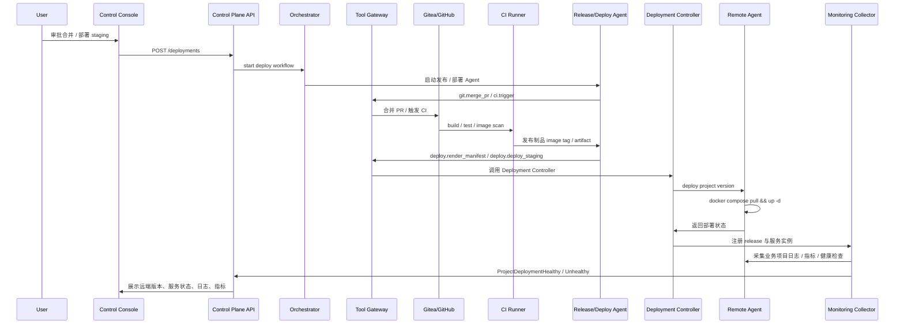

# PR 合并到远端部署流程

> 来源：[设计书 10 章](../../云舵 CloudHelm 毕设设计书.md)  
> 目的：定义端到端业务流程、参与模块和关键产物。
## 实现检查点

- 入口 API 是否存在。
- Orchestrator 状态迁移是否完整。
- Agent 输出是否结构化保存。
- Tool Gateway 是否记录工具调用和审批。
- 控制台是否能展示实时状态、产物和错误。

## 设计书摘录

### 10.2 PR 合并到远端部署流程

该流程的目标是把 Agents 在本地隔离环境中完成的软件开发结果，通过 Release / Deploy Agent 部署到远端业务项目运行环境，并把远端运行状态回传到控制台。CI 负责构建、测试、安全扫描和制品交付，远端部署动作由 Agent 经 Tool Gateway、Deploy Tool、Deployment Controller 与 Remote Agent 执行。



MVP 中部署动作由 Release / Deploy Agent 编排执行，可以实现为：

```text
1. CI 构建业务项目 Docker 镜像并输出 image tag / artifact。
2. Release / Deploy Agent 读取 CI 结果和 release plan，向 Tool Gateway 发起 `deploy.render_manifest` / `deploy.deploy_staging`。
3. Tool Gateway 校验风险等级，必要时创建审批。
4. 审批通过后，Deployment Controller 生成 compose 文件和 .env。
5. Remote Agent 在远端业务项目目录执行：
   docker compose pull
   docker compose up -d
6. Remote Agent 执行健康检查：
   curl /health
   docker compose ps
7. Monitoring Collector 注册：
   project_id
   environment_id
   deployment_id
   service_id
   image_tag
   commit_sha
```
