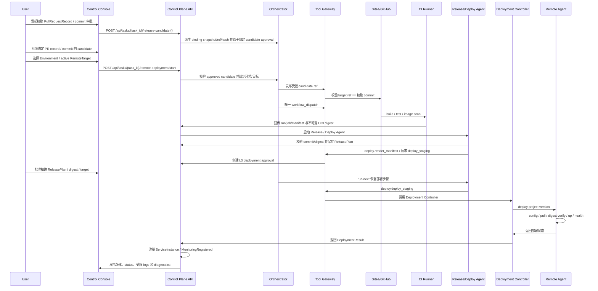

# PR Record 与精确 commit 到远端部署流程

> 来源：[设计书 10 章](../../云舵 CloudHelm 毕设设计书.md)  
> 目的：定义端到端业务流程、参与模块和关键产物。
## 实现检查点

- 入口 API 是否存在。
- Orchestrator 状态迁移是否完整。
- Agent 输出是否结构化保存。
- Tool Gateway 是否记录工具调用和审批。
- 控制台是否能展示实时状态、产物和错误。

## 设计书摘录

### 10.2 PR Record 与精确 commit 到远端部署流程

该流程的目标是把 M6 固化的 PullRequestRecord 与精确 commit，经两道人工审批、
唯一一次真实 CI 和不可变制品校验后部署到远端 staging/demo。CI 只负责构建、
测试、安全扫描和制品交付；远端部署动作固定由 Release / Deploy Agent 经
Tool Gateway、Deploy Tool、Deployment Controller 与 Remote Agent 执行。



M7 部署动作按以下固定顺序执行：

```text
1. `POST /api/tasks/{task_id}/release-candidate` 只接受 `{}`，从服务端读取最新版
   open PullRequestRecord 与 active RepositoryBinding，派生完整 commit、binding
   snapshot/hash、受控 candidate ref、幂等键和 request hash，并原子创建
   ReleaseCandidate 与 L2 Approval；审批前不 push、不触发 CI。
2. 用户批准绑定精确 PR record、commit、candidate ref 和 request hash 的
   release candidate。
3. `remote-deployment/start` 只接受 `environment_id`，要求已有 approved
   candidate，并由服务端选择 active RemoteTarget；该入口不重复创建第一道审批。
4. Git Tool 发布受控 candidate ref 并复核该 ref 仍指向精确 commit，Platform
   API 随后对固定 workflow 执行唯一一次
   `workflow_dispatch`。
5. CI 生成 JUnit、安全报告、SBOM、扫描结果、manifest 和不可变 OCI digest；
   workflow 内禁止部署动作。
6. Release / Deploy Agent 校验 PR record、commit、CI manifest 与 digest 全链，
   生成并固化 ReleasePlan。
7. Tool Gateway 为 `deploy.deploy_staging` 创建绑定 ReleasePlan、digest、
   Environment 和 RemoteTarget 的 L3 deployment approval。
8. 审批通过并由 `run-next` 显式恢复后，Deploy Tool 调用 Deployment
   Controller；Controller 从受控模板渲染 Compose，
   secret 只使用远端 env profile / credential store 引用。
9. Remote Agent 在远端业务项目目录执行：
   docker compose config
   docker compose pull
   verify RepoDigests / platform manifest
   docker compose up -d --wait
10. Remote Agent 执行健康检查：
   curl /health
   docker compose ps
11. Platform API 注册：
   project_id
   environment_id
   deployment_id
   service_id
   image_digest
   commit_sha
12. M7 Remote Ops 只提供服务 status、受时间/行数/字节限制且脱敏的直读 logs
    和固定只读 diagnostics。
13. Task 进入 Monitoring 并写入 MonitoringRegistered；M7 不自动回滚。
```

M7 不提供 remote session、WebSocket terminal、服务重启、metrics 或 Loki
集中日志查询；指标、集中日志与告警进入 M8，交互式远程接管属于后续增强版。

详细事务、worker、数据、认证与失败恢复契约见
[M7 CI/CD 与远端部署闭环细化设计](../15-detailed-design/09-m7-ci-remote-deployment-flow.md)。
