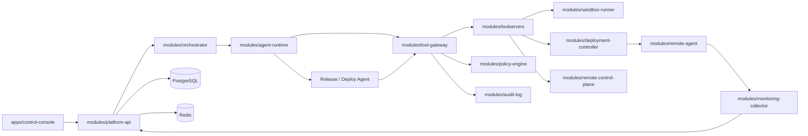

# 模块契约细化

> 来源：设计书 7 章、11 章、12 章  
> 目的：把 Monorepo 中每个模块的输入、输出、依赖和失败处理写成实现契约。

## 1. 模块总览

## 2. apps/control-console

### 职责

- 展示项目、任务、Agent timeline、工具调用、审批卡片、diff、测试报告、远端状态。
- 发起开发目标、设计审批、PR 合并审批、远程接管、部署审批。
- 通过 SSE/WebSocket 接收实时任务事件、远端日志和远程终端流。

### 输入

- 用户输入：自然语言需求、Issue、附件、技术约束、审批决策。
- API 数据：Project、Task、RequirementSpec、TechnicalDesign、ToolCall、ApprovalRequest、Deployment、Alert、Incident。

### 输出

- REST 请求：创建任务、审批、暂停、恢复、接管、部署请求。
- UI 状态：任务看板、时间线、diff、远端状态面板。

### 失败处理

- API 失败：展示错误卡片和 trace_id。
- SSE 断开：自动重连，并通过 timeline API 补齐事件。
- 远程终端断开：关闭输入，保留输出日志，允许重新建立 session。

## 3. modules/platform-api

### 职责

- 对外提供统一 REST / SSE / WebSocket API。
- 负责资源校验、权限上下文、请求幂等、事件推送。
- 不直接执行工具，不直接调用远端命令。

### 输入

- 控制台请求。
- Webhook：CI 结果、告警、部署状态、Remote Agent 心跳。
- Orchestrator 回调事件。

### 输出

- 数据库写入：Project、Task、Spec、Design、Approval、Deployment、Alert、Incident、EventLog。
- Orchestrator 启动/恢复信号。
- SSE/WebSocket 事件。

### 核心服务

|服务|职责|
|---|---|
|ProjectService|项目、仓库、默认分支、环境初始化|
|TaskService|任务创建、状态查询、暂停/恢复/取消|
|RequirementService|需求规格保存、版本管理、审批|
|DesignService|技术设计保存、设计审查、OpenAPI/DB schema 关联|
|DevelopmentPlanService|Planner Agent 产物查询和内部创建|
|OrchestrationService|M4 start/run-next 编排、AgentRun、状态迁移和事件副作用|
|ApprovalService|审批请求、批准、拒绝、过期处理|
|EventService|append event、timeline 查询、SSE 广播|
|DeploymentService|部署记录、健康检查、回滚请求|
|IncidentService|告警确认、incident 创建、runbook proposal|

## 4. modules/orchestrator

### 职责

- 实现任务状态机。
- 调度 Agent，收集结构化输出。
- 根据工具结果、测试结果、审批结果决定下一状态。

### 输入

- TaskCreated、RequirementApproved、DesignApproved、ToolCallCompleted、ApprovalApproved、CIWebhookFailed、ProjectAlertFired。

### 输出

- AgentRun 创建。
- ToolCall 请求。
- ApprovalRequest 请求。
- Task 状态迁移事件。

### 状态机要求

- 任意状态迁移必须写入 EventLog。
- 每个状态应具有超时策略。
- 等待人工审批时不得继续执行风险动作。
- 失败后优先进入可恢复状态，而不是直接 Failed。

### M4 落地

- `modules/orchestrator` 当前实现纯状态机：`Created -> RequirementClarifying -> Designing -> WaitingDesignApproval -> Planning`。
- Platform API 的 `OrchestrationService` 负责事务内写入 Task、AgentRun、RequirementSpec、TechnicalDesign、DevelopmentPlan、ApprovalRequest 和 EventLog。
- `run-next` 一次只推进一个最小 Agent 步骤，便于黑盒测试和答辩演示。

### M6 落地

- 新增 `Planning -> Scaffolding -> Implementing -> Testing -> Reviewing ->
  SecurityScanning -> ReadyForPR -> PullRequestCreated` 纯状态机。
- 测试、审查或安全门禁要求修改时可回到 `Implementing`。
- Platform API 负责 AgentRun、ToolCall、Artifact、PullRequestRecord、
  conversation 与 EventLog 的事务和外部副作用边界；Orchestrator 不直接执行工具。

## 5. modules/agent-runtime

### 职责

- 封装 LLM 调用、prompt、结构化输出、重试、模型错误恢复。
- 每个 Agent 只处理自己的角色职责。

### 输入

- Orchestrator 提供的 task context。
- Spec Store 中的需求、设计、验收标准。
- Tool Gateway 返回的工具结果。

### 输出

- 结构化对象：RequirementSpec、TechnicalDesign、DevelopmentPlan、PatchPlan、TestReport、ReviewReport、IncidentAnalysis。
- ToolCallRequest。
- ApprovalRequired reason。

### 失败处理

- JSON 解析、结构化响应或瞬时 HTTP/网络失败：按配置执行有界指数退避重试，默认总尝试 3 次。
- 可恢复请求/响应错误耗尽重试后写入失败 AgentRun，并把 Task 暂停在原业务阶段；认证等不可重试 4xx 进入失败。
- 工具失败：把结构化错误交回 Orchestrator。
- 上下文不足：生成 clarification request，不继续实现。

### M4-M6 落地

- `modules/agent-runtime` 已提供 Requirement、Architect、Planner、Scaffold、
  Coder、Tester、Reviewer、Security 八类普通 Agent。
- 默认 `local_structured` provider 读取真实输入并生成结构化草案；`openai_compatible` provider 使用 HTTP SSE Responses API、跨角色稳定扁平 schema、完整 root conversation、encrypted reasoning 和 Codex headers。当前真实流程透传兼容端点的 `gpt-5.6-sol` / `xhigh`，支持可配置 timeout/attempts/backoff，并保留 Chat Completions 兼容模式。
- 八类普通角色复用一个 Task root conversation；只有显式 spawn 才创建 child conversation。
- 每个成功 Agent 步骤使用数据库 savepoint，业务产物、conversation turn、AgentRun 完成状态和完成事件要么一起保留，要么全部回滚；失败记录在回滚后单独提交。
- M6 工具步骤在基础设施失败时保存已经发生的配对 provider call/output 和
  `<failed_step_context>`，同时保持业务产物未完成。
- Agent Runtime 不写数据库、不直接执行工具；所有请求由 Platform API 绑定
  execution recipe 后交给 Tool Gateway，所有输出入库前再次校验。

## 6. modules/tool-gateway

### 职责

- 工具注册、工具发现、参数校验、风险分级、权限判断、审批拦截、审计、限流。
- Agent 不能绕过 Gateway 调用工具。

### 输入

- Agent ToolCallRequest。
- Policy Engine 决策。
- Approval API 决策。
- MCP Tool Server metadata。

### 输出

- ToolCall 记录。
- ApprovalRequest。
- ToolResult。
- Audit event。

### 失败处理

- 参数不合法：返回 `VALIDATION_ERROR`。
- 权限拒绝：返回 `POLICY_DENIED`。
- 需要审批：返回 `APPROVAL_REQUIRED` 并暂停工作流。
- 工具超时：返回 `TOOL_TIMEOUT`，由 Orchestrator 判断重试。

## 7. modules/toolservers

### 职责

承载具体 MCP 工具服务。MVP 建议按工具组拆服务，也可以先合并为一个 `devops-tools` 服务，但对外仍保持工具命名空间清晰。

### 工具组

|工具组|最小能力|
|---|---|
|Requirement Tool|parse、generate_acceptance_criteria、update_spec|
|Design Tool|generate_architecture、generate_api_design、generate_db_design|
|Repo Tool|list_files、read_file、write_file、search_code、apply_patch|
|Sandbox Tool|exec、install_deps、run_tests、collect_artifacts|
|Git Tool|status、diff、branch、commit、create_pr|
|Deploy Tool|render_manifest、deploy_staging、health_check、rollback_request|
|Monitoring Tool|query_metrics、search_logs、list_alerts、get_recent_deployments|
|Remote Control Tool|service_status、stream_logs、ssh_exec_readonly、open_terminal|

## 8. modules/sandbox-runner

### 职责

- 创建隔离执行环境。
- 挂载 worktree。
- 限制 CPU、内存、网络、运行时间。
- 收集测试报告、截图、coverage、日志 artifact。

### 输入

- sandbox session spec。
- command spec。
- workspace mount spec。

### 输出

- exit_code、stdout/stderr 摘要、artifact 列表、resource usage。

## 9. modules/deployment-controller

### 职责

- 根据 commit/image/release 生成部署计划。
- 调用 Remote Agent 在远端执行部署。
- 记录 deployment、service_instances。
- 接受 Release / Deploy Agent 经 Tool Gateway 发起的部署请求。
- 触发健康检查与回滚建议。

### 输入

- Release / Deploy Agent deployment request。
- CI build artifact。
- deployment request。
- environment / remote target。

### 输出

- release plan。
- rendered compose / manifest。
- deployment result。
- health check result。

## 10. modules/remote-agent

### 职责

- 部署在远端主机。
- 心跳、服务发现、命令执行、日志流、指标导出。
- 默认只服务绑定的项目环境。

### 输入

- Control Plane 指令。
- 本地 Docker/systemd 状态。
- 应用日志和指标。

### 输出

- heartbeat。
- service status。
- deploy result。
- log stream。
- metric endpoint。

## 11. modules/monitoring-collector

### 职责

- 查询 Prometheus、Loki、Alertmanager、Sentry。
- 将外部观测数据转换为平台事件。
- 绑定 project/environment/deployment/service 维度。

### 输出事件

- ProjectMetricUpdated。
- ProjectLogReceived。
- ProjectAlertFired。
- ProjectDeploymentUnhealthy。
- ProjectIncidentCreated。

## 12. modules/policy-engine 与 audit-log

### Policy Engine

- 输入：agent_type、tool_name、risk_level、project、environment、arguments summary。
- 输出：allow / deny / require_approval。

### Audit Log

- 输入：工具调用、审批、远端会话、部署、回滚、人工接管。
- 输出：append-only EventLog，可按 task/project/environment 查询。
## M5 实现同步：Tool Gateway 模块契约

`modules/tool-gateway` 已作为独立 Python 包接入 Platform API，模块边界如下：

- `registry.py`：只负责注册和查找 `ToolDeclaration`，不执行工具、不写数据库。
- `gateway.py`：统一执行查找、参数校验、风险等级比对、审批拦截、handler 调用和审计摘要。
- `policies.py`：统一处理 workspace 路径边界、敏感文件、命令 denylist、环境变量白名单和超时上限。
- `audit.py`：生成参数摘要、稳定 hash、参数/结果/输出脱敏，不直接持久化。
- `tools/`：实现 Requirement、Design、Repo、Scaffold、Sandbox、Test、
  Security、Git 以及 L3 审批占位工具。
- Platform API 只能通过 `ToolGatewayService` 调用本模块。入口先用短事务原子抢占 `(task_id, idempotency_key)` 并写 `pending` ToolCall，再执行文件/Git/进程副作用，最后在后续事务写终态、Approval 和 Event；数据库事务不得跨越外部副作用。
- Repo、Sandbox、Git 的工作区必须位于 `CLOUDHELM_TOOL_WORKSPACE_ROOTS`；空配置默认拒绝。
- `tool_calls.arguments_json` 只保存脱敏快照，`audit_json` 保存服务端生成的主体、风险、幂等键、参数/原因 hash 和终态。

M6 Sandbox Tool 的隔离边界仍是本地受控目录 + `subprocess` 超时，并增加
Scaffold、pytest、Bandit、pip-audit 和 format patch 正向 profile。Docker
sandbox、网络隔离和资源 quota 已延后到 M7 远端部署前再次评估。

带 `workflow_step` 的 M6 AgentRun 只能通过内部 Agent executor 调用
`ToolGatewayService`。executor 按工具名、Pydantic 默认值规范化后的模型参数和
允许次数绑定 execution recipe；公开 HTTP 入口、未批准参数或超额调用都不会
进入工具 handler。
