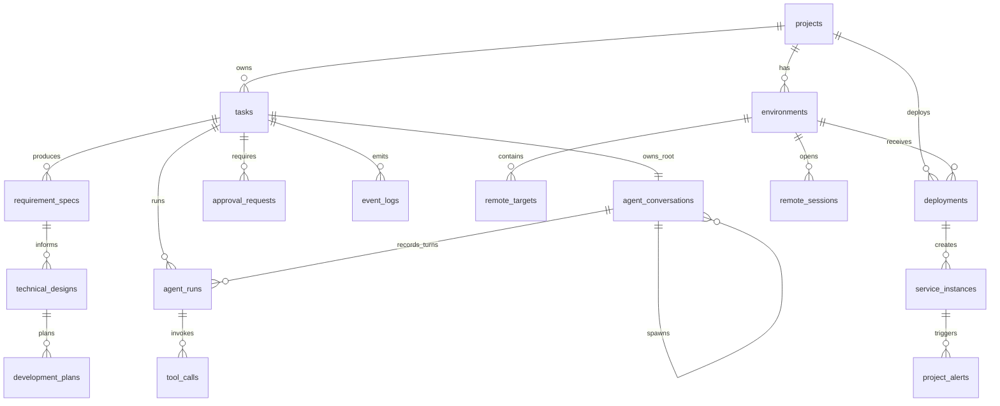

# 数据模型细化设计

> 来源：设计书 11 章  
> 目的：补充实体关系、状态字段、索引建议、事件类型和数据生命周期。

## M2 落地状态

M2 已通过 Alembic 创建以下 PostgreSQL 基础表：

```text
projects
tasks
requirement_specs
technical_designs
agent_runs
tool_calls
approval_requests
event_logs
```

实现位置：

- ORM：`modules/platform-api/src/cloudhelm_platform_api/models/`
- 迁移：`modules/platform-api/migrations/versions/20260708_0001_create_core_m2_tables.py`
- 连接配置：`CLOUDHELM_DATABASE_URL`

关键落地规则：

- 主键使用 PostgreSQL UUID，应用层生成 UUID。
- JSON 结构字段使用 JSONB。
- 时间字段使用 timezone-aware UTC datetime 和 PostgreSQL `TIMESTAMPTZ`。
- `tasks(project_id,status)`、`event_logs(task_id,created_at)` 等控制台常用查询已建索引。
- 写业务状态和写 `event_logs` 必须在同一 service 事务中提交。

M2 未创建 environments、deployments、remote_targets、monitoring 等远端运维表；这些表保留到部署和监控里程碑。

## M4 落地状态

M4 新增迁移 `modules/platform-api/migrations/versions/20260708_0002_create_m4_agent_tables.py`：

- `development_plans` 表。
- `agent_runs.summary`、`structured_output_type`、`structured_output_json`、`error_code`、`error_message`。

`development_plans` 至少包含 `id`、`task_id`、`project_id`、`technical_design_id`、`summary`、`steps_json`、`risks_json`、`status`、`version`、`created_by_agent_run_id`、`created_at`、`updated_at`。`steps_json` 和 `risks_json` 使用 PostgreSQL JSONB，并由 Pydantic schema 校验。

### M4/M5 conversation 纠偏

迁移 `20260711_0005_create_agent_conversations.py` 新增：

#### `agent_conversations`

|字段|说明|
|---|---|
|`task_id`|所属 Task。|
|`source_type`|`root` 或 `subagent`。|
|`parent_conversation_id`|child 的父 conversation；root 为 null。|
|`spawned_by_agent_run_id`|显式 spawn 的 running 父 AgentRun。|
|`agent_role` / `nickname`|child 角色和展示名称；root 不绑定普通角色。|
|`objective`|显式 child 的唯一子目标；root 为 null。|
|`depth` / `status` / `fork_mode`|父子深度、生命周期、fresh/full_history。|
|`provider_name` / `model_name`|会话固定 Provider 与模型；中途不可切换。|
|`prompt_cache_key`|唯一、稳定、不包含 prompt 正文的缓存路由键。|
|`items_json`|完整可重放 ResponseItem：消息、encrypted reasoning、工具调用/结果和平台上下文。|
|`turn_count`|只统计通过输出 schema 并已提交的成功模型 turn。|
|`last_response_id`|最近一次成功供应商 Responses ID。|

约束：

- PostgreSQL partial unique index `ux_agent_conversations_task_root` 保证每个 Task
  只有一个 root。
- `ck_agent_conversations_source_fields` 保证 root/child 的 parent、spawn、
  role、objective、fork mode 和 depth 组合合法。
- 普通角色切换只更新 root `items_json/turn_count`，不新增 conversation。
- child 只能由显式 spawn 服务创建。
- 每个 Agent 步骤通过 savepoint 原子保存业务产物、成功 AgentRun、
  conversation turn 和完成事件；晚期失败回滚以上成功侧写入，再记录失败运行。

#### `agent_runs` conversation/cache 字段

|字段|说明|
|---|---|
|`conversation_id` / `conversation_turn`|本次运行所属 conversation 和成功提交后的 turn。|
|`cached_input_tokens`|AgentRun 内全部已完成供应商请求的真实缓存 token 总量。|
|`provider_request_count`|含结构化修复在内的已完成供应商请求次数。|
|`provider_requests`|逐请求 response ID、cache key、input/cached/output token 和 cache_hit。|
|`provider_response_id`|最终成功请求的 response ID。|
|`prompt_cache_key`|本次运行使用的 conversation cache key。|

`cache_hit` 不单独落库为可写布尔值；API/EventLog 从每次请求真实
`cached_input_tokens > 0` 推导，避免固定返回或本地估算。

## 1. 核心 ER 关系



## 2. 状态枚举建议

### tasks.status

|值|含义|
|---|---|
|created|任务创建但未开始|
|running|工作流正在执行|
|waiting_approval|等待人工审批|
|paused|用户暂停|
|failed|不可自动恢复失败|
|done|任务完成|
|cancelled|用户取消|

### tasks.current_phase

与 Orchestrator 状态机保持一致：

```text
Created
RequirementClarifying
Designing
WaitingDesignApproval
Planning
Scaffolding
Implementing
Testing
Reviewing
SecurityScanning
PullRequestCreated
WaitingMergeApproval
Deploying
Monitoring
Remediating
WaitingOpsApproval
Done
Failed
```

### approval_requests.status

```text
pending
approved
rejected
expired
cancelled
```

### deployments.status

```text
planned
pending_approval
deploying
healthy
unhealthy
failed
rollback_requested
rolled_back
cancelled
```

### project_alerts.status

```text
firing
acknowledged
resolved
suppressed
```

## 3. 索引建议

|表|索引|用途|
|---|---|---|
|projects|`idx_projects_provider_repo(provider, repo_url)`|避免重复接入同一仓库|
|tasks|`idx_tasks_project_status(project_id, status)`|项目任务列表|
|tasks|`idx_tasks_phase(current_phase)`|任务看板过滤|
|requirement_specs|`idx_requirement_specs_task_version(task_id, version)`|需求版本查询|
|technical_designs|`idx_technical_designs_task_status(task_id, status)`|设计审查查询|
|development_plans|`idx_development_plans_task_status(task_id, status)`|开发计划查询|
|agent_runs|`idx_agent_runs_task_started(task_id, started_at DESC)`|Agent timeline|
|agent_runs|`ix_agent_runs_conversation_turn(conversation_id, conversation_turn)`|同一会话 turn 审计|
|agent_conversations|`ux_agent_conversations_task_root(task_id) WHERE source_type='root'`|每个 Task 唯一 root|
|agent_conversations|`ix_agent_conversations_parent_status(parent_conversation_id,status)`|child 生命周期查询|
|tool_calls|`idx_tool_calls_task_started(task_id, started_at DESC)`|工具调用列表|
|tool_calls|`idx_tool_calls_agent(agent_run_id)`|Agent 详情|
|approval_requests|`idx_approval_pending(status, risk_level, created_at)`|审批队列|
|event_logs|`idx_event_logs_task_created(task_id, created_at)`|timeline / SSE 回放|
|event_logs|`idx_event_logs_type_created(event_type, created_at)`|事件查询|
|environments|`idx_environments_project(project_id, type)`|环境列表|
|deployments|`idx_deployments_env_started(environment_id, started_at DESC)`|部署历史|
|service_instances|`idx_service_instances_env_status(environment_id, status)`|远端服务面板|
|project_alerts|`idx_alerts_project_status(project_id, status, fired_at DESC)`|告警列表|
|remote_sessions|`idx_remote_sessions_env_started(environment_id, started_at DESC)`|远程接管审计|

## 4. JSONB 字段约束

### requirement_specs.constraints_json

```json
[
  {
    "type": "technology",
    "value": "FastAPI",
    "required": true
  },
  {
    "type": "testing",
    "value": "pytest must pass",
    "required": true
  }
]
```

### requirement_specs.acceptance_criteria_json

```json
[
  {
    "id": "AC-001",
    "description": "用户可以通过邮箱和密码注册",
    "verification": "pytest",
    "status": "pending"
  }
]
```

### tool_calls.arguments_json

只保存脱敏参数快照或安全引用；不得保存凭据和文件正文：

```json
{
  "path": "backend/app/api/auth.py",
  "content": {
    "redacted": true,
    "length": 1280,
    "sha256": "sha256:..."
  },
  "api_token": "<redacted>"
}
```

### tool_calls.audit_json

审计字段只能由 Tool Gateway / Platform API 服务端生成：

```json
{
  "tool": "repo.write_file",
  "task_id": "uuid",
  "agent_run_id": "uuid",
  "agent_type": "coder",
  "risk_level": "L1",
  "idempotency_key": "write-auth-v1",
  "arguments_hash": "sha256:...",
  "reason_hash": "sha256:...",
  "status": "succeeded"
}
```

### development_plans.steps_json

```json
[
  {
    "id": "STEP-001",
    "title": "补齐契约和迁移",
    "description": "同步 schema、OpenAPI 和 migration",
    "agent": "architect",
    "expected_artifact": "schema_and_migration",
    "depends_on": [],
    "status": "pending"
  }
]
```

### development_plans.risks_json

```json
[
  {
    "id": "RISK-001",
    "description": "外部模型配置缺失",
    "mitigation": "保留 local_structured provider 或写入失败事件",
    "risk_level": "L1"
  }
]
```

### event_logs.payload

必须包含可回放状态所需字段：

```json
{
  "task_id": "uuid",
  "from": "Testing",
  "to": "Reviewing",
  "reason": "all tests passed",
  "actor": "orchestrator"
}
```

## 5. 事件类型建议

### 任务与 Agent

- TaskCreated
- TaskPhaseChanged
- TaskPaused
- TaskResumed
- TaskCancelled
- AgentRunStarted
- AgentRunCompleted
- AgentRunFailed
- DevelopmentPlanCreated

### 需求与设计

- RequirementSpecCreated
- RequirementSpecUpdated
- RequirementApproved
- RequirementChangesRequested
- TechnicalDesignProposed
- TechnicalDesignApproved
- TechnicalDesignChangesRequested

### 工具与审批

- ToolCallStarted
- ToolCallSucceeded
- ToolCallFailed
- ApprovalRequested
- ApprovalApproved
- ApprovalRejected

### Git / CI / 部署

- BranchCreated
- CommitCreated
- PullRequestCreated
- CIFailed
- CIPassed
- DeploymentRequested
- DeploymentStarted
- DeploymentHealthy
- DeploymentUnhealthy
- RollbackRequested

### 远端运维

- RemoteAgentHeartbeat
- ProjectServiceStatusChanged
- ProjectLogReceived
- ProjectMetricUpdated
- ProjectAlertFired
- ProjectIncidentCreated
- RunbookProposed
- RemoteSessionOpened
- RemoteSessionClosed

## 6. 数据生命周期

|数据|保留策略|
|---|---|
|projects/tasks/spec/design|毕设 MVP 永久保留|
|event_logs/tool_calls/approval_requests|append-only，永久保留或按项目归档|
|Agent conversation|保存完整可重放 ResponseItem；reasoning 只保存供应商 encrypted content，不保存或展示明文思维链|
|sandbox artifact|本地保留最近 N 次，重要报告转存 artifact|
|远端日志|Loki 中保留短期；平台只保存摘要和引用|
|指标数据|Prometheus 保留短期；平台保存告警和关键快照|
|remote_sessions 输出|MVP 可保存文本摘要，完整输出按风险配置保留|

## 7. Migration 规则

- 所有表结构通过 migration 管理。
- 字段新增必须向后兼容。
- 删除字段必须先弃用，再清理。
- destructive migration 必须生成 ApprovalRequest。
- 生产扩展时对 event_logs 和 tool_calls 考虑分区表。
## M5 实现同步：tool_calls 字段扩展

M5 为 `tool_calls` 增加以下字段：

|字段|类型|说明|
|---|---|---|
|`idempotency_key`|text nullable|同一任务内幂等键；非空时 `(task_id, idempotency_key)` 唯一。|
|`arguments_summary`|text nullable|脱敏参数摘要。|
|`result_summary`|text nullable|工具结果摘要。|
|`stdout_summary` / `stderr_summary`|text nullable|命令输出截断摘要。|
|`duration_ms`|integer nullable|执行耗时。|
|`error_code`|text nullable|稳定失败码，例如 `path_sensitive_file`、`command_timeout`。|
|`audit_json`|jsonb not null|服务端生成的调用主体、风险、幂等键、hash、终态和错误码。|

审批拦截时，`tool_calls.approval_id` 指向同事务创建的 `approval_requests.id`，状态为 `waiting_approval`，`finished_at` 为空。
