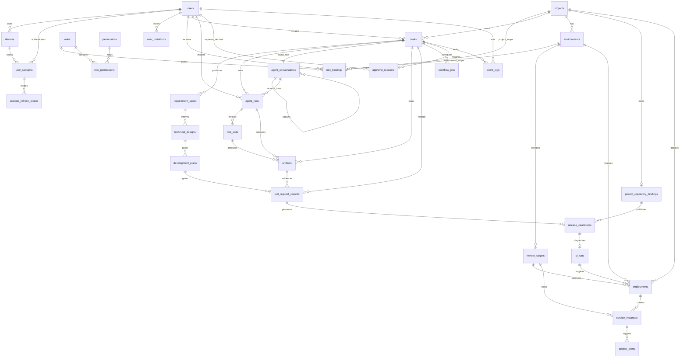

# 数据模型细化设计

> 来源：设计书 11 章  
> 目的：补充实体关系、状态字段、索引建议、事件类型和数据生命周期。

## M2 落地状态

M2 已通过 Alembic 创建以下 PostgreSQL 基础表：

```text
projects
tasks
requirement_specs
technical_designs
agent_runs
tool_calls
approval_requests
event_logs
```

实现位置：

- ORM：`modules/platform-api/src/cloudhelm_platform_api/models/`
- 迁移：`modules/platform-api/migrations/versions/20260708_0001_create_core_m2_tables.py`
- 连接配置：`CLOUDHELM_DATABASE_URL`

关键落地规则：

- 主键使用 PostgreSQL UUID，应用层生成 UUID。
- JSON 结构字段使用 JSONB。
- 时间字段使用 timezone-aware UTC datetime 和 PostgreSQL `TIMESTAMPTZ`。
- `tasks(project_id,status)`、`event_logs(task_id,created_at)` 等控制台常用查询已建索引。
- 写业务状态和写 `event_logs` 必须在同一 service 事务中提交。

M2 当时未创建远端运维表；M7-1 已通过独立迁移补充 Environment、
RemoteTarget 和 machine-auth 两张子表，Deployment/Monitoring 仍留在后续切片。

## 0.1 存储与身份规划修订

后续数据层分成三类：

- Ops Hub PostgreSQL：平台权威任务、事件、审批、WorkflowJob、部署、用户和 RBAC。
- Desktop SQLite：非权威 server profile、草稿、缓存和 event sequence。
- 业务项目数据：由项目自己的 migration/volume/database 管理。

Desktop 不复制 PostgreSQL 表，业务项目不连接 CloudHelm database。详细边界见
[Desktop、Ops Hub 与业务项目存储边界](../07-data/02-storage-boundary.md)。

Ops Hub 多用户目标新增：

```text
users
devices
device_pairing_challenges
user_sessions
session_refresh_tokens
user_invitations
roles
permissions
role_permissions
role_bindings
system_security_state
```

现有 Approval、Task、AgentRun、ToolCall、ReleaseCandidate、CIRun、EventLog、
Deployment 后续要增加真实 `*_user_id` provenance/审计引用。调用方字符串 actor
只保留兼容投影，不能继续充当授权身份。
TechnicalDesign 还要增加当前版本的 user/AgentRun 修改者与 content hash，审批
绑定 design id/version/hash 后执行职责分离。`last_modified_source` 使用
`user | agent_run | legacy_system` CHECK；content hash 使用
`technical-design-content.v1` stable canonical object。
EventLog 后续增加单调 sequence、stream kind、project/aggregate identity、
user/device/session actor 与 subject user，支持 Desktop snapshot + incremental
event sync。精确字段见
[Ops Hub 身份、用户与分层权限细化](11-identity-access-control.md)。

## M4 落地状态

M4 新增迁移 `modules/platform-api/migrations/versions/20260708_0002_create_m4_agent_tables.py`：

- `development_plans` 表。
- `agent_runs.summary`、`structured_output_type`、`structured_output_json`、`error_code`、`error_message`。

`development_plans` 至少包含 `id`、`task_id`、`project_id`、`technical_design_id`、`summary`、`steps_json`、`risks_json`、`status`、`version`、`created_by_agent_run_id`、`created_at`、`updated_at`。`steps_json` 和 `risks_json` 使用 PostgreSQL JSONB，并由 Pydantic schema 校验。

### M4/M5 conversation 纠偏

迁移 `20260711_0005_create_agent_conversations.py` 新增：

#### `agent_conversations`

|字段|说明|
|---|---|
|`task_id`|所属 Task。|
|`source_type`|`root` 或 `subagent`。|
|`parent_conversation_id`|child 的父 conversation；root 为 null。|
|`spawned_by_agent_run_id`|显式 spawn 的 running 父 AgentRun。|
|`agent_role` / `nickname`|child 角色和展示名称；root 不绑定普通角色。|
|`objective`|显式 child 的唯一子目标；root 为 null。|
|`depth` / `status` / `fork_mode`|父子深度、生命周期、fresh/full_history。|
|`provider_name` / `model_name`|会话固定 Provider 与模型；中途不可切换。|
|`prompt_cache_key`|唯一、稳定、不包含 prompt 正文的缓存路由键。|
|`items_json`|完整可重放 ResponseItem：消息、encrypted reasoning、工具调用/结果和平台上下文。|
|`turn_count`|已提交的逻辑 turn；通常为成功角色输出，M6 工具失败时也可提交配对 call/output 与失败上下文。|
|`revision`|会话历史乐观并发版本；任何成功保存的 turn/context 都递增。|
|`last_response_id`|最近一次已保存供应商 Responses ID。|

约束：

- PostgreSQL partial unique index `ux_agent_conversations_task_root` 保证每个 Task
  只有一个 root。
- `ck_agent_conversations_source_fields` 保证 root/child 的 parent、spawn、
  role、objective、fork mode 和 depth 组合合法。
- 普通角色切换只更新 root `items_json/turn_count`，不新增 conversation。
- child 只能由显式 spawn 服务创建。
- 每个 Agent 步骤通过 savepoint 原子保存业务产物、成功 AgentRun、
  conversation turn 和完成事件；晚期失败回滚以上成功侧写入，再记录失败运行。
- M6 工具调用已落库后发生基础设施失败时，保存配对 provider call/output 与
  `<failed_step_context>`；失败 AgentRun 关联该 turn，但成功业务产物仍回滚。

#### `agent_runs` conversation/cache 字段

|字段|说明|
|---|---|
|`conversation_id` / `conversation_turn`|本次运行所属 conversation 和成功提交后的 turn。|
|`cached_input_tokens`|AgentRun 内全部已完成供应商请求的真实缓存 token 总量。|
|`provider_request_count`|含结构化修复在内的已完成供应商请求次数。|
|`provider_requests`|逐请求 response ID、cache key、input/cached/output token 和 cache_hit。|
|`provider_response_id`|最终成功请求的 response ID。|
|`prompt_cache_key`|本次运行使用的 conversation cache key。|

`cache_hit` 不单独落库为可写布尔值；API/EventLog 从每次请求真实
`cached_input_tokens > 0` 推导，避免固定返回或本地估算。

## M6 落地状态

迁移 `20260714_0006_create_m6_local_development.py` 新增：

### `agent_runs` M6 身份

|字段|说明|
|---|---|
|`workflow_step`|`run_scaffold`、`run_coder`、`run_tester`、`run_reviewer`、`run_security`。|
|`attempt`|同一 Task/step 的重试序号，从 1 开始。|
|`idempotency_key`|任务内 Agent 步骤幂等键。|

- 三个字段必须同时为空或同时非空。
- `(task_id, idempotency_key)` 在非空时唯一。
- partial unique index 保证每个 Task 同时最多一个
  `workflow_step IS NOT NULL AND status IN ('pending','running')` 的 AgentRun。

### `tool_calls` provider 身份

|字段|说明|
|---|---|
|`provider_call_id`|Responses function/custom call ID。|
|`provider_item_type`|`function_call` 或 `custom_tool_call`。|

provider pair 必须同时存在或同时为空；存在时必须绑定 AgentRun，并通过
`(agent_run_id, provider_call_id)` 唯一索引防止重复映射。

### `artifacts`

保存 producer 引用、artifact type/status、展示名、媒体类型、内部相对
`storage_key`、SHA-256、大小、摘要、metadata 和任务内幂等键：

- producer 为 agent/tool/system 时，只允许对应审计引用存在。
- `(task_id, idempotency_key)` 与 `storage_key` 唯一。
- API 不返回 `storage_key`，只返回 `artifact://<id>` 和受限安全预览。

### `pull_request_records`

保存 Task/Project/DevelopmentPlan、本地 branch/commit、changed files、diff stat、
branch/commit ToolCall 和 diff/test/review/security Artifact：

- provider 为 `local/github/gitea`，M6 使用 `local`。
- local record 必须 `url IS NULL`。
- `(task_id, commit_sha)` 与 `(task_id, idempotency_key)` 唯一。
- base/head branch 必须不同；四类质量 Artifact 不可为空。

## M7-1 落地状态

迁移 `20260715_0007_create_m7_environment_remote_target.py` 已新增：

- `environments`
- `remote_targets`
- `remote_agent_credentials`
- `remote_agent_replay_nonces`

整条子资源链路使用 `Project -> Environment -> RemoteTarget -> Credential -> Nonce` 的
`ON DELETE CASCADE`。数据库只保存 credential ref 与 SHA-256 fingerprint，真实
secret 不入库。nonce 只保存 hash，并由
`uq_remote_agent_replay_nonces_credential_hash` 裁决并发 replay。

M7-2A 的 `20260716_0008` 已创建 `project_repository_bindings`、
`release_candidates`、`workflow_jobs` 和资源型 Approval 字段。M7-2B1 已在该
底座上实现 RepositoryProfile/Binding PUT/GET、幂等、漂移失效和并发门禁；
M7-2B2 已实现 Candidate、第一道 L2 Approval 与
`release_candidate_reconcile` WorkflowJob 原子事务，以及 approve/reject、
freshness、自批和并发门禁。durable dispatcher/worker 仍未完成。
`ci_runs`、`deployments` 和 `service_instances` 仍属于后续 M7 纵切，不能因 M7-1
四张基础表或 M7-2A 三张数据表已落地而标记完整 M7 完成。

## 1. 核心 ER 关系



上图的 M7 远端目标只表示运行 Remote Agent 的 Linux staging/demo 主机。
`project_alerts` 从 M8 才启用；production、Kubernetes target 和
`remote_sessions` 保留在增强版数据模型，不进入 M7 migration 或验收。

## 2. 状态枚举建议

### tasks.status

|值|含义|
|---|---|
|created|任务创建但未开始|
|running|工作流正在执行|
|waiting_approval|等待人工审批|
|paused|用户暂停|
|failed|不可自动恢复失败|
|done|任务完成|
|cancelled|用户取消|

### tasks.current_phase

与 Orchestrator 状态机保持一致：

```text
Created
RequirementClarifying
Designing
WaitingDesignApproval
Planning
Scaffolding
Implementing
Testing
Reviewing
SecurityScanning
PullRequestCreated
WaitingMergeApproval
CIValidating
ReleasePlanning
WaitingDeployApproval
Deploying
VerifyingDeployment
Monitoring
Remediating
WaitingOpsApproval
Done
Failed
```

### approval_requests.status

```text
pending
approved
rejected
expired
cancelled
```

M7 的 L2 release candidate 与 L3/L4 远端审批还必须保存
`resource_type`、`resource_id`、`request_hash`、
`expires_at` 和 `consumed_at`。审批目标变化、hash 漂移、过期、已消费或实现者
自批均不得恢复副作用。

资源字段、request hash 与 expiry 必须成组存在；同一
`resource_type/resource_id/action` 只允许一条审批。`consumed_at` 仅允许
`status=approved`，且必须满足
`decided_at <= consumed_at < expires_at`。approve/reject 不消费审批。

### project_repository_bindings.status

```text
active
disabled
```

### release_candidates.status

```text
pending_approval
approved
rejected
published
stale
cancelled
```

Candidate 必须保存不含 secret 的 `binding_snapshot_json` 和覆盖内部 clone URL、
credential ref 的 `binding_snapshot_sha256`。binding 或最新版 PR 漂移时，旧
pending/approved candidate 转为 stale，pending Approval 同步 expired。
系统 freshness 失效固定写
`decided_by=system:release_candidate_freshness` 和数据库决策时间。

安全 snapshot 精确包含八个字段：schema version、provider、repository external
id/owner/name、default branch、workflow id、release ref prefix。内部 snapshot
hash 还覆盖 profile key、clone URL 与 credential ref。hash 统一复用
`stable_json_hash`，格式为 `sha256:<64 lowercase hex>`。

Candidate request hash 绑定 `action=approve_release_candidate`、Task、Project、
PR record、binding、snapshot hash、commit 和 target ref；target ref 固定为
`{release_ref_prefix}/{task_id}/{full_commit_sha}/{snapshot_hash_hex}`。
`(pull_request_record_id, binding_snapshot_sha256)` 是 Candidate 唯一身份。
rejected 后重复 POST 返回原记录；重新申请必须产生新 PR 或新 snapshot。
每 Task 的部分唯一索引只包含 `pending_approval|approved`，published 保留为历史
发布终态。

### deployments.status

```text
planned
pending_approval
queued
deploying
verifying
healthy
unhealthy
failed
rollback_requested
cancelled
```

M7 不自动写 `rolled_back`；rollback request 只保存 candidate/plan，后续执行必须
创建新的 Deployment 和独立审批。

### workflow_jobs.status

```text
pending
claimed
running
succeeded
failed
cancel_requested
cancelled
recovery_required
```

`workflow_jobs` 是 PostgreSQL 业务权威，Redis/Celery 只投递 job id。每个 job
保存 `side_effect_class=none|external_idempotent|external_uncertain`，且只能由
服务端 handler registry 按 job type 派生。

状态分类固定为：

```text
claimable         = pending
lease-active      = claimed | running | cancel_requested
resource-blocking = pending | claimed | running | cancel_requested | recovery_required
terminal          = succeeded | failed | cancelled
manual-blocking   = recovery_required
```

pending 取消直接进入 cancelled；claimed 且 handler 尚未开始时直接 cancelled；
running 取消进入 cancel_requested 并保留 lease。`recovery_required` 清空
worker/dispatch lease，`next_retry_at/next_enqueue_at/finished_at` 为空，并阻止同
资源创建新 job。

safe retry 或 stale reclaim 只有在 `attempt < max_attempts` 时回 pending；耗尽时
进入 failed，写 `workflow_job_attempts_exhausted`、数据库完成时间并清 lease/
retry/enqueue。已请求取消且确认无副作用时优先 cancelled。

`release_candidate_reconcile` 只允许 Task `running|waiting_approval`。dispatcher
排除 paused/cancelled/failed/done；mark-running 遇到 paused 时回 pending 并清
lease，Task resume 将 pending job 的 next enqueue 推进到数据库当前时间。

stale 处理固定为：

- `none`：未取消的 stale claimed/running 安全回 pending；stale
  cancel_requested 进入 cancelled。
- `external_idempotent`：查询相同远端 operation 后，只有明确终态、明确未执行或
  可附着到同一幂等 operation 时收敛/重排；unknown 进入 recovery_required。
- `external_uncertain`：running 后只接受明确 succeeded/failed；其余结果进入
  recovery_required。

cancel_requested 覆盖 external stale 规则：不重新调用原副作用；remote
cancelled/not_started -> cancelled，succeeded -> succeeded，failed -> failed，
running/unknown -> recovery_required。

为关闭 PostgreSQL commit 与 Redis publish 的永久空窗，表内还保存 dispatch
lease、`next_enqueue_at`、`last_enqueued_at`、enqueue attempt/error；周期
dispatcher 使用 `FOR UPDATE SKIP LOCKED` 抢占并补投，重复消息由 PostgreSQL
claim 去重。

dispatcher due 条件必须同时服从 business retry 与 enqueue 时间：

```text
status=pending
attempt<max_attempts
next_retry_at IS NULL OR next_retry_at<=now()
next_enqueue_at<=now()
dispatch lease 为空或过期
```

reserve 先提交 dispatch lease 和递增后的 enqueue attempt，再 publish；success/
failure finalize 必须以 `status=pending + owner` 条件更新，避免覆盖已经 claim 的
job。success finalize 必须清 `last_enqueue_error_code`。worker 同时访问
Task/job/resource 时固定按
`Task -> WorkflowJob -> ProjectRepositoryBinding -> ReleaseCandidate -> Approval`
加锁；Binding PUT 先取得 RepositoryBinding 配置 namespace 的 transaction-level
advisory lock，再按 `Binding -> Candidate(UUID 顺序) -> Approval(UUID 顺序)`
加锁且不反向获取 Task。该全局短事务锁用于避免跨 Project repository identity
swap 死锁，不替代 Candidate/Approval 实体锁。

### M7 新增权威表

- `project_repository_bindings`：服务端 Gitea profile、repository identity、
  workflow id 和 credential ref。
- `release_candidates`：PullRequestRecord、完整 commit、target ref、审批、
  binding snapshot/hash、request hash 和远端 SHA 校验。
- `workflow_jobs`：PostgreSQL 业务 job、attempt、lease、heartbeat、retry 和
  enqueue/recovery 状态；Celery business task 只携带 job id。
- `environments`：M7-1 已实现。只允许 `staging`、`demo`，保存 base URL；
  `env_profile_ref` 为内部可空字段，`production` 属于增强版。
- `remote_targets`：Linux Remote Agent 的 `display_name`、`target_type`、
  `agent_id`、`agent_endpoint`、`credential_ref`、`tls_fingerprint`、
  `agent_version`、`capabilities_json`、status、heartbeat、event 和 error。
  读取 API 隐藏
  `credential_ref` 并只展示脱敏 endpoint；Kubernetes context/namespace 属于
  增强版独立 schema。
- `remote_agent_credentials`：target/agent/key/scope/lifecycle、credential ref
  和 secret fingerprint；真实 secret 不入库。
- `remote_agent_replay_nonces`：credential + nonce hash 唯一，保留时间覆盖完整
  timestamp 容差窗口。
- `ci_runs`：run/job、commit、manifest 和 webhook 幂等身份。
- `deployments`、`service_instances`：审批后的部署、远端 operation、健康和服务
  实例。

M7 审批与制品不变量：

1. `release_candidates.approval_id` 绑定第一道 release candidate approval；
   审批前不得发布 candidate ref 或触发 CI。
2. Gitea workflow 不监听 push，只允许固定 workflow、精确 ref 和结构化 inputs
   的唯一 `workflow_dispatch`；同一 ReleaseCandidate 只允许一个有效 CIRun，
   CI 不调用 SSH、Compose、Remote Agent 或任何部署接口。
3. CIRun manifest、ReleasePlan 和 Deployment 必须绑定 M6 精确 commit、
   OCI index digest 与目标平台 manifest digest，禁止使用可变 tag 或 image id
   代替。
4. `deployments.approval_id` 绑定第二道 deployment approval；过期、已消费、
   request hash 漂移或实现者自批均不得恢复副作用。
5. M7 只保存 `rollback_candidate_id` / rollback request Artifact，不写
   restart/rollback 执行状态。部署健康后写 `MonitoringRegistered`，Task 停在
   `Monitoring` 等待 M8。

完整字段、约束和删除规则见
[09-m7-ci-remote-deployment-flow.md](09-m7-ci-remote-deployment-flow.md)。

### project_alerts.status

```text
firing
acknowledged
resolved
suppressed
```

## 3. 索引建议

|表|索引|用途|
|---|---|---|
|projects|`idx_projects_provider_repo(provider, repo_url)`|避免重复接入同一仓库|
|tasks|`idx_tasks_project_status(project_id, status)`|项目任务列表|
|tasks|`idx_tasks_phase(current_phase)`|任务看板过滤|
|requirement_specs|`idx_requirement_specs_task_version(task_id, version)`|需求版本查询|
|technical_designs|`idx_technical_designs_task_status(task_id, status)`|设计审查查询|
|development_plans|`idx_development_plans_task_status(task_id, status)`|开发计划查询|
|agent_runs|`idx_agent_runs_task_started(task_id, started_at DESC)`|Agent timeline|
|agent_runs|`ix_agent_runs_conversation_turn(conversation_id, conversation_turn)`|同一会话 turn 审计|
|agent_conversations|`ux_agent_conversations_task_root(task_id) WHERE source_type='root'`|每个 Task 唯一 root|
|agent_conversations|`ix_agent_conversations_parent_status(parent_conversation_id,status)`|child 生命周期查询|
|tool_calls|`idx_tool_calls_task_started(task_id, started_at DESC)`|工具调用列表|
|tool_calls|`idx_tool_calls_agent(agent_run_id)`|Agent 详情|
|approval_requests|`idx_approval_pending(status, risk_level, created_at)`|审批队列|
|event_logs|`idx_event_logs_task_created(task_id, created_at)`|timeline / SSE 回放|
|event_logs|`idx_event_logs_type_created(event_type, created_at)`|事件查询|
|event_logs|`ux_event_logs_sequence(sequence)`|M9 Ops Hub 全局单调同步位置|
|event_logs|`idx_event_logs_project_sequence(project_id, sequence)`|Desktop project 增量补齐|
|event_logs|`idx_event_logs_subject_sequence(subject_user_id, sequence)`|Desktop 用户控制流增量补齐|
|event_logs|`idx_event_logs_aggregate_version(aggregate_type, aggregate_id, aggregate_version)`|read model 版本与旧事件拒绝|
|users|规范化 username/email 唯一索引|登录和邀请冲突|
|devices|`idx_devices_user_status(user_id,status)`|用户设备管理|
|user_sessions|`idx_user_sessions_user_device(user_id,device_id,expires_at)`|session 生命周期|
|session_refresh_tokens|`ux_session_refresh_tokens_hash(token_hash)`|轮换和旧 token 重用检测|
|user_invitations|`ux_user_invitations_token_hash(token_hash)`|邀请 token 单次消费|
|role_bindings|system/project/environment 三组 active partial unique index|真实 FK scope 的幂等 binding 与过期/撤销|
|environments|`ix_environments_project_status_created(project_id, status, created_at)`|环境列表|
|remote_targets|`ix_remote_targets_environment_status_created(environment_id, status, created_at)`|目标列表|
|remote_targets|`ix_remote_targets_last_heartbeat(last_heartbeat_at)`|离线收敛扫描|
|remote_agent_credentials|`ix_remote_agent_credentials_target_agent(target_id, agent_id)`|machine identity 查询|
|remote_agent_replay_nonces|`ix_remote_agent_replay_nonces_expires(expires_at)`|过期 nonce 清理|
|release_candidates|`ux_release_candidates_binding_ref(repository_binding_id, target_ref)`|受控 candidate ref 唯一|
|release_candidates|`ux_release_candidates_pr_snapshot(pull_request_record_id, binding_snapshot_sha256)`|Candidate 业务身份唯一|
|release_candidates|`ux_release_candidates_task_active(task_id) WHERE status IN ('pending_approval','approved')`|每 Task 唯一审批/发布前 Candidate|
|ci_runs|`ux_ci_runs_release_candidate(release_candidate_id)`|同一 candidate 唯一有效 dispatch/run|
|workflow_jobs|`ix_workflow_jobs_status_lease(status, lease_expires_at) WHERE status IN ('claimed','running','cancel_requested')`|worker lease 与 stale reclaim|
|workflow_jobs|`ix_workflow_jobs_due_enqueue(next_enqueue_at,id) WHERE status='pending'`|broker 失败补投|
|workflow_jobs|`ix_workflow_jobs_due_retry(next_retry_at,id) WHERE status='pending' AND next_retry_at IS NOT NULL`|business retry 到期扫描|
|workflow_jobs|`ux_workflow_jobs_blocking_resource(job_type, resource_type, resource_id) WHERE status IN ('pending','claimed','running','cancel_requested','recovery_required')`|同一资源唯一 resource-blocking job|
|deployments|`idx_deployments_env_started(environment_id, started_at DESC)`|部署历史|
|service_instances|`idx_service_instances_env_status(environment_id, status)`|远端服务面板|
|project_alerts|`idx_alerts_project_status(project_id, status, fired_at DESC)`|M8 告警列表|
|remote_sessions|`idx_remote_sessions_env_started(environment_id, started_at DESC)`|增强版远程接管审计，非 M7|

## 4. JSONB 字段约束

### requirement_specs.constraints_json

```json
[
  {
    "type": "technology",
    "value": "FastAPI",
    "required": true
  },
  {
    "type": "testing",
    "value": "pytest must pass",
    "required": true
  }
]
```

### requirement_specs.acceptance_criteria_json

```json
[
  {
    "id": "AC-001",
    "description": "用户可以通过邮箱和密码注册",
    "verification": "pytest",
    "status": "pending"
  }
]
```

### tool_calls.arguments_json

只保存脱敏参数快照或安全引用；不得保存凭据和文件正文：

```json
{
  "path": "backend/app/api/auth.py",
  "content": {
    "redacted": true,
    "length": 1280,
    "sha256": "sha256:..."
  },
  "api_token": "<redacted>"
}
```

### tool_calls.audit_json

审计字段只能由 Tool Gateway / Platform API 服务端生成：

```json
{
  "tool": "repo.write_file",
  "task_id": "uuid",
  "agent_run_id": "uuid",
  "agent_type": "coder",
  "risk_level": "L1",
  "idempotency_key": "write-auth-v1",
  "arguments_hash": "sha256:...",
  "reason_hash": "sha256:...",
  "status": "succeeded"
}
```

### development_plans.steps_json

```json
[
  {
    "id": "STEP-001",
    "title": "补齐契约和迁移",
    "description": "同步 schema、OpenAPI 和 migration",
    "agent": "architect",
    "expected_artifact": "schema_and_migration",
    "depends_on": [],
    "status": "pending"
  }
]
```

### development_plans.risks_json

```json
[
  {
    "id": "RISK-001",
    "description": "外部模型配置缺失",
    "mitigation": "保留 local_structured provider 或写入失败事件",
    "risk_level": "L1"
  }
]
```

### event_logs.payload

必须包含可回放状态所需字段：

```json
{
  "task_id": "uuid",
  "from": "Testing",
  "to": "Reviewing",
  "reason": "all tests passed",
  "actor": "orchestrator"
}
```

M9 目标 envelope 把以下字段放在 payload 外并建立索引：

```text
sequence
stream_kind
project_id
aggregate_type
aggregate_id
aggregate_version
schema_version
actor_user_id
actor_device_id
actor_session_id
subject_user_id
```

payload 中的 actor 只是业务描述；权限、职责分离和审计使用顶层认证引用。
`actor_user_id` 表示执行者，`subject_user_id` 表示 user_control 事件受众；
`/api/me/events*` 只按 subject 索引读取。

## 5. 事件类型建议

### 任务与 Agent

- TaskCreated
- TaskPhaseChanged
- TaskPaused
- TaskResumed
- TaskCancelled
- AgentRunStarted
- AgentRunCompleted
- AgentRunFailed
- DevelopmentPlanCreated

### 需求与设计

- RequirementSpecCreated
- RequirementSpecUpdated
- RequirementApproved
- RequirementChangesRequested
- TechnicalDesignProposed
- TechnicalDesignApproved
- TechnicalDesignChangesRequested

### 工具与审批

- ToolCallStarted
- ToolCallSucceeded
- ToolCallFailed
- ApprovalRequested
- ApprovalApproved
- ApprovalRejected

### Git / CI / 部署

- BranchCreated
- CommitCreated
- PullRequestCreated
- WorkflowJobQueued
- ReleaseCandidateApprovalRequested
- ReleaseCandidateApproved
- ReleaseCandidateRejected
- ReleaseCandidatePublished
- CIRunTriggered
- CIRunStarted
- CIRunPassed
- CIRunFailed
- CIArtifactPublished
- ReleasePlanCreated
- DeploymentApprovalRequested
- DeploymentRequested
- DeploymentStarted
- DeploymentStepUpdated
- DeploymentHealthy
- DeploymentUnhealthy
- DeploymentFailed
- RollbackRequested
- ServiceInstanceRegistered
- MonitoringRegistered

其中 `CIRunTriggered` 只对应唯一 `workflow_dispatch`，不由 push 自动触发；
`RollbackRequested` 只记录 candidate/request，不代表已经执行回滚。

### M7 远端状态

- EnvironmentCreated
- RemoteTargetRegistered
- RemoteAgentHeartbeat
- RemoteAgentOnline
- RemoteAgentOffline
- RemoteAgentRecovered
- ProjectServiceStatusChanged

普通高频 heartbeat 只更新 `last_heartbeat_at`；首次上线、离线、恢复或错误状态
变化才写 EventLog，避免事件风暴。M7 受限直读日志不把原始日志正文写入
EventLog。

### M8 监控与增强版运维

- ProjectLogReceived
- ProjectMetricUpdated
- ProjectAlertFired
- ProjectIncidentCreated
- RunbookProposed
- RemoteSessionOpened
- RemoteSessionClosed

`ProjectLogReceived`、指标、告警和 Incident 从 `MonitoringRegistered` 后由 M8
接管；RemoteSession 事件只用于增强版。

### M9 用户、权限与 Desktop 同步

- UserInvited
- UserActivated
- UserDisabled
- DevicePairingRequested
- DevicePairingExpired
- DevicePairingRejected
- DevicePaired
- DeviceRevoked
- DeviceSessionCreated
- DeviceSessionRejected
- SessionRevoked
- RefreshTokenReuseDetected
- RoleBindingGranted
- RoleBindingRevoked
- RoleBindingExpired
- PermissionDenied
- EventCursorResetRequired

role binding 撤销/过期时，被影响用户接收最小 self/control event，用于刷新
effective permissions 和清理无权 Desktop 缓存；事件不得泄露其他 scope 资源。

## 6. 数据生命周期

|数据|保留策略|
|---|---|
|projects/tasks/spec/design|毕设 MVP 永久保留|
|event_logs/tool_calls/approval_requests|append-only，永久保留或按项目归档|
|users/roles/permissions|长期保留；禁用/撤销使用状态，不物理删除审计引用|
|user_sessions/refresh token history|按安全保留期保存 hash 与撤销/reuse 证据，绝不保存明文 token|
|role_bindings/invitations|保留 grant/revoke/expire/accept 记录；过期 token hash 按策略清理|
|Desktop SQLite|独立 migration；cache 可重建，草稿按用户导出/清理，credential 单独管理|
|Agent conversation|保存完整可重放 ResponseItem；reasoning 只保存供应商 encrypted content，不保存或展示明文思维链|
|sandbox artifact|本地保留最近 N 次，重要报告转存 artifact|
|M7 受限直读日志|Remote Agent 按时间、行数和字节上限即时返回并脱敏；平台只保存请求/结果摘要，不建立集中日志库|
|M8 远端日志|Loki 中保留短期；平台只保存摘要和引用|
|M8 指标数据|Prometheus 保留短期；平台保存告警和关键快照|
|remote_sessions 输出|增强版可保存文本摘要，完整输出按风险配置保留；M7 不创建 session|

## 7. Migration 规则

- 所有表结构通过 migration 管理。
- Ops Hub PostgreSQL 使用 Alembic；Desktop SQLite 使用独立 migration chain。
- 字段新增必须向后兼容。
- 删除字段必须先弃用，再清理。
- destructive migration 必须生成 ApprovalRequest。
- 生产扩展时对 event_logs 和 tool_calls 考虑分区表。
## M5 实现同步：tool_calls 字段扩展

M5 为 `tool_calls` 增加以下字段：

|字段|类型|说明|
|---|---|---|
|`idempotency_key`|text nullable|同一任务内幂等键；非空时 `(task_id, idempotency_key)` 唯一。|
|`arguments_summary`|text nullable|脱敏参数摘要。|
|`result_summary`|text nullable|工具结果摘要。|
|`stdout_summary` / `stderr_summary`|text nullable|命令输出截断摘要。|
|`duration_ms`|integer nullable|执行耗时。|
|`error_code`|text nullable|稳定失败码，例如 `path_sensitive_file`、`command_timeout`。|
|`audit_json`|jsonb not null|服务端生成的调用主体、风险、幂等键、hash、终态和错误码。|

审批拦截时，`tool_calls.approval_id` 指向同事务创建的 `approval_requests.id`，状态为 `waiting_approval`，`finished_at` 为空。
