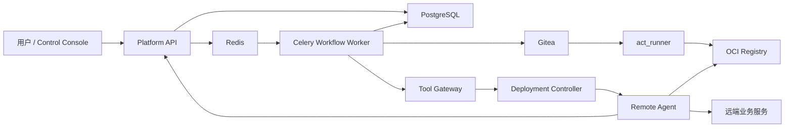

# M7 CI/CD 与远端部署闭环细化设计

> 状态：M7-0 实施前设计基线
> 适用版本：`0.5.1` 基线，M7 完成目标 `0.6.0`
> 适用环境：本地 Windows 控制平面 + 本地 Gitea/CI/registry + 远端 Linux
> staging/demo
> 非完成声明：本文只锁定实现契约；没有对应生产代码、测试和真实远端 E2E 时，
> 不得把 M7 写成已交付。

## 1. 目标与边界

M7 把 M6 的本地等价 PullRequestRecord 和精确 commit 转换为真实 CI 制品，再由
Release / Deploy Agent 在两道人工审批后通过 Tool Gateway、Deployment
Controller 和 Remote Agent 部署到远端 staging/demo。

固定终点：

```text
M6 PullRequestCreated
  -> release candidate approval
  -> 受控 Gitea ref
  -> workflow_dispatch
  -> CI test/security/build/artifact
  -> immutable OCI digest
  -> ReleasePlan
  -> deployment approval
  -> Remote Agent deployment
  -> health verification
  -> MonitoringRegistered
  -> Task.current_phase = Monitoring
```

M7 不包含：

- production、Kubernetes、自动回滚和任意远端 shell。
- CI workflow 内执行 SSH、Compose 上线、服务重启或部署 webhook。
- M8 的 Prometheus/Loki/Alertmanager、告警分析和 SRE 闭环。
- 交互式终端、远程桌面、文件传输和任意主机注册。

M7 只提供 Remote Agent 的受限直读日志与固定 diagnostics；M8 再提供 Loki
集中检索、指标和告警。

## 2. 不可变设计决策

### 2.1 部署执行者

真实部署的唯一链路是：

```text
Release / Deploy Agent
  -> Tool Gateway
  -> Deploy Tool
  -> Deployment Controller
  -> Remote Agent
```

- CI 只生成测试、安全、SBOM、镜像扫描、镜像和 manifest。
- SSH 只用于人工安装和审批后的固定只读诊断，不作为部署执行器。
- Deployment Controller 不写 Platform 数据库，不生成业务审批。
- Remote Agent 只执行已经通过 Platform API、Tool Gateway 和 Approval 的
  固定部署请求。

### 2.2 两道审批

#### Release candidate approval

绑定：

- Task、Project、最新版 PullRequestRecord。
- 受控 repository binding。
- 完整 commit SHA。
- 目标 release ref。
- request hash。

审批通过前禁止 push 和 CI dispatch。

#### Deployment approval

绑定：

- release candidate、CIRun 和 CI manifest。
- commit SHA、OCI repository、index/manifest digest。
- Environment、RemoteTarget。
- ReleasePlan 和 `release_plan_sha256`。
- request hash。

审批通过前禁止 Remote Agent 副作用。审批只记录决策；实际执行由后续
`run-next` 创建或恢复 ToolCall，并交给 workflow worker。

Coder、Scaffold、提交代码的 AgentRun、创建 PullRequestRecord 的 AgentRun
不得批准上述任一请求。

### 2.3 CI 单一触发源

- Gitea workflow 不监听 push。
- Git Tool 先把精确 commit 推送到服务端生成的 candidate ref。
- Platform API 再使用固定 workflow id、精确 ref 和结构化 inputs 调用
  `workflow_dispatch`。
- `publish_release_candidate` 和 `trigger_ci` 是两个独立步骤。
- delivery id 只标识 webhook delivery attempt；业务幂等还要绑定 repository、
  run/job id、action/status、head SHA 和 provider updated time。

### 2.4 镜像身份

必须区分：

- OCI index digest：多平台索引身份。
- platform manifest digest：目标 Linux 平台 manifest 身份。
- image config digest / local image id：本地运行时配置身份。

审批、ReleasePlan 和 Deployment 使用 registry index/manifest digest。Remote
Agent 在 `pull` 后通过 registry 结果、`RepoDigests` 和目标平台信息复核，不以
容器 `.Image`、本地 image id、tag 或日志文本替代 digest。

### 2.5 回滚

M7 只保存：

- 上一个健康 release。
- rollback candidate。
- rollback plan/request。

M7 不自动执行回滚。后续若实现回滚执行，必须再次形成 L3 审批和独立
Deployment。

## 3. 部署拓扑



隔离要求：

- Gitea、act_runner、registry 和控制平面可在本地 Docker Compose 中运行，但
  runner 不与 Remote Agent 共用 Docker socket 或权限边界。
- runner 固定 patch 版本或镜像 digest，不使用 `latest`/`nightly`。
- 远端 Linux 主机只用于 staging/demo，Remote Agent 由 systemd 管理。
- registry credential、Gitea token、machine credential 和 SSH key 均由受控
  credential store/file 提供，不进入 Git 或 API。

## 4. 模块职责

### 4.1 Platform API

- 管理 Environment、RemoteTarget、RepositoryBinding。
- 持久化 ReleaseCandidate、CIRun、WorkflowJob、Deployment、ServiceInstance。
- 校验 machine heartbeat 和 Gitea webhook。
- 创建审批、事件和 Artifact。
- 只在短事务中 claim/写终态，不在数据库锁内等待外部系统。

### 4.2 Workflow Engine

采用 Redis + Celery：

- Celery task payload 只包含 `workflow_job_id`。
- PostgreSQL WorkflowJob 是业务权威。
- worker 负责 claim、lease heartbeat、stale reclaim 和调用 provider/service。
- 未知远端状态进入 `recovery_required`，不盲目重放。

### 4.3 Tool Gateway

- 固定工具 schema、角色 allowlist、risk、approval 和 audit。
- 高风险 Deploy ToolCall 首次只进入 `waiting_approval`。
- 审批后并发恢复只允许一个执行者。
- Tool Gateway 不接受任意 URL、host、credential、Compose 或 command。

### 4.4 Release / Deploy Agent

- 读取服务端派生的 PR、CI、Environment、Target 和健康 release。
- 生成严格 ReleasePlan。
- 校验 commit/digest 全链一致。
- 通过 ToolCall 请求受控 CI、Deploy 和 Remote 工具。
- 不直接调用 Git、HTTP、Docker、SSH 或文件系统。

### 4.5 Deployment Controller

- 验证 ReleasePlan。
- 使用 StrictUndefined 从受控模板渲染 Compose。
- 固定 `image@sha256:...` 和 manifest hash。
- 调用服务端记录的 Remote Agent endpoint。
- 轮询同一 idempotency operation，返回 DeploymentResult。
- 不写 Platform 数据库，不直接 SSH。

### 4.6 Remote Agent

- 暴露 health、version、capabilities、deployment operation、service status、
  受限日志和 diagnostics。
- 使用 SQLite operation store 保证重启后可查询。
- 只操作受控 project/release 根目录。
- 执行 Compose policy、pull、digest 验证、up、ps 和 HTTP health。
- 不提供自由 shell、任意 Compose、任意路径和交互终端。

## 5. 权威数据身份

### 5.1 ProjectRepositoryBinding

每个 Project 最多一个 active binding：

- provider 固定为 `gitea`。
- `profile_key` 引用服务端配置。
- repository id/owner/name、clone URL、default branch。
- credential ref、workflow id、release ref prefix。

API 只接受 profile key。credential ref 不进入读取响应，clone URL 和 workflow
配置不能由普通调用方自由提交。

### 5.2 ReleaseCandidate

ReleaseCandidate 是 M6 PR 与真实远端 CI 之间的持久化身份：

- Task、Project、PullRequestRecord、repository binding。
- commit SHA、target ref、request hash。
- pending_approval/approved/published/stale/cancelled。
- approval、remote verified SHA、idempotency key。

published 只有在 `git ls-remote --refs` 返回的完整 SHA 与本地 commit 完全一致
后成立。

### 5.3 CIRun

- provider、external run id、repository、source ref、commit。
- PullRequestRecord、ReleaseCandidate、Task、Project。
- workflow revision、status、started/finished time。
- artifact manifest Artifact。
- event action/status、provider updated time、head SHA。
- provider/run id 和 Task/idempotency key 唯一。

### 5.4 WorkflowJob

字段至少包含：

- job type、resource type/id。
- request hash、idempotency key。
- pending/claimed/running/succeeded/failed/cancel_requested/
  recovery_required。
- attempt、max attempts。
- lease owner、lease expiry、heartbeat。
- next retry、cancel requested。
- safe payload/result JSON、error code、started/finished time。

Celery task id 不是业务身份。

### 5.5 Environment

- Project、name、staging/demo type。
- active/disabled/degraded status。
- base URL、env profile ref。
- Project/name 唯一。

### 5.6 RemoteTarget

- Environment、display name、target type。
- agent id、服务端 endpoint、credential ref、TLS fingerprint。
- status、agent version、capabilities、last heartbeat/error。
- Environment/agent id 唯一。

读取响应不返回 credential ref，endpoint 只返回脱敏展示值。

### 5.7 Deployment

- Task、Project、Environment、RemoteTarget、CIRun。
- ReleasePlan Artifact、Approval。
- release version、commit、image ref/digest、request hash。
- remote operation id、status、health summary、failure、rollback candidate。
- requested/approved/dispatched actor。
- Task/idempotency key、Environment/release version 唯一。

### 5.8 ServiceInstance

- Deployment、Environment、RemoteTarget。
- service name、Compose project。
- runtime type/ref、status、health URL/result。
- Deployment/service name 唯一。

## 6. 状态机

```text
PullRequestCreated
  -> WaitingMergeApproval
  -> CIValidating
  -> ReleasePlanning
  -> WaitingDeployApproval
  -> Deploying
  -> VerifyingDeployment
  -> Monitoring
```

next action：

```text
request_release_candidate_approval
publish_release_candidate
trigger_ci
poll_ci
run_release_agent
request_deployment_approval
execute_deployment
verify_deployment
complete_m7_handoff
```

规则：

- 每次 start/run-next 只推进一个可审计动作。
- `start` 只创建 release candidate approval。
- CI 由 webhook/poll 更新，不在 HTTP 请求内长时间等待。
- deploy approval 前没有远端副作用。
- deploy dispatch 前再次读取 Task、Approval、CI、Deployment 和 Target。
- 健康成功写 `MonitoringRegistered`，Task 进入 Monitoring，不进入 Done。
- dispatch 前 pause/cancel 阻断；dispatch 后只写 cancel requested，并等待
  Remote Agent operation 终态。

## 7. 异步 job 与恢复

### 7.1 Claim

1. API 在短事务创建 WorkflowJob 并投递 Celery。
2. worker 按 job id `FOR UPDATE`。
3. 校验 status、request hash、Task 和资源状态。
4. 写 claimed/running、lease owner/expiry、attempt。
5. 提交事务。
6. 执行外部调用。
7. 新事务写结果、事件、Artifact 和业务资源终态。

### 7.2 Heartbeat

- worker 周期更新 job heartbeat/lease。
- Remote Agent 独立更新 target heartbeat。
- 两类 heartbeat 不混用。

### 7.3 Stale reclaim

- 只处理 lease 已过期且状态 active 的 job。
- 查询 Gitea run 或 Remote Agent operation。
- 已有远端结果则收敛本地状态。
- 明确未执行且满足幂等条件才重新投递。
- 状态未知则 `recovery_required`，需要人工核验。

### 7.4 Celery 配置

- `acks_late=true`。
- 有界 worker prefetch。
- 显式 soft/hard time limit。
- broker payload 不含 secret 或大对象。
- retry 只用于纯查询或已完成远端状态查询后的安全恢复。

## 8. CI 与制品

固定 workflow：

- `uv lock --check`。
- pytest + JUnit。
- Bandit。
- pip-audit。
- Buildx build/push。
- image scan。
- SBOM/provenance。
- CI manifest。

workflow 静态检查拒绝：

- SSH/SCP。
- `docker compose up` 到远端。
- Remote Agent 或 Deployment API。
- 服务重启和任意 deploy webhook。

CI manifest 至少保存：

- provider、repository、run/job id。
- workflow revision、ref、commit。
- test/security/build 状态。
- index digest、目标平台 manifest digest。
- JUnit、安全、SBOM、scan Artifact 和 SHA-256。
- started/finished time。

任何门禁失败时不产生可部署 manifest。

## 9. Machine authentication 与 heartbeat

Machine credential 绑定：

- RemoteTarget。
- agent id。
- key id。
- capability scope。
- expires/revoked time。

请求签名覆盖：

```text
method
path
timestamp
nonce
body_sha256
```

Platform API：

- 限制时间偏差。
- 常量时间比较签名。
- 持久化或唯一约束 replay identity。
- 拒绝跨 target、过期、撤销和重复 nonce。
- 允许新旧 key 短期重叠轮换。
- API、EventLog 和日志只返回 fingerprint。

Heartbeat 更新：

- agent version。
- capabilities。
- current time。
- 可选 service summary。

首次上线、offline、恢复和错误状态变化写 EventLog；普通高频 heartbeat 只更新
时间戳，按间隔降频记录。

## 10. Remote Agent 部署步骤

1. 验证 machine/deployment request。
2. 校验 idempotency key + request hash。
3. 读取或创建 SQLite operation。
4. 校验受控 project/release 路径。
5. 从 credential store/_FILE 读取 registry credential。
6. 渲染或接收 Controller 签名/哈希绑定的 manifest。
7. `docker compose config`。
8. 对规范化 Compose 执行 policy：
   - 无 privileged。
   - 无 host network/PID/IPC。
   - 无 Docker socket。
   - 无任意 device/危险 capability。
   - 无受控根外 bind mount。
   - 只有批准 digest。
9. `docker compose pull`。
10. 验证 registry/RepoDigests/平台 manifest。
11. `docker compose up -d --wait --wait-timeout ...`。
12. `docker compose ps` 和容器资源 inspect。
13. 独立 HTTP `/health`。
14. 写 operation、release metadata、health 和 rollback candidate。

失败时保留诊断，不删除命名卷，不自动回滚。

## 11. HTTP/TLS 与凭据

- HTTPX client 使用受控 CA、hostname verification、四类 timeout、limits、
  `trust_env=False`。
- 默认不跟随 redirect；确需 redirect 时只允许同源/allowlist。
- endpoint 来自 RemoteTarget 服务端记录。
- systemd secret 优先使用 `LoadCredential=`/`LoadCredentialEncrypted=` 或 `_FILE`。
- `EnvironmentFile` 只保存非敏感配置。
- Remote Agent unit 使用专用用户、`UMask=0077`、`PrivateTmp=true`、
  `NoNewPrivileges=true`、`ProtectSystem=strict` 和精确 `ReadWritePaths`。

## 12. SSH 诊断

SSH 只允许固定 profile：

- docker_ps。
- compose_ps。
- disk_usage。
- systemd_status。

客户端：

- StrictHostKeyChecking。
- 专用 known_hosts。
- IdentitiesOnly、BatchMode、`-T`、ClearAllForwardings。

服务端：

- `authorized_keys restrict`。
- forced command wrapper。
- 禁 PTY、agent/X11/TCP forwarding 和 user rc。
- 特权诊断使用 root-owned wrapper 与精确 sudoers。

加入 docker group 的账号是 root 级权限边界，不描述为普通只读账号。

## 13. API 边界

最小 API：

```text
PUT  /api/projects/{project_id}/repository-binding
GET  /api/projects/{project_id}/repository-binding

POST /api/projects/{project_id}/environments
GET  /api/projects/{project_id}/environments
GET  /api/environments/{environment_id}

POST /api/environments/{environment_id}/remote-targets
GET  /api/environments/{environment_id}/remote-targets
POST /api/remote-targets/{target_id}/test-connection

POST /api/remote-agents/heartbeat
```

发布 API：

```text
GET  /api/tasks/{task_id}/release-candidate
GET  /api/tasks/{task_id}/ci-runs
GET  /api/ci-runs/{ci_run_id}
POST /api/webhooks/ci/gitea

GET  /api/tasks/{task_id}/remote-deployment
POST /api/tasks/{task_id}/remote-deployment/start
POST /api/tasks/{task_id}/remote-deployment/run-next

GET  /api/projects/{project_id}/deployments
GET  /api/deployments/{deployment_id}
POST /api/deployments/{deployment_id}/health-check
POST /api/deployments/{deployment_id}/rollback-request
```

服务与日志 API：

```text
GET  /api/environments/{environment_id}/services
GET  /api/services/{service_id}/status
GET  /api/services/{service_id}/logs
GET  /api/services/{service_id}/logs/stream
POST /api/services/{service_id}/collect-diagnostics
```

请求方不得提交：

- commit、image ref/digest、RemoteTarget endpoint。
- token、SSH key、credential、env 内容。
- arbitrary URL、workflow path、refspec、Compose、path 或 command。

`remote-deployment/start` 只接受 `environment_id`，其他资源由服务端派生。

## 14. Event 与 SSE

M7 事件至少包括：

- RepositoryBindingConfigured。
- EnvironmentCreated。
- RemoteTargetRegistered。
- RemoteAgentHeartbeat / Online / Offline。
- ReleaseCandidateApprovalRequested / Approved / Rejected / Published。
- CIRunTriggered / Started / Passed / Failed。
- CIArtifactPublished。
- ReleasePlanCreated。
- DeploymentApprovalRequested。
- DeploymentRequested / Started / StepUpdated / Healthy / Unhealthy / Failed。
- ServiceInstanceRegistered。
- ProjectServiceStatusChanged。
- MonitoringRegistered。

SSE 使用数据库 EventLog tailing：

- 支持 `Last-Event-ID`。
- 连接建立后新增事件必须实时到达。
- 断线重连去重。
- 高频 heartbeat 降频。
- payload 不含 secret、完整 endpoint、credential 或原始远端日志。

## 15. 风险等级

|工具|风险|审批|
|---|---:|---|
|ci.trigger_workflow|L2|否|
|ci.get_workflow_status|L0|否|
|ci.get_job_logs|L0|否|
|ci.get_artifact_manifest|L0|否|
|ci.rerun_failed_job|L2|否，仅失败固定 job|
|deploy.render_manifest|L1|否|
|deploy.deploy_staging|L3|是|
|deploy.get_release_status|L0|否|
|deploy.health_check|L0|否|
|deploy.rollback_request|L3|是，仅生成请求|
|remote.list_targets|L0|否|
|remote.service_status|L0|否|
|remote.stream_logs|L0|否|
|remote.collect_diagnostics|L0|否，仅固定 profile|
|remote.ssh_exec_readonly|L1|是，且目标显式启用|

## 16. 失败与恢复

|失败|处理|
|---|---|
|release approval 拒绝/过期|不 push、不触发 CI|
|远端 ref 不匹配|candidate stale，禁止 dispatch|
|CI failed|Task 暂停在 CIValidating，保存报告|
|manifest commit/digest 不匹配|禁止 ReleasePlan|
|deploy approval stale|禁止恢复 ToolCall|
|Remote Agent offline|部署阻塞；可审批 SSH 诊断，不切换 SSH 部署|
|dispatch timeout|查询相同 operation，不盲目重发|
|worker hard crash|lease 过期后查询远端状态并收敛或 recovery_required|
|Compose policy 拒绝|远端无副作用，保存失败证据|
|health failed|Deployment unhealthy，保存 rollback candidate|

## 17. 验收矩阵

### 17.1 黑盒

- Environment 只接受 staging/demo，重复 name 冲突。
- RemoteTarget 响应隐藏 credential 和完整 endpoint。
- machine heartbeat 正常、跨 target、过期、撤销、重放。
- online/offline/recovery 事件正确。
- release candidate approval 前无 push/CI。
- 同一 candidate 只触发一个有效 CI run。
- CI workflow 无部署命令。
- digest/commit 全链一致。
- deployment approval 前远端无变化。
- 审批通过并显式推进后只执行一次 operation。
- Remote Agent restart 后可查询旧 operation。
- 健康成功后 Task 进入 Monitoring。
- 受限日志满足时间、行数和字节上限。

### 17.2 白盒

- migration upgrade/downgrade/check。
- repository 归属、唯一约束、分页。
- WorkflowJob claim、lease、heartbeat、stale reclaim。
- Approval request hash、expires、consumed、实现者自批拒绝。
- webhook 签名、空签名、delivery 和 run/job 幂等。
- ReleasePlan 严格 schema 和 secret 检测。
- Tool risk/approval/resume 并发。
- Compose StrictUndefined 和危险配置拒绝。
- Remote Agent path/symlink/operation SQLite。
- HTTPX TLS、timeout、redirect 和 response size。
- SSE 建连后新事件、重连和去重。

### 17.3 真实 E2E

- 一次真实 Gitea workflow dispatch。
- 精确 commit 的 test/security/build/artifact。
- registry immutable digest。
- 一台真实 Linux staging/demo 主机。
- systemd Remote Agent、心跳、Compose deployment。
- `/health` 成功、ServiceInstance 正确。
- 控制台展示完整 timeline。
- 清理临时 runner、容器、release 和凭据。

## 18. 实施切片

### M7-0：设计与资料

- 本文和总体设计书/API/Data/Workflow/Testing 同步。
- 官方资料纠错并提交。
- 不勾选生产能力。

### M7-1：Environment / RemoteTarget / heartbeat

- migration、repository、service、API。
- machine auth、online/offline/recovery。
- Remote Agent 最小 health/version/capabilities。
- OpenAPI/schema/pytest。

### M7-2：Repository binding / candidate / workflow jobs

- 受控 profile。
- 两道审批基础。
- Celery + Redis worker 与 lease。

### M7-3：Gitea CI 与不可变制品

- CI infra、provider、webhook、manifest。

### M7-4：Remote Agent / Controller / Tool / Agent

- 真实部署能力和审批恢复。

### M7-5：Orchestrator / Console / E2E

- Task 到 Monitoring 的完整闭环。

每个切片必须独立测试、记录进度、提交并推送功能分支。
