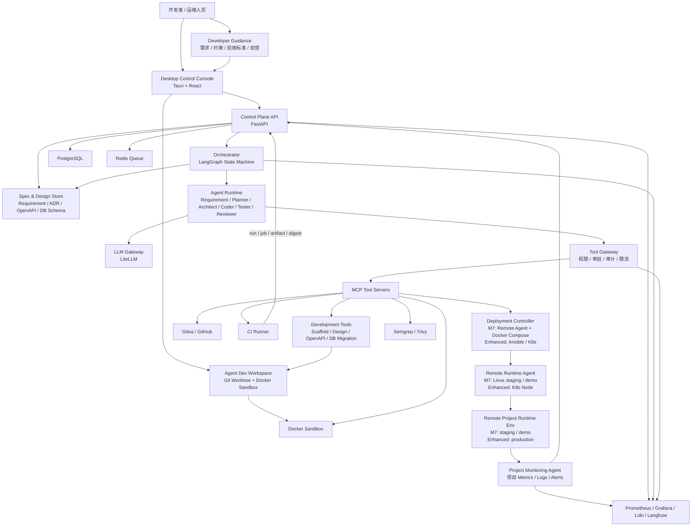
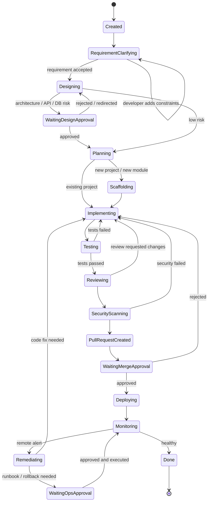
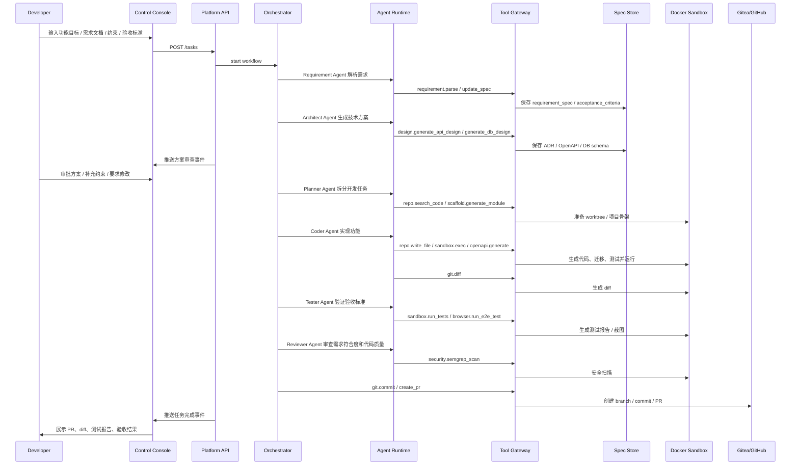
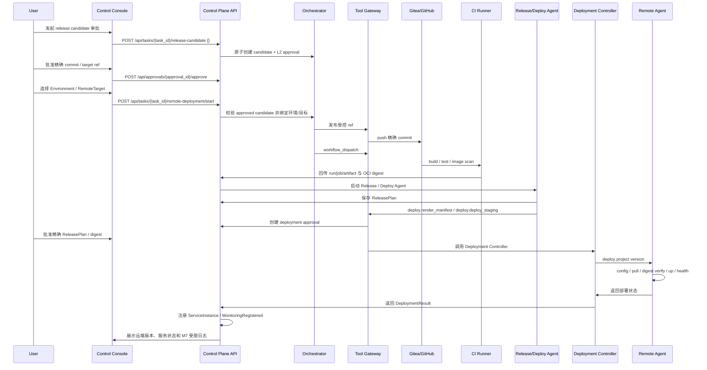

# 云舵 CloudHelm 毕设设计书

> 版本：v0.1  
> 日期：2026-07-07  
> 关键词：云舵、CloudHelm、AI Agent、MCP、Tool Gateway、本地开发、Agent 化远程部署、远程控制、云端部署、CI 构建流水线、实时监控、自动运维、人机协同、安全审计、桌面控制台

---

## 1. 项目名称

**云舵 CloudHelm：面向本地开发、Agent 执行远程部署与实时运维的多 Agent DevOps 平台**

简称：

**CloudHelm / 云舵**

推荐论文题目：

> **云舵：面向本地开发、Agent 执行远程部署与实时运维的多 Agent DevOps 平台设计与实现**

### 1.1 命名含义

“云舵”中的“云”代表远端服务器、云端部署环境和远程运行的业务项目；“舵”代表控制、调度、接管、审批、回滚和运维决策。整个名称强调：开发者在本地控制台中像驾驶员一样掌舵，通过 Agent、工具系统和远程控制平面，由 Release / Deploy Agent 把本地隔离环境中完成的软件开发结果安全地部署到远端环境，并持续监控和运维远端业务项目。

英文名 **CloudHelm** 中的 “Helm” 有“船舵、掌舵”的含义，同时也与 Kubernetes 生态中的 Helm 形成技术联想，适合表达本项目“本地控制、Agent 执行远端部署、持续运维”的系统定位。

---

## 2. 项目定位

本项目不是一个简单的聊天机器人，也不是“多个 Agent 互相聊天写代码”的演示系统，而是一个面向真实软件工程流程的 **本地开发、Agent 执行远程部署、实时监控与自动运维平台**。

系统的核心目标是打通三类场景：

1. **本地 Agent 开发**：开发者不是直接手写代码，而是在本机通过桌面控制台向 Agents 提出产品目标、功能需求、技术约束、验收标准和修改意见；Agents 在本地 Git worktree 与 Docker sandbox 中完成需求分析、架构设计、代码生成、测试、重构、文档和 PR。
2. **Agent 执行远程部署**：代码通过 Git / CI 生成可追踪产物后，由 Release / Deploy Agent 在 release candidate 与 deployment 两道审批通过后，经 Tool Gateway 调用 Deploy Tool、Deployment Controller 与 Remote Agent，把业务项目部署到 M7 的远程 Linux staging / demo；Kubernetes 集群属于增强版。CI / CD 只为 Agent 部署闭环提供构建、测试、安全扫描和制品交付能力，不执行部署。
3. **实时监控运维**：运维对象是 **已经由 Agent 部署到远端环境的业务项目**，包括该项目的进程、容器、服务、日志、指标、告警、发布版本和运行健康状态；这些数据实时回传到控制台，由 SRE Agent / Release Agent 进行分析、建议修复或触发审批。

系统目标是把软件生产过程抽象成一条可审计、可暂停、可回滚、可人工接管的自治流水线：

```text
Observe -> Plan -> Implement -> Verify -> Review -> Deploy -> Monitor -> Remediate -> Learn
```

毕设阶段不追求完整的 7×24 生产级全自动运维，而是实现一个可落地的 MVP：

```text
功能需求 / 迭代目标 / Issue / 告警输入
    -> Orchestrator 拆解任务
    -> Planner / Architect Agents 生成开发方案
    -> Coder / Tester / Reviewer Agents 在 Docker Sandbox 中实现功能
    -> 自动运行测试 / 安全扫描
    -> 生成 Git branch / commit / PR
    -> Reviewer Agent 审查
    -> 人类在桌面控制台 Approve / Reject / Pause / Takeover
    -> CI 构建镜像 / 制品
    -> Release / Deploy Agent 经 release candidate 与 deployment 两道审批后执行远程 staging / demo 部署
    -> 远程监控 Agent 实时采集该业务项目的日志、指标和告警
    -> 全流程事件审计
```

---

## 3. 设计目标

### 3.1 功能目标

1. 支持开发者通过自然语言、需求文档、Issue、截图或接口说明指导 Agents 进行软件开发，而不是要求开发者直接编码。
2. 支持完整开发类任务，而不局限于修复类任务：
   - 从 0 创建项目骨架。
   - 实现新功能。
   - 修改已有功能。
   - 设计 API。
   - 设计数据库表和迁移脚本。
   - 开发前端页面。
   - 开发后端接口。
   - 集成第三方服务。
   - 重构模块。
   - 生成测试用例。
   - 生成技术文档。
   - 修复 bug。
   - 处理 CI 失败。
   - 分析远端业务项目告警。
3. 支持开发者对 Agent 开发过程进行持续指导：
   - 补充需求。
   - 修改验收标准。
   - 约束技术栈。
   - 指定代码风格。
   - 要求重做方案。
   - 审批或拒绝架构方案。
   - 对 diff 提出修改意见。
   - 在必要时人工接管。
4. 支持多 Agent 分工协作：
   - Requirement Agent：澄清需求、提取验收标准、生成任务说明。
   - Planner Agent：任务拆解、迭代计划和风险评估。
   - Architect Agent：模块划分、接口设计、数据模型设计和技术方案评审。
   - Coder Agent：根据需求和方案进行代码实现。
   - Tester Agent：生成测试、运行测试、分析失败原因。
   - Reviewer Agent：代码审查、需求符合度检查、可维护性检查。
   - Security Agent：安全扫描与风险提示。
    - Release / Deploy Agent：生成发布计划，在 release candidate 与 deployment 两道审批通过后执行远端部署，检查发布健康状态并生成回滚候选。
   - SRE Agent：分析远端已部署业务项目的运行问题。
5. 支持 Agent 调用工具，而不是只输出文本。
6. 所有工具调用必须经过统一 Tool Gateway。
7. 支持 Docker Sandbox 隔离执行命令和修改代码。
8. 支持 Git 分支、commit、diff、PR 工作流。
9. 支持远程部署目标管理；M7 仅包含远程 Linux 主机上的 staging / demo，Kubernetes 集群和 production 属于增强版。
10. 支持远程控制能力；M7 仅包含远程服务状态、受限日志、部署状态和固定只读诊断，任意远程命令与人工终端接管属于增强版。
11. 支持实时监控运维，包括指标、日志、告警、发布状态、错误率、延迟和资源使用率。
12. 支持人类审批、暂停、接管、拒绝和回滚。
13. 支持事件日志、审计日志、Agent 运行轨迹和成本统计。
14. 支持桌面端控制台，体验参考 Codex App：
   - 项目 / 任务线程。
   - 内嵌终端。
   - diff 查看。
   - 测试报告。
   - 远程环境状态。
   - 实时监控面板。
   - 工具调用记录。
   - 审批按钮。

### 3.2 非功能目标

1. **安全性**：Agent 默认无生产权限，高风险操作必须审批。
2. **可观测性**：记录每次 Agent 决策、工具调用、命令输出和测试结果。
3. **可恢复性**：任务状态可持久化，失败后可重试或人工接管。
4. **远程可控性**：远程部署和运维动作必须可追踪、可中断、可审批、可回放。
5. **云端适配性**：部署目标可以是单台云服务器，也可以扩展到 Kubernetes / GitOps。
6. **可扩展性**：工具通过 MCP / Tool Server 扩展。
7. **可替换性**：模型通过 LiteLLM 接入，支持 OpenAI、Claude、本地模型等。
8. **可演示性**：毕设答辩时可以完整演示“开发者指导 Agents 实现功能 -> 本地 sandbox 验证 -> PR -> Release / Deploy Agent 执行远程部署 -> 实时监控 -> 运维反馈”的闭环。

---

## 4. 参考开源项目与借鉴点

以下项目用于技术调研和架构参考，不要求全部集成。

### 4.1 Agent 与自治软件工程

|项目|地址|借鉴点|
|---|---|---|
|OpenHands|[github.com/OpenHands/openhands](https://github.com/OpenHands/openhands)|自托管 coding agent 控制中心，参考任务执行、浏览器、终端、文件操作、运行时隔离等设计|
|Open SWE|[github.com/langchain-ai/open-swe](https://github.com/langchain-ai/open-swe)|异步软件工程 Agent，参考 GitHub issue 触发、sandbox、自动 PR、多任务并行|
|SWE-agent|[github.com/SWE-agent/SWE-agent](https://github.com/SWE-agent/SWE-agent)|面向真实 GitHub issue 的修复 Agent，参考软件工程 benchmark 和命令执行循环|
|SWE-ReX|[github.com/SWE-agent/swe-rex](https://github.com/SWE-agent/swe-rex)|远程执行与 sandbox shell 框架，参考本地 / Docker / 云端执行环境抽象|
|Aider|[github.com/aider-ai/aider](https://github.com/aider-ai/aider)|参考终端内 AI pair programming 与 Git diff 工作流|
|PR-Agent|[github.com/The-PR-Agent/pr-agent](https://github.com/The-PR-Agent/pr-agent)|参考自动 PR 描述、PR review、代码建议生成|

### 4.2 Codex 风格桌面端参考

|项目 / 文档|地址|借鉴点|
|---|---|---|
|Codex App 官方文档|[developers.openai.com/codex/app](https://developers.openai.com/codex/app)|参考桌面端项目线程、并行任务、worktree、终端、Git 工作流、自动化任务等交互模式|
|Codex CLI|[github.com/openai/codex](https://github.com/openai/codex)|参考本地 coding agent 的权限、文件系统、shell、MCP、Git 集成方式|

本项目不复制 Codex，而是实现一个面向毕设场景的 **Codex-like DevOps Control Console**。

### 4.3 工具协议与工具生态

|项目|地址|借鉴点|
|---|---|---|
|Model Context Protocol|[modelcontextprotocol.io](https://modelcontextprotocol.io/)|作为 Agent 调用工具的标准协议|
|MCP Python SDK|[github.com/modelcontextprotocol/python-sdk](https://github.com/modelcontextprotocol/python-sdk)|开发 MCP Server / MCP Client|
|MCP Servers|[github.com/modelcontextprotocol/servers](https://github.com/modelcontextprotocol/servers)|参考文件系统、GitHub、数据库等工具服务形态|
|FastMCP|[github.com/jlowin/fastmcp](https://github.com/jlowin/fastmcp)|快速开发 Python MCP 工具服务|
|GitHub MCP Server|[github.com/github/github-mcp-server](https://github.com/github/github-mcp-server)|参考 Issue、PR、仓库、Actions 等 GitHub 工具能力|
|Playwright MCP|[github.com/microsoft/playwright-mcp](https://github.com/microsoft/playwright-mcp)|参考浏览器自动化工具接入|

### 4.4 编排、模型与观测

|项目|地址|借鉴点|
|---|---|---|
|LangGraph|[github.com/langchain-ai/langgraph](https://github.com/langchain-ai/langgraph)|有状态 Agent 工作流、human-in-the-loop、任务恢复|
|LiteLLM|[github.com/BerriAI/litellm](https://github.com/BerriAI/litellm)|统一模型网关，支持多模型供应商|
|Langfuse|[github.com/langfuse/langfuse](https://github.com/langfuse/langfuse)|LLM tracing、prompt、cost、eval 管理|
|OpenTelemetry|[opentelemetry.io](https://opentelemetry.io/)|日志、指标、trace 统一采集|

### 4.5 DevOps、安全与自动化

|项目|地址|借鉴点|
|---|---|---|
|Gitea|[about.gitea.com](https://about.gitea.com/)|自托管 Git 服务，适合毕设本地部署|
|Argo CD|[github.com/argoproj/argo-cd](https://github.com/argoproj/argo-cd)|GitOps 持续部署参考|
|Prometheus|[prometheus.io](https://prometheus.io/)|指标采集与告警|
|Grafana|[github.com/grafana/grafana](https://github.com/grafana/grafana)|观测面板|
|Loki|[grafana.com/oss/loki](https://grafana.com/oss/loki/)|日志聚合|
|Semgrep|[github.com/semgrep/semgrep](https://github.com/semgrep/semgrep)|SAST 静态安全扫描|
|Trivy|[github.com/aquasecurity/trivy](https://github.com/aquasecurity/trivy)|依赖、容器、文件系统漏洞扫描|
|OPA|[github.com/open-policy-agent/opa](https://github.com/open-policy-agent/opa)|Policy-as-Code 权限控制|
|OpenBao|[openbao.org](https://openbao.org/)|密钥管理，作为 Vault 开源替代参考|
|n8n|[github.com/n8n-io/n8n](https://github.com/n8n-io/n8n)|可视化工作流与 human-in-the-loop 参考|
|StackStorm|[github.com/StackStorm/st2](https://github.com/StackStorm/st2)|事件驱动运维自动化与 runbook 参考|

### 4.6 远程控制与远程部署参考

|项目|地址|借鉴点|
|---|---|---|
|Ansible|[github.com/ansible/ansible](https://github.com/ansible/ansible)|基于 SSH 的远程部署、配置管理、批量命令执行|
|Rundeck|[github.com/rundeck/rundeck](https://github.com/rundeck/rundeck)|参考远端作业的审批、受控执行、执行记录和回滚脚本管理，用于设计 Agent 经审批后执行部署动作|
|Windmill|[github.com/windmill-labs/windmill](https://github.com/windmill-labs/windmill)|参考把脚本封装为可审批、可审计的自动化动作，辅助设计 Deploy Tool / Runbook Tool|
|Kestra|[github.com/kestra-io/kestra](https://github.com/kestra-io/kestra)|参考事件驱动工作流和远端任务编排，辅助设计 Release / Deploy Agent 的部署流程|
|Apache Guacamole|[github.com/apache/guacamole-client](https://github.com/apache/guacamole-client)|无客户端远程桌面 / SSH / RDP / VNC 网关，参考远程会话管理|
|MeshCentral|[github.com/Ylianst/MeshCentral](https://github.com/Ylianst/MeshCentral)|开源远程设备管理，参考 agent 心跳、远程终端、远程文件和设备状态|
|Teleport|[github.com/gravitational/teleport](https://github.com/gravitational/teleport)|基础设施访问平台，参考 SSH / Kubernetes / Database 访问审计和权限控制|
|Terraform / OpenTofu|[github.com/opentofu/opentofu](https://github.com/opentofu/opentofu)|云资源声明式管理，后续扩展云主机、网络、Kubernetes 集群创建|

本项目的远程部署不是“CI/CD 独立把代码推到远端”，而是参考上述受控远程执行与 Runbook 系统：CI 负责构建、测试和产物交付；Release / Deploy Agent 在 release candidate 与 deployment 两道审批通过后，通过 Tool Gateway、Deploy Tool、Deployment Controller 与 Remote Agent 完成远端部署。

### 4.7 远端业务项目运维参考

本项目的运维对象是远端已经部署的业务项目，因此参考项目应重点覆盖 **远端部署、服务管理、容器管理、应用监控、日志采集、告警、故障处理和回滚**。

|类别|项目|地址|借鉴点|
|---|---|---|---|
|远端容器管理|Portainer|[github.com/portainer/portainer](https://github.com/portainer/portainer)|参考 Docker / Kubernetes 环境可视化管理、容器状态、日志、重启、部署栈管理|
|自托管部署平台|Coolify|[github.com/coollabsio/coolify](https://github.com/coollabsio/coolify)|参考将 Git 仓库部署到远程服务器、服务状态、环境变量、域名、日志的一体化体验|
|自托管部署平台|Dokploy|[github.com/Dokploy/dokploy](https://github.com/Dokploy/dokploy)|参考 Docker Compose / Traefik 风格的远程应用部署与管理|
|自托管 PaaS|CapRover|[github.com/caprover/caprover](https://github.com/caprover/caprover)|参考一键部署、应用管理、域名、SSL、容器运行状态|
|远程主机管理|Cockpit|[github.com/cockpit-project/cockpit](https://github.com/cockpit-project/cockpit)|参考 Linux 主机 Web 管理、服务状态、日志、终端和系统资源查看|
|监控告警|Prometheus Alertmanager|[github.com/prometheus/alertmanager](https://github.com/prometheus/alertmanager)|参考告警分组、静默、路由和通知|
|主机指标|node_exporter|[github.com/prometheus/node_exporter](https://github.com/prometheus/node_exporter)|采集远端主机 CPU、内存、磁盘、网络等指标|
|容器指标|cAdvisor|[github.com/google/cadvisor](https://github.com/google/cadvisor)|采集远端容器资源使用、重启、文件系统和网络指标|
|黑盒探测|blackbox_exporter|[github.com/prometheus/blackbox_exporter](https://github.com/prometheus/blackbox_exporter)|对远端业务项目做 HTTP/TCP/ICMP 健康检查|
|日志采集|Grafana Alloy|[github.com/grafana/alloy](https://github.com/grafana/alloy)|统一采集 metrics、logs、traces，向 Prometheus / Loki / OTLP 发送数据|
|日志采集|Fluent Bit|[github.com/fluent/fluent-bit](https://github.com/fluent/fluent-bit)|轻量日志采集器，适合部署在远端主机或容器节点|
|日志管道|Vector|[github.com/vectordotdev/vector](https://github.com/vectordotdev/vector)|高性能日志 / 指标管道，参考日志解析、过滤、路由|
|可用性监控|Uptime Kuma|[github.com/louislam/uptime-kuma](https://github.com/louislam/uptime-kuma)|参考服务可用性监控、状态页、通知和探测配置|
|错误追踪|Sentry|[github.com/getsentry/sentry](https://github.com/getsentry/sentry)|参考应用异常聚合、release 关联、错误堆栈和影响范围分析|
|链路追踪|OpenTelemetry Collector|[github.com/open-telemetry/opentelemetry-collector](https://github.com/open-telemetry/opentelemetry-collector)|远端业务项目 traces / metrics / logs 的采集和转发|
|Runbook 自动化|Rundeck|[github.com/rundeck/rundeck](https://github.com/rundeck/rundeck)|参考运维任务编排、审批、执行记录、远程命令|
|Runbook 自动化|Kestra|[github.com/kestra-io/kestra](https://github.com/kestra-io/kestra)|参考事件驱动工作流、脚本任务、定时任务和执行记录|
|Runbook 自动化|Windmill|[github.com/windmill-labs/windmill](https://github.com/windmill-labs/windmill)|参考把 Python / Bash / TypeScript 脚本变成可审批、可审计的运维动作|
|安全接入|WireGuard|[github.com/WireGuard/wireguard-tools](https://github.com/WireGuard/wireguard-tools)|用于控制平面与远端部署目标之间的安全网络连接|
|内网接入|Headscale|[github.com/juanfont/headscale](https://github.com/juanfont/headscale)|自托管 Tailscale 控制面，参考远端节点接入和 ACL|

### 4.8 Agent 指导开发与项目生成参考

本项目的“本地开发”不是开发者亲自写代码，而是开发者通过控制台指导 Agents 完成软件开发。因此还需要参考 **需求澄清、项目脚手架、代码生成、AI 编程代理、接口生成、组件开发和规格驱动开发** 相关项目。

|类别|项目|地址|借鉴点|
|---|---|---|---|
|AI 编程 Agent|Continue|[github.com/continuedev/continue](https://github.com/continuedev/continue)|参考 IDE 内 AI 编程助手、上下文选择、模型适配和开发者指导交互|
|AI 编程 Agent|Cline|[github.com/cline/cline](https://github.com/cline/cline)|参考可调用终端、文件、浏览器、MCP 工具的编码 Agent 工作流|
|AI 编程 Agent|Roo Code|[github.com/RooCodeInc/Roo-Code](https://github.com/RooCodeInc/Roo-Code)|参考多模式 AI 编码、工具调用审批、代码修改和任务执行体验|
|AI 编程 Agent|OpenHands|[github.com/OpenHands/openhands](https://github.com/OpenHands/openhands)|参考从任务目标到代码实现、测试、浏览器和终端操作的一体化 Agent 环境|
|AI 编程 Agent|Aider|[github.com/aider-ai/aider](https://github.com/aider-ai/aider)|参考通过 Git diff 驱动的 AI 结对编程和 commit 工作流|
|软件模板 / 脚手架|Backstage Software Templates|[github.com/backstage/backstage](https://github.com/backstage/backstage)|参考从模板创建服务、生成项目骨架、登记服务目录|
|软件模板 / 脚手架|Cookiecutter|[github.com/cookiecutter/cookiecutter](https://github.com/cookiecutter/cookiecutter)|参考基于模板生成项目骨架、配置变量和工程结构|
|软件模板 / 脚手架|Yeoman|[github.com/yeoman/yo](https://github.com/yeoman/yo)|参考通用脚手架生成器和 generator 生态|
|Monorepo / 工程化|Nx|[github.com/nrwl/nx](https://github.com/nrwl/nx)|参考多应用、多包、任务图、构建缓存和工程生成器|
|Monorepo / 工程化|Turborepo|[github.com/vercel/turborepo](https://github.com/vercel/turborepo)|参考前端 / 全栈 monorepo 构建、缓存和任务编排|
|接口生成|OpenAPI Generator|[github.com/OpenAPITools/openapi-generator](https://github.com/OpenAPITools/openapi-generator)|参考从 OpenAPI 规范生成客户端、服务端 stub 和类型定义|
|数据库开发|Prisma|[github.com/prisma/prisma](https://github.com/prisma/prisma)|参考 schema-first 数据模型、迁移和类型安全数据库访问|
|前端组件开发|Storybook|[github.com/storybookjs/storybook](https://github.com/storybookjs/storybook)|参考组件开发、组件文档、交互测试和 UI 验收|
|浏览器测试|Playwright|[github.com/microsoft/playwright](https://github.com/microsoft/playwright)|参考前端功能验收、端到端测试和截图验证|

---

## 5. 总体技术选型

### 5.1 主要技术栈

|模块|技术选型|说明|
|---|---|---|
|桌面端控制台|Tauri + React + TypeScript|轻量桌面端，支持本地文件、终端、系统集成|
|UI 组件|Tailwind CSS + shadcn/ui|快速构建现代化管理台|
|代码编辑 / Diff|Monaco Editor|展示代码、diff、patch|
|终端组件|xterm.js|嵌入式终端输出和接管|
|后端 API|Python + FastAPI|提供任务、审批、事件、Agent 控制 API|
|Agent 编排|LangGraph|实现状态机、多 Agent、human-in-the-loop|
|模型接入|LiteLLM|统一接入 OpenAI、Claude、本地模型等|
|需求规格化|Markdown Spec + JSON Schema + Pydantic|把开发者自然语言目标转为结构化需求、验收标准和任务边界|
|技术设计产物|ADR + OpenAPI + Mermaid + 数据库 schema|让 Architect Agent 输出可审查的架构决策、接口设计和数据模型|
|项目脚手架|Cookiecutter / Backstage Templates / Yeoman|从需求生成项目骨架、模块目录、基础配置和 CI 文件|
|接口生成|OpenAPI Generator|根据 API 规范生成客户端、服务端 stub 和类型定义|
|数据库迁移|Alembic / Prisma Migrate|生成和审查数据库 schema 与 migration|
|前端组件开发|Storybook + Playwright|组件级开发、视觉检查和端到端验收|
|工具协议|MCP|工具标准化调用|
|工具开发|FastMCP / MCP Python SDK|开发自定义 Tool Server|
|任务队列|Redis + Celery / RQ|执行异步 Agent 任务|
|数据库|PostgreSQL|任务、事件、审批、工具调用、审计记录|
|沙箱|Docker Sandbox|隔离代码执行、测试和文件修改|
|Git 服务|Gitea / GitHub API|MVP 推荐 Gitea，便于本地部署演示|
|CI|Gitea Actions / GitHub Actions|跑测试、安全扫描和构建，产出镜像 / artifact；部署动作由 Agent 编排执行|
|远程控制|Remote Agent + 固定 SSH 诊断；WebSocket Terminal 为增强版|M7 只提供服务状态、受限日志和审批后的固定只读诊断；自由命令与人工终端接管不进入 M7|
|Agent 化远程部署|Release / Deploy Agent + Deploy Tool + Deployment Controller + Remote Agent + Docker Compose|M7 由 Agent 在两道审批后通过 Tool Gateway 调用部署工具，并由 Remote Agent 在远端 staging / demo 执行受控 Docker Compose；SSH 只用于审批后的固定只读诊断，Ansible、Kubernetes 与 Argo CD 属于增强版|
|部署目标|M7：远程 Linux 主机；增强版：K8s 集群|M7 只支持 staging / demo，production 属于增强版|
|配置管理|环境变量 + Secret Store + 部署清单|管理远程服务配置、密钥引用和版本|
|远端服务管理|systemd + Docker Engine + Docker Compose|systemd 管理 Remote Agent；M7 业务项目统一以受控 Docker Compose 栈运行|
|远端反向代理|Caddy / Traefik / Nginx Proxy Manager|管理远端业务项目域名、HTTPS、路由和健康检查|
|远端主机指标|node_exporter|采集远端主机 CPU、内存、磁盘、网络|
|远端容器指标|cAdvisor|采集远端业务容器 CPU、内存、网络、重启次数|
|远端日志采集|Grafana Alloy / Fluent Bit / Vector|将业务项目日志采集到 Loki 或其他日志后端|
|远端可用性探测|blackbox_exporter / Uptime Kuma|对远端业务项目 HTTP 接口、端口、页面进行探活|
|远端异常追踪|Sentry|采集业务项目运行时异常、堆栈、release 关联|
|安全扫描|Semgrep + Trivy|代码和依赖安全检查|
|可观测性|OpenTelemetry + Prometheus + Grafana + Loki|系统指标、日志、trace|
|LLM 观测|Langfuse|Agent prompt、trace、token 成本|
|权限策略|OPA / 自研 Policy Engine|工具调用权限和审批规则|
|密钥管理|OpenBao / 本地加密配置|保存 API token 和临时凭据|

### 5.1.1 Agent 指导开发技术选型

为了体现“开发者指导 Agents 进行软件开发”，本地开发链路需要额外引入规格化、设计、脚手架和验收能力。

|阶段|主要技术|产物|说明|
|---|---|---|---|
|需求输入|Markdown / Issue / 表单 / 附件解析|`requirement_spec`|开发者描述目标，Requirement Agent 提取用户故事、约束和验收标准|
|需求澄清|LLM structured output + Pydantic|`clarification_questions` / `acceptance_criteria`|当需求不完整时，Agent 生成澄清问题；需求明确后生成验收标准|
|方案设计|ADR + Mermaid + OpenAPI + DB schema|`technical_design`|Architect Agent 输出模块、接口、数据表、状态机和风险点|
|任务拆分|LangGraph state + JSON task graph|`development_plan`|Planner Agent 把功能拆成可执行 steps，并分配给 Coder / Tester / Reviewer|
|项目生成|Cookiecutter / Backstage Templates / Yeoman|项目骨架、目录、配置文件|支持从 0 创建服务、前端项目、全栈模板或 worker|
|代码实现|Repo Tool + Sandbox Tool + LLM code edit|patch / diff|Coder Agent 在本地 worktree 中完成实现，不直接改远端|
|接口与类型|OpenAPI Generator / TypeScript types|client SDK / server stub|保证前后端接口契约一致|
|数据库变更|Alembic / Prisma Migrate|migration file|数据库 schema 变更必须可审查，可回滚|
|测试验收|pytest / vitest / Playwright / Storybook|test report / screenshot|Tester Agent 自动生成和运行单元测试、集成测试、E2E 测试|
|远端发布|Release / Deploy Agent + Deploy Tool + Deployment Controller + Remote Agent|deployment / release status|CI 只提供构建产物，Release / Deploy Agent 经两道审批后执行部署、健康检查和状态回传|
|人工指导|Control Console approval / comment|approval record / redirect event|开发者可以审批方案、要求重做、补充约束、对 diff 提意见|

### 5.2 MVP 推荐组合

毕设阶段推荐先实现以下组合：

```text
Tauri + React + TypeScript
FastAPI + PostgreSQL + Redis
LangGraph + LiteLLM
MCP + FastMCP
Requirement Spec + ADR + OpenAPI
Cookiecutter / Backstage Templates
OpenAPI Generator + Alembic / Prisma Migrate
pytest / vitest / Playwright / Storybook
Docker Sandbox
Gitea + Gitea Actions
Release / Deploy Agent + Deploy Tool + Deployment Controller + Remote Agent
Docker Compose Deploy + OCI digest + Redis/Celery workflow worker
Semgrep + Trivy
Langfuse
Prometheus + Grafana
```

Kubernetes、Argo CD、OpenBao、StackStorm、Terraform / OpenTofu 可以作为设计扩展，不作为第一阶段强制实现。

### 5.3 远端业务项目运维技术选型

远端业务项目运维能力建议分成三个版本：MVP、增强版、生产扩展版。

#### 5.3.1 MVP 版本

|能力|技术选型|说明|
|---|---|---|
|远端环境|一台 Ubuntu 云服务器 / Linux 虚拟机|作为 staging / demo 环境|
|应用运行方式|Docker Engine + Docker Compose|每个业务项目一个 compose project|
|部署方式|Release / Deploy Agent + Tool Gateway + Deployment Controller + Remote Agent|CI 只交付不可变制品；两道审批后由 Remote Agent 执行 Docker Compose|
|远程控制|Remote Agent + SSH fallback|默认走平台 Remote Agent；Agent 不可用时 SSH 只执行审批后的固定只读诊断，不用于部署|
|远程终端|MVP 排除|M7 不提供 WebSocket/xterm.js 交互终端，后续扩展需单独安全设计|
|服务状态|`docker compose ps` / `systemctl status`|查询业务项目服务运行状态|
|日志|M7 Remote Agent 受限直读；M8 Alloy / Fluent Bit -> Loki|M7 限制时间、行数和字节，M8 再集中检索|
|主机指标|node_exporter -> Prometheus|采集远端主机基础资源|
|容器指标|cAdvisor -> Prometheus|采集业务容器资源和重启状态|
|接口探活|blackbox_exporter / Uptime Kuma|HTTP 健康检查和可用性记录|
|告警|Alertmanager|业务服务不可用、错误率、资源过高、部署失败|
|错误追踪|Sentry，可选|如果示例业务项目是 Web 应用，可接入 Sentry SDK|
|回滚|OCI digest + Compose/ReleasePlan 版本|M7 只记录 rollback candidate/request，不自动执行回滚|

MVP 的核心不是管理很多云资源，而是让开发者指导 Agents 在本地隔离环境中完成业务项目开发，再由 Release / Deploy Agent 基于 CI 产物，经 release candidate 与 deployment 两道人工审批把开发结果完整部署到远端，并对这个远端业务项目做可视化运维。

#### 5.3.2 增强版

|能力|技术选型|说明|
|---|---|---|
|多环境|staging / production / preview env|每个 PR 可以部署 preview，每个 main 分支部署 staging|
|部署平台参考|Coolify / Dokploy / CapRover|参考 Git 到远端容器服务的部署体验|
|容器管理参考|Portainer|参考容器状态、日志、重启、环境变量管理|
|反向代理|Traefik / Caddy|自动路由、HTTPS、蓝绿 / 灰度入口|
|链路追踪|OpenTelemetry Collector + Tempo / Jaeger|采集业务项目请求链路|
|自动 Runbook|Rundeck / StackStorm / Windmill|把重启、清缓存、回滚、扩容封装为可审批动作|
|安全连接|WireGuard / Headscale|控制平面和远端节点之间建立安全网络|

#### 5.3.3 生产扩展版

|能力|技术选型|说明|
|---|---|---|
|集群运行|Kubernetes / K3s|远端业务项目以 Deployment / Service / Ingress 运行|
|GitOps|Argo CD / Flux CD|远端环境只接受 Git 仓库中的部署声明|
|包管理|Helm / Kustomize|管理业务项目部署模板|
|策略控制|OPA / Kyverno|限制危险部署、权限、镜像来源|
|密钥管理|OpenBao / External Secrets Operator|远端环境不保存明文密钥|
|云资源管理|OpenTofu / Terraform|声明式创建云服务器、网络、数据库、集群|

### 5.4 远端业务项目运维数据采集链路

```text
远端业务项目
  ├── 应用日志 stdout / file log
  │     -> Grafana Alloy / Fluent Bit / Vector
  │     -> Loki
  │
  ├── 应用指标 /metrics
  │     -> Prometheus scrape
  │     -> Grafana dashboard / Alertmanager
  │
  ├── 主机指标
  │     -> node_exporter
  │     -> Prometheus
  │
  ├── 容器指标
  │     -> cAdvisor
  │     -> Prometheus
  │
  ├── 可用性探测
  │     -> blackbox_exporter / Uptime Kuma
  │     -> Alertmanager
  │
  └── 应用异常
        -> Sentry
        -> Incident Event
```

采集到的数据最终统一转换成平台事件：

```text
ProjectMetricUpdated
ProjectLogReceived
ProjectAlertFired
ProjectDeploymentUnhealthy
ProjectServiceRestarted
ProjectRollbackRequested
ProjectIncidentCreated
RequirementSpecCreated
TechnicalDesignProposed
DesignApprovalRequested
AcceptanceCriteriaVerified
```

---

## 6. 总体架构

### 6.1 架构图



### 6.2 本地与远程边界

|区域|运行内容|说明|
|---|---|---|
|本地桌面端|Tauri 控制台、需求输入、方案审查、diff viewer、内嵌终端、任务面板|开发者主要操作入口，用于指导 Agents、审批方案、提出反馈和人工接管|
|本地 Agent 开发区|Git worktree、Docker sandbox、项目模板、测试执行、代码编辑|Agents 根据开发者目标进行需求分析、项目生成、代码实现、测试和 PR 的默认位置|
|规格与设计区|Requirement Spec、ADR、OpenAPI、数据库 schema、验收标准|保存开发者指导和 Agent 设计产物，作为后续实现、测试和审查的依据|
|控制平面|FastAPI、Orchestrator、Tool Gateway、数据库、队列|可以部署在本机，也可以部署在云端；负责调度、权限、审计|
|远程执行区|M7：Remote Agent、Docker Compose 和业务容器；增强版：K8s workload|运行被部署的业务项目，提供项目状态回传、受限日志和固定诊断|
|观测区|Prometheus、Grafana、Loki、Langfuse、Alertmanager|重点采集远端业务项目的指标、日志、告警和发布状态，同时也采集平台自身运行状态|

### 6.3 运维对象边界

本系统中的“运维”特指 **对远端已部署业务项目的运维**，不是对本地开发 sandbox 的运维，也不是仅对平台自身的运维。

|对象|是否属于核心运维对象|说明|
|---|---|---|
|远端业务服务进程 / 容器|是|例如用户项目的 Web API、Worker、前端服务、定时任务|
|远端业务项目日志|是|例如 access log、application log、error log、container log|
|远端业务项目指标|是|例如 QPS、错误率、延迟、CPU、内存、容器重启次数|
|远端业务项目告警|是|例如接口错误率升高、服务不可用、部署健康检查失败|
|远端业务项目发布版本|是|例如当前 commit、不可变 OCI digest、release id、回滚候选；tag 只作展示别名|
|本地 Docker sandbox|否|只作为开发和测试环境，不作为运维目标|
|Agent 平台自身|次要|平台自身需要基础监控，但不是毕设重点运维对象|

因此 SRE Agent / Monitoring Collector / Remote Control Tool 的默认上下文都应该绑定到：

```text
project_id + environment_id + deployment_id + service_id
```

即：某个项目在某个远端环境中的某次部署及其服务实例。

### 6.4 核心原则

1. **Agent 不直接调用外部系统**：必须经过 Tool Gateway。
2. **实现者不能自己批准上线**：Coder Agent 与 Reviewer / Release / Human Approval 分离。
3. **所有修改走 Git 工作流**：branch、commit、PR、review、merge。
4. **命令执行在 Sandbox 中完成**：禁止直接修改宿主机或生产环境。
5. **高风险工具必须审批**：数据库写操作、部署、回滚、删除、生产变更必须人工确认。
6. **事件溯源**：所有任务状态变化、工具调用、审批操作都写入事件表。
7. **开发者指导与 Agent 实现分离**：开发者主要负责目标、约束、验收和审批；Agents 负责在本地隔离工作区中生成方案、实现代码、运行测试和提交 PR。
8. **本地 Agent 开发与 Agent 远程部署分离**：代码生成、修改和测试优先在本地 sandbox 完成；远程环境只接受经过 Git / CI 验证的产物，并由 Release / Deploy Agent 通过 Tool Gateway 和受控部署工具执行上线。
9. **远程控制必须可审计**：针对远端业务项目的远程命令、日志拉取、重启、扩容、回滚都必须记录操作者、参数、输出和审批链。

---

## 7. 功能模块分层与目录架构

由于本项目涉及桌面端、后端服务、Agent Runtime、Tool Server、Sandbox Runner、DevOps 集成等多个程序，不能简单按“前端 / 后端”划分。推荐使用 **按功能模块划分的 Monorepo 架构**。

下列目录树表示项目目标态，不等同于 M7 交付清单。`open_terminal`、
`remote_sessions`、Ansible、Kubernetes、GitOps 和 production 目录或适配器均为
增强版预留；M7 只实现 Remote Agent + Docker Compose 的 staging/demo 链路。

### 7.1 推荐目录结构

```text
cloudhelm/
├── README.md
├── docs/
│   ├── architecture.md
│   ├── api.md
│   ├── requirements-and-design.md
│   ├── agent-workflow.md
│   ├── tool-permission.md
│   ├── remote-control.md
│   ├── deployment-targets.md
│   ├── monitoring-and-ops.md
│   ├── database-schema.md
│   ├── deployment.md
│   └── references.md
│
├── apps/
│   └── control-console/
│       ├── src-tauri/
│       ├── src/
│       │   ├── pages/
│       │   ├── components/
│       │   ├── features/
│       │   │   ├── requirement-editor/
│       │   │   ├── design-review/
│       │   │   ├── task-board/
│       │   │   ├── agent-timeline/
│       │   │   ├── diff-viewer/
│       │   │   ├── terminal-panel/
│       │   │   ├── approval-panel/
│       │   │   ├── remote-env-panel/
│       │   │   ├── deployment-panel/
│       │   │   └── observability-panel/
│       │   ├── api/
│       │   └── store/
│       └── package.json
│
├── modules/
│   ├── platform-api/
│   │   ├── app/
│   │   │   ├── routers/
│   │   │   ├── services/
│   │   │   ├── schemas/
│   │   │   ├── dependencies/
│   │   │   └── main.py
│   │   └── pyproject.toml
│   │
│   ├── orchestrator/
│   │   ├── workflows/
│   │   │   ├── requirement_to_feature.py
│   │   │   ├── scaffold_project.py
│   │   │   ├── issue_to_pr.py
│   │   │   ├── ci_failure_fix.py
│   │   │   └── incident_triage.py
│   │   ├── state_machines/
│   │   ├── policies/
│   │   └── tests/
│   │
│   ├── agent-runtime/
│   │   ├── agents/
│   │   │   ├── requirement_agent.py
│   │   │   ├── planner_agent.py
│   │   │   ├── architect_agent.py
│   │   │   ├── scaffold_agent.py
│   │   │   ├── coder_agent.py
│   │   │   ├── tester_agent.py
│   │   │   ├── reviewer_agent.py
│   │   │   ├── security_agent.py
│   │   │   ├── release_agent.py
│   │   │   └── sre_agent.py
│   │   ├── prompts/
│   │   ├── memory/
│   │   ├── llm/
│   │   └── tests/
│   │
│   ├── spec-store/
│   │   ├── requirements/
│   │   ├── adr/
│   │   ├── openapi/
│   │   ├── database-schema/
│   │   └── acceptance-criteria/
│   │
│   ├── tool-gateway/
│   │   ├── gateway/
│   │   │   ├── router.py
│   │   │   ├── permission.py
│   │   │   ├── approval.py
│   │   │   ├── audit.py
│   │   │   ├── rate_limit.py
│   │   │   └── mcp_client.py
│   │   └── tests/
│   │
│   ├── toolservers/
│   │   ├── requirement-tool/
│   │   │   ├── server.py
│   │   │   └── tools/
│   │   │       ├── parse_requirement.py
│   │   │       ├── generate_acceptance_criteria.py
│   │   │       └── update_spec.py
│   │   ├── design-tool/
│   │   │   ├── server.py
│   │   │   └── tools/
│   │   │       ├── generate_api_design.py
│   │   │       ├── generate_db_design.py
│   │   │       └── update_technical_plan.py
│   │   ├── scaffold-tool/
│   │   │   ├── server.py
│   │   │   └── tools/
│   │   │       ├── list_templates.py
│   │   │       ├── generate_project.py
│   │   │       ├── generate_module.py
│   │   │       └── generate_ci_config.py
│   │   ├── repo-tool/
│   │   │   ├── server.py
│   │   │   └── tools/
│   │   │       ├── read_file.py
│   │   │       ├── write_file.py
│   │   │       └── search_code.py
│   │   ├── git-tool/
│   │   │   ├── server.py
│   │   │   └── tools/
│   │   │       ├── status.py
│   │   │       ├── diff.py
│   │   │       ├── branch.py
│   │   │       ├── commit.py
│   │   │       └── create_pr.py
│   │   ├── sandbox-tool/
│   │   │   ├── server.py
│   │   │   └── tools/
│   │   │       ├── exec.py
│   │   │       ├── run_tests.py
│   │   │       └── collect_artifacts.py
│   │   ├── browser-tool/
│   │   │   ├── server.py
│   │   │   └── playwright/
│   │   ├── ci-tool/
│   │   ├── deploy-tool/
│   │   │   ├── server.py
│   │   │   └── tools/
│   │   │       ├── deploy_staging.py
│   │   │       ├── check_release.py
│   │   │       ├── rollback.py
│   │   │       └── render_manifest.py
│   │   ├── remote-control-tool/
│   │   │   ├── server.py
│   │   │   └── tools/
│   │   │       ├── ssh_exec.py
│   │   │       ├── stream_logs.py
│   │   │       ├── service_status.py
│   │   │       └── open_terminal.py
│   │   ├── security-tool/
│   │   ├── observability-tool/
│   │   └── approval-tool/
│   │
│   ├── sandbox-runner/
│   │   ├── images/
│   │   ├── runner/
│   │   ├── workspace-manager/
│   │   └── cleanup/
│   │
│   ├── remote-control-plane/
│   │   ├── connections/
│   │   ├── sessions/
│   │   ├── ssh/
│   │   ├── websocket/
│   │   └── audit/
│   │
│   ├── remote-agent/
│   │   ├── heartbeat/
│   │   ├── command-runner/
│   │   ├── log-streamer/
│   │   ├── metrics-exporter/
│   │   └── service-discovery/
│   │
│   ├── deployment-controller/
│   │   ├── targets/
│   │   ├── strategies/
│   │   │   ├── docker_compose.py
│   │   │   ├── ansible.py
│   │   │   ├── kubernetes.py
│   │   │   └── gitops.py
│   │   ├── release_plan.py
│   │   ├── rollback_plan.py
│   │   └── health_check.py
│   │
│   ├── monitoring-collector/
│   │   ├── prometheus/
│   │   ├── loki/
│   │   ├── alertmanager/
│   │   ├── synthetic-checks/
│   │   └── incident-events/
│   │
│   ├── workflow-engine/
│   │   ├── queue.py
│   │   ├── workers.py
│   │   ├── retry.py
│   │   └── scheduler.py
│   │
│   ├── policy-engine/
│   │   ├── rules/
│   │   │   ├── tool_permissions.rego
│   │   │   └── deployment_policy.rego
│   │   ├── evaluator.py
│   │   └── tests/
│   │
│   ├── audit-log/
│   │   ├── event_store.py
│   │   ├── append_event.py
│   │   └── replay.py
│   │
│   └── integrations/
│       ├── gitea/
│       ├── github/
│       ├── ssh/
│       ├── ansible/
│       ├── docker/
│       ├── kubernetes/
│       ├── argocd/
│       ├── prometheus/
│       ├── grafana-loki/
│       ├── alertmanager/
│       ├── sentry/
│       └── notification/
│
├── packages/
│   ├── shared-contracts/
│   │   ├── openapi.yaml
│   │   ├── events.schema.json
│   │   ├── tool.schema.json
│   │   ├── task.schema.json
│   │   ├── requirement.schema.json
│   │   └── technical-design.schema.json
│   ├── python-sdk/
│   └── typescript-sdk/
│
├── database/
│   ├── migrations/
│   ├── seed/
│   └── schema.sql
│
├── infra/
│   ├── docker-compose/
│   │   ├── docker-compose.dev.yml
│   │   └── docker-compose.observability.yml
│   ├── remote-agent/
│   ├── ansible/
│   ├── cloud-init/
│   ├── k8s/
│   ├── helm/
│   └── scripts/
│
├── examples/
│   ├── sample-repo-python/
│   ├── sample-repo-node/
│   └── demo-issues/
│
└── tests/
    ├── integration/
    ├── e2e/
    └── fixtures/
```

### 7.2 模块职责说明

|目录|职责|
|---|---|
|`apps/control-console`|桌面控制台，负责开发者需求输入、Agent 指导、方案审查、diff、日志、审批、远程状态和终端接管|
|`modules/platform-api`|统一 API 服务，对桌面端提供需求、任务、设计、事件、审批、配置接口|
|`modules/orchestrator`|核心编排器，定义“需求 -> 设计 -> 实现 -> 测试 -> PR -> 部署 -> 监控”的状态机和 Agent 协作流程|
|`modules/agent-runtime`|具体 Agent 实现，包括 Requirement、Planner、Architect、Coder、Tester、Reviewer、SRE 等角色，以及 prompt、LLM 调用、记忆和结构化输出|
|`modules/spec-store`|保存结构化需求、验收标准、ADR、OpenAPI、数据库 schema 和 Agent 设计产物|
|`modules/tool-gateway`|工具统一入口，负责权限、审批、审计、限流、MCP 路由|
|`modules/toolservers`|具体 MCP 工具服务，包括需求解析、设计生成、脚手架、代码仓库、Git、沙箱、部署和监控工具|
|`modules/sandbox-runner`|创建、销毁、清理 Docker sandbox，挂载仓库工作区|
|`modules/remote-control-plane`|管理针对远端业务项目的远程连接、远程终端、远程命令会话、WebSocket 日志流和远程操作审计|
|`modules/remote-agent`|部署在远程主机或集群中的轻量 agent，负责业务项目心跳、命令执行、日志流、指标暴露和服务发现|
|`modules/deployment-controller`|管理业务项目的部署目标、发布策略、健康检查、回滚计划和部署状态|
|`modules/monitoring-collector`|采集远端业务项目指标、日志、告警和 synthetic check 结果，并转换为平台事件|
|`modules/workflow-engine`|异步任务队列、worker、重试、定时任务|
|`modules/policy-engine`|权限策略与风险分级，后期可接 OPA|
|`modules/audit-log`|事件溯源、审计记录、状态回放|
|`modules/integrations`|外部系统适配器，例如 Gitea、GitHub、SSH、Ansible、Docker、Kubernetes、Prometheus、Loki|
|`packages/shared-contracts`|跨模块共享协议、事件 schema、OpenAPI、工具 schema|
|`infra`|本地 Agent 开发、Release / Deploy Agent 远端部署、观测系统、CI 构建配置|
|`examples`|演示需求、演示仓库、演示 issue、Release / Deploy Agent 远端部署示例，便于答辩展示|

---

## 8. Agent 分层设计

### 8.1 Agent 角色

|Agent|职责|允许工具|
|---|---|---|
|Requirement Agent|解析开发者输入的目标、需求文档、Issue、截图或接口说明，提取用户故事、约束和验收标准|requirement.parse、spec.update、repo read|
|Planner Agent|理解开发目标、拆解步骤、评估风险、生成迭代计划和任务图|只读 repo、issue、spec、日志、指标|
|Architect Agent|设计模块边界、API、数据库 schema、状态机、目录结构和技术方案|design.generate、spec.update、repo read|
|Scaffold Agent|根据模板创建项目骨架、模块目录、配置文件、CI 文件和基础测试|scaffold.generate、repo write、sandbox exec|
|Coder Agent|根据需求和技术方案实现功能、修改代码、补测试、生成 patch|repo write、sandbox exec、git diff|
|Tester Agent|安装依赖、运行测试、分析失败原因|sandbox exec、ci logs、test report|
|Reviewer Agent|审查 diff、指出风险、判断是否满足需求|repo read、git diff、安全扫描结果|
|Security Agent|运行 Semgrep / Trivy / dependency audit|security scan、repo read|
|Release / Deploy Agent|生成远端业务项目的 ReleasePlan，经 release candidate 与 deployment 两道审批后执行 staging / demo 部署，检查发布健康状态，并生成 canary / rollback 建议|ci status、deploy plan、deploy staging、release status；两道审批分别绑定精确 commit/ref 与 ReleasePlan/digest|
|SRE Agent|分析远端业务项目的告警、日志、指标，建议 runbook|monitor read、logs search、低风险 runbook|

### 8.2 Agent 协作状态机



### 8.3 Agent 输出必须结构化

Agent 不允许只输出自然语言，关键步骤必须输出结构化对象。

示例：任务计划对象

```json
{
  "task_id": "task_001",
  "risk_level": "L1",
  "summary": "为示例项目实现用户注册、登录、个人资料页面和远端 staging 部署",
  "requirement_spec": {
    "user_story": "作为普通用户，我希望可以注册账号、登录系统并查看个人资料。",
    "acceptance_criteria": [
      "用户可以通过邮箱和密码注册",
      "注册后可以登录并获得访问令牌",
      "登录用户可以访问个人资料接口和页面",
      "单元测试、接口测试和基础 E2E 测试通过"
    ],
    "constraints": [
      "后端使用 FastAPI",
      "前端使用 React",
      "数据库迁移必须可回滚"
    ]
  },
  "steps": [
    {
      "name": "生成需求规格和验收标准",
      "agent": "requirement",
      "expected_artifact": "requirement_spec"
    },
    {
      "name": "设计 API、数据库表和模块结构",
      "agent": "architect",
      "expected_artifact": "technical_design"
    },
    {
      "name": "实现后端接口、前端页面和测试",
      "agent": "coder",
      "expected_artifact": "patch"
    },
    {
      "name": "运行单元测试、接口测试和 E2E 测试",
      "agent": "tester",
      "expected_artifact": "test_report"
    }
  ],
  "required_tools": [
    "requirement.parse",
    "design.generate_api_design",
    "design.generate_db_design",
    "repo.read_file",
    "repo.write_file",
    "sandbox.exec",
    "git.diff"
  ],
  "approval_required": false
}
```

---

## 9. Tool Layer 设计

### 9.1 为什么要单独设计 Tool Layer

Agent 必须能调用工具，否则只能“建议怎么做”，不能完成真实软件工程闭环。但工具能力不能直接暴露给 Agent，否则会产生不可控风险。

因此采用三层结构：

```text
Agent
  -> Tool Gateway
      -> MCP Tool Server
          -> Requirement / Design / Scaffold / Sandbox / Git / CI / Deploy / Monitor / Security
```

### 9.2 Tool Gateway 职责

1. 工具注册与发现。
2. 工具参数校验。
3. 权限判断。
4. 风险分级。
5. 人类审批。
6. 限流和预算控制。
7. 工具调用审计。
8. 结果脱敏。
9. 失败重试。
10. trace 上报。

### 9.3 工具风险等级

|等级|说明|示例工具|审批|
|---|---|---|---|
|L0|只读工具|读需求、读文件、查日志、查指标、看 PR|不需要|
|L1|本地 Agent 开发写操作|更新需求规格、生成设计草案、修改 worktree、运行测试、安装依赖|默认允许，需审计|
|L2|协作平台写操作|创建 PR、评论 issue、提交 commit、更新开发计划|可自动执行，需审计|
|L3|远端业务项目环境变更|部署 staging、重启远端业务服务、清缓存、切换 feature flag|需要审批|
|L4|远端 production 高危操作|生产数据库迁移、删除数据、生产回滚、权限变更|必须人工审批|

### 9.4 MVP 工具清单

#### Requirement Tool

```text
requirement.parse(input)
requirement.generate_acceptance_criteria(requirement_id)
requirement.update_spec(requirement_id, patch)
requirement.list_constraints(project_id)
requirement.ask_clarification(task_id, questions)
```

#### Design Tool

```text
design.generate_architecture(requirement_id)
design.generate_api_design(requirement_id)
design.generate_db_design(requirement_id)
design.generate_state_machine(requirement_id)
design.update_technical_plan(plan_id, patch)
design.render_mermaid(diagram_spec)
```

#### Scaffold Tool

```text
scaffold.list_templates()
scaffold.generate_project(template_id, variables)
scaffold.generate_module(project_id, module_spec)
scaffold.generate_ci_config(project_id, stack)
scaffold.generate_openapi_stub(openapi_path)
```

#### Repo Tool

```text
repo.list_files(path)
repo.read_file(path)
repo.write_file(path, content)
repo.search_code(query)
repo.apply_patch(patch)
```

#### Git Tool

```text
git.status()
git.diff()
git.create_branch(name)
git.commit(message)
git.revert(commit_id)
git.create_pr(title, body, base, head)
```

#### Sandbox Tool

```text
sandbox.exec(command, cwd, timeout)
sandbox.install_deps(command)
sandbox.run_tests(command)
sandbox.collect_artifacts()
sandbox.reset()
```

#### Browser Tool

```text
browser.open(url)
browser.click(selector_or_instruction)
browser.type(selector, text)
browser.screenshot()
browser.extract_text()
browser.run_e2e_test()
```

#### CI Tool

```text
ci.get_workflow_status(repo, run_id)
ci.get_failed_jobs(repo, run_id)
ci.get_job_logs(repo, job_id)
ci.rerun_job(repo, job_id)
```

#### Deploy Tool

```text
deploy.render_manifest(project_id, environment_id, version)
deploy.deploy_staging(project_id, version)
deploy.get_release_status(project_id, environment_id, deployment_id)
deploy.health_check(project_id, environment_id, service_id)
deploy.rollback_request(project_id, environment_id, target_version)
```

#### Remote Control Tool

这些工具只面向远端已部署业务项目和其所在运行环境。

```text
remote.list_targets(project_id)
remote.service_status(project_id, environment_id, service_id)
remote.stream_logs(project_id, environment_id, service_id, since)
remote.ssh_exec_readonly(project_id, environment_id, diagnostic_profile)
remote.restart_service_request(project_id, environment_id, service_id)
remote.collect_diagnostics(project_id, environment_id, service_id)
```

M7 只实现 `service_status`、受限 `stream_logs`、固定
`diagnostic_profile` 和无副作用 `collect_diagnostics`。`open_terminal`、
`restart_service_request` 及任意命令参数属于后续增强能力，不进入 M7
工具 allowlist。

#### Monitoring Tool

```text
monitor.query_metrics(project_id, environment_id, query, time_range)
monitor.search_logs(project_id, environment_id, service_id, query, time_range)
monitor.list_alerts(project_id, environment_id)
monitor.get_alert_detail(alert_id)
monitor.get_slo_status(project_id, environment_id)
monitor.get_recent_deployments(project_id, environment_id)
```

#### Security Tool

```text
security.semgrep_scan(path)
security.trivy_scan(path)
security.dependency_audit(path)
```

#### Approval Tool

```text
approval.request(task_id, action, risk_level, reason)
approval.approve(approval_id)
approval.reject(approval_id, reason)
approval.pause(task_id)
approval.takeover(task_id)
```

### 9.5 MCP Tool Server 示例结构

```python
from fastmcp import FastMCP

mcp = FastMCP("repo-tool")

@mcp.tool()
def read_file(path: str) -> dict:
    """Read a UTF-8 text file from current sandbox workspace."""
    # 真实实现需要路径归一化、权限检查、审计
    with open(path, "r", encoding="utf-8") as f:
        return {
            "path": path,
            "content": f.read()
        }

@mcp.tool()
def write_file(path: str, content: str) -> dict:
    """Write a UTF-8 text file in current sandbox workspace."""
    with open(path, "w", encoding="utf-8", newline="\n") as f:
        f.write(content)
    return {
        "path": path,
        "written": True
    }

if __name__ == "__main__":
    mcp.run()
```

---

## 10. 核心业务流程设计

### 10.1 开发者指导 Agents 完成功能开发到 PR 流程



此流程覆盖的任务不只包括修复 bug，还包括：

```text
1. 从 0 创建一个新项目。
2. 为已有项目实现新功能。
3. 设计并实现 REST API。
4. 设计数据库 schema 和迁移脚本。
5. 开发前端页面和组件。
6. 集成第三方服务。
7. 重构已有模块。
8. 补充测试、文档和示例。
9. 修复 bug 或处理 CI 失败。
```

### 10.2 M6 精确 commit 到远端部署流程

该流程的目标是把 Agents 在本地隔离环境中完成的软件开发结果部署到远端业务项目运行环境，并把远端运行状态回传到控制台。



MVP 中部署动作由 Release / Deploy Agent 编排执行，可以实现为：

```text
1. 用户审批绑定 PullRequestRecord、完整 commit 和受控 target ref 的 release candidate。
2. Git Tool 验证远端 ref 后，Platform API 使用固定 workflow id 和精确 ref
   执行唯一一次 `workflow_dispatch`。
3. CI 执行 test/security/build，输出 JUnit、安全报告、SBOM、扫描结果、CI
   manifest 和不可变 OCI digest，不执行部署。
4. Release / Deploy Agent 校验 PR commit、CI commit 和 digest 一致，生成
   ReleasePlan。
5. Tool Gateway 为 `deploy.deploy_staging` 创建绑定 ReleasePlan/digest/
   Environment/RemoteTarget 的 L3 deployment approval。
6. 审批通过并显式推进后，Deployment Controller 从受控模板生成固定 digest 的
   Compose；secret 只通过远端 env profile / credential store 引用。
7. Remote Agent 在远端业务项目目录执行：
   docker compose config
   docker compose pull
   verify RepoDigests / platform manifest
   docker compose up -d --wait
8. Remote Agent 执行健康检查：
   curl /health
   docker compose ps
9. Platform API 注册：
   project_id
   environment_id
   deployment_id
   service_id
   image_digest
   commit_sha
10. Task 进入 Monitoring 并写入 MonitoringRegistered；M7 不自动回滚。
```

### 10.3 CI 失败自动修复流程

```text
1. CI webhook 推送失败事件。
2. Orchestrator 创建 ci_failure_fix 任务。
3. Tester Agent 拉取失败 job 日志。
4. Planner Agent 判断失败类型：
   - 单元测试失败
   - 类型检查失败
   - lint 失败
   - 依赖安装失败
   - 环境配置失败
5. Coder Agent 修改代码或配置。
6. Sandbox 中复现并运行测试。
7. 创建修复 PR。
8. Reviewer Agent 给出审查结论。
9. 人类确认是否合并。
```

### 10.4 远端业务项目告警分析与 Runbook 建议流程

M8 默认只对远端业务项目进行分析和建议；staging / demo 的低风险 runbook
后续可按策略审批执行。production 只保留为增强版风险模型，不进入 M7/M8
工具 allowlist。

```text
1. Prometheus / Alertmanager / Loki / Sentry 告警进入系统。
2. 告警被绑定到 project_id + environment_id + service_id。
3. SRE Agent 查询该远端业务项目的指标、日志、最近部署记录和 release diff。
3. Agent 判断可能原因：
   - 代码 bug
   - 容量不足
   - 下游依赖异常
   - 数据库慢查询
   - 最近发布引入问题
   - 配置错误
   - 容器重启循环
4. 生成 incident analysis：
   - 影响服务
   - 影响环境
   - 首次发生时间
   - 当前错误率 / 延迟 / 可用性
   - 关联部署版本
   - 可疑 commit / PR
5. 若是代码问题，转为 issue_to_pr 流程。
6. 若是运维操作，生成 runbook proposal；以下动作属于 M8，M7 不实现或执行：
   - 重启远端业务服务
   - 回滚到上一版本
   - 临时关闭 feature flag
   - 扩容副本数
   - 清理业务缓存
7. Tool Gateway 根据风险等级决定是否请求人工审批。
8. 执行后继续监控远端业务项目恢复情况。
```

### 10.5 远程人工接管流程

远程人工接管属于 M7 之后的增强能力，用于 Agent 无法确定原因、审批人希望手动
检查远端业务项目时。M7 只保留审批后的固定只读诊断，不创建交互式远程会话。

```text
1. 用户在控制台点击 Takeover。
2. Control Plane 创建 remote_session。
3. Tool Gateway 校验用户权限、目标环境、操作等级。
4. Remote Control Plane 建立 WebSocket terminal。
5. 用户只能进入指定 project / environment 的受控工作目录。
6. 所有命令输入、输出、开始时间、结束时间写入 audit log。
7. 接管结束后生成 takeover summary。
8. 若用户手动修复，需要把操作转化为 runbook 或修复 PR，避免只停留在临时状态。
```

---

## 11. 数据库设计

### 11.1 核心实体

|实体|说明|
|---|---|
|Project|接入的平台项目或仓库|
|Task|一次用户目标或自动触发任务|
|RequirementSpec|开发者目标、功能需求、约束和验收标准|
|TechnicalDesign|Agent 生成的技术方案、ADR、API 设计和数据库设计|
|AcceptanceCriteria|可执行或可检查的验收标准|
|TaskStep|任务拆解后的步骤|
|AgentRun|某个 Agent 的一次运行|
|ToolCall|一次工具调用|
|ApprovalRequest|审批请求|
|EventLog|事件溯源记录|
|Artifact|产物，例如 patch、测试报告、扫描报告|
|SandboxSession|沙箱会话|
|PullRequestRecord|PR 记录|
|PolicyDecision|权限策略判断结果|
|Environment|M7 远端业务项目环境：staging、demo；production 属于增强版|
|RemoteTarget|M7 远端 Linux 主机上的 Remote Agent；K8s namespace 属于增强版|
|Deployment|业务项目一次远端部署记录|
|ServiceInstance|远端业务服务实例，例如 API、Worker、Frontend|
|ProjectMetric|远端业务项目指标快照或指标引用|
|ProjectAlert|远端业务项目告警|
|Incident|远端业务项目故障事件|
|RemoteSession|M7 后续增强版的远程终端 / 远程接管会话|

### 11.2 关键表设计

#### projects

```sql
CREATE TABLE projects (
    id UUID PRIMARY KEY,
    name TEXT NOT NULL,
    repo_url TEXT NOT NULL,
    default_branch TEXT NOT NULL DEFAULT 'main',
    provider TEXT NOT NULL,
    created_at TIMESTAMPTZ NOT NULL DEFAULT now(),
    updated_at TIMESTAMPTZ NOT NULL DEFAULT now()
);
```

#### tasks

```sql
CREATE TABLE tasks (
    id UUID PRIMARY KEY,
    project_id UUID NOT NULL REFERENCES projects(id),
    title TEXT NOT NULL,
    description TEXT NOT NULL,
    source_type TEXT NOT NULL,
    source_ref TEXT,
    status TEXT NOT NULL,
    risk_level TEXT NOT NULL DEFAULT 'L0',
    current_phase TEXT NOT NULL,
    created_by TEXT NOT NULL,
    created_at TIMESTAMPTZ NOT NULL DEFAULT now(),
    updated_at TIMESTAMPTZ NOT NULL DEFAULT now()
);
```

#### requirement_specs

```sql
CREATE TABLE requirement_specs (
    id UUID PRIMARY KEY,
    task_id UUID NOT NULL REFERENCES tasks(id),
    project_id UUID NOT NULL REFERENCES projects(id),
    source_type TEXT NOT NULL,
    raw_input TEXT NOT NULL,
    user_story TEXT,
    constraints_json JSONB NOT NULL DEFAULT '[]',
    acceptance_criteria_json JSONB NOT NULL DEFAULT '[]',
    status TEXT NOT NULL,
    version INTEGER NOT NULL DEFAULT 1,
    created_at TIMESTAMPTZ NOT NULL DEFAULT now(),
    updated_at TIMESTAMPTZ NOT NULL DEFAULT now()
);
```

#### technical_designs

```sql
CREATE TABLE technical_designs (
    id UUID PRIMARY KEY,
    task_id UUID NOT NULL REFERENCES tasks(id),
    requirement_spec_id UUID NOT NULL REFERENCES requirement_specs(id),
    design_type TEXT NOT NULL,
    content_markdown TEXT NOT NULL,
    openapi_json JSONB,
    db_schema_json JSONB,
    mermaid_diagram TEXT,
    risk_level TEXT NOT NULL DEFAULT 'L0',
    status TEXT NOT NULL,
    created_by_agent_run_id UUID,
    created_at TIMESTAMPTZ NOT NULL DEFAULT now(),
    updated_at TIMESTAMPTZ NOT NULL DEFAULT now()
);
```

#### agent_runs

```sql
CREATE TABLE agent_runs (
    id UUID PRIMARY KEY,
    task_id UUID NOT NULL REFERENCES tasks(id),
    agent_type TEXT NOT NULL,
    status TEXT NOT NULL,
    model_name TEXT,
    prompt_hash TEXT,
    input_tokens INTEGER DEFAULT 0,
    output_tokens INTEGER DEFAULT 0,
    cost_usd NUMERIC(12, 6) DEFAULT 0,
    started_at TIMESTAMPTZ NOT NULL DEFAULT now(),
    finished_at TIMESTAMPTZ
);
```

#### tool_calls

```sql
CREATE TABLE tool_calls (
    id UUID PRIMARY KEY,
    task_id UUID NOT NULL REFERENCES tasks(id),
    agent_run_id UUID REFERENCES agent_runs(id),
    tool_name TEXT NOT NULL,
    risk_level TEXT NOT NULL,
    arguments_json JSONB NOT NULL,
    result_json JSONB,
    status TEXT NOT NULL,
    approval_id UUID,
    started_at TIMESTAMPTZ NOT NULL DEFAULT now(),
    finished_at TIMESTAMPTZ
);
```

#### approval_requests

```sql
CREATE TABLE approval_requests (
    id UUID PRIMARY KEY,
    task_id UUID NOT NULL REFERENCES tasks(id),
    action TEXT NOT NULL,
    risk_level TEXT NOT NULL,
    reason TEXT NOT NULL,
    status TEXT NOT NULL,
    requested_by_agent_run_id UUID REFERENCES agent_runs(id),
    decided_by TEXT,
    decided_at TIMESTAMPTZ,
    created_at TIMESTAMPTZ NOT NULL DEFAULT now()
);
```

#### event_logs

```sql
CREATE TABLE event_logs (
    id UUID PRIMARY KEY,
    task_id UUID REFERENCES tasks(id),
    event_type TEXT NOT NULL,
    actor_type TEXT NOT NULL,
    actor_id TEXT,
    payload JSONB NOT NULL,
    created_at TIMESTAMPTZ NOT NULL DEFAULT now()
);
```

#### environments

```sql
CREATE TABLE environments (
    id UUID PRIMARY KEY,
    project_id UUID NOT NULL REFERENCES projects(id),
    name TEXT NOT NULL,
    type TEXT NOT NULL,
    status TEXT NOT NULL,
    base_url TEXT,
    created_at TIMESTAMPTZ NOT NULL DEFAULT now(),
    updated_at TIMESTAMPTZ NOT NULL DEFAULT now()
);
```

#### remote_targets

```sql
CREATE TABLE remote_targets (
    id UUID PRIMARY KEY,
    environment_id UUID NOT NULL REFERENCES environments(id),
    display_name TEXT NOT NULL,
    target_type TEXT NOT NULL,
    agent_id TEXT NOT NULL,
    agent_endpoint TEXT NOT NULL,
    credential_ref TEXT NOT NULL,
    tls_fingerprint TEXT NOT NULL,
    status TEXT NOT NULL,
    agent_version TEXT,
    capabilities_json JSONB NOT NULL DEFAULT '{}',
    last_heartbeat_at TIMESTAMPTZ,
    last_error_code TEXT,
    created_at TIMESTAMPTZ NOT NULL DEFAULT now(),
    updated_at TIMESTAMPTZ NOT NULL DEFAULT now(),
    UNIQUE (environment_id, agent_id)
);
```

API 不返回 `credential_ref`，`agent_endpoint` 只返回脱敏展示值。SSH、K8s
context 和 namespace 不进入 M7 `remote_targets` 生产模型。

#### deployments

```sql
CREATE TABLE deployments (
    id UUID PRIMARY KEY,
    task_id UUID NOT NULL REFERENCES tasks(id),
    project_id UUID NOT NULL REFERENCES projects(id),
    environment_id UUID NOT NULL REFERENCES environments(id),
    remote_target_id UUID NOT NULL REFERENCES remote_targets(id),
    ci_run_id UUID NOT NULL REFERENCES ci_runs(id),
    commit_sha TEXT NOT NULL,
    image_ref TEXT NOT NULL,
    image_digest TEXT NOT NULL,
    release_version TEXT NOT NULL,
    request_hash TEXT NOT NULL,
    approval_id UUID REFERENCES approval_requests(id),
    remote_operation_id TEXT,
    status TEXT NOT NULL,
    requested_by_actor TEXT NOT NULL,
    approved_by_actor TEXT,
    dispatched_by_agent_run_id UUID REFERENCES agent_runs(id),
    idempotency_key TEXT NOT NULL,
    started_at TIMESTAMPTZ NOT NULL DEFAULT now(),
    finished_at TIMESTAMPTZ,
    rollback_from UUID REFERENCES deployments(id),
    UNIQUE (task_id, idempotency_key),
    UNIQUE (environment_id, release_version)
);
```

#### service_instances

```sql
CREATE TABLE service_instances (
    id UUID PRIMARY KEY,
    deployment_id UUID NOT NULL REFERENCES deployments(id),
    environment_id UUID NOT NULL REFERENCES environments(id),
    service_name TEXT NOT NULL,
    runtime_type TEXT NOT NULL,
    runtime_ref TEXT,
    status TEXT NOT NULL,
    health_url TEXT,
    last_health_check_at TIMESTAMPTZ,
    created_at TIMESTAMPTZ NOT NULL DEFAULT now()
);
```

#### project_alerts

```sql
CREATE TABLE project_alerts (
    id UUID PRIMARY KEY,
    project_id UUID NOT NULL REFERENCES projects(id),
    environment_id UUID NOT NULL REFERENCES environments(id),
    service_instance_id UUID REFERENCES service_instances(id),
    alert_name TEXT NOT NULL,
    severity TEXT NOT NULL,
    status TEXT NOT NULL,
    source TEXT NOT NULL,
    labels JSONB NOT NULL DEFAULT '{}',
    annotations JSONB NOT NULL DEFAULT '{}',
    fired_at TIMESTAMPTZ NOT NULL,
    resolved_at TIMESTAMPTZ
);
```

#### remote_sessions

`remote_sessions` 是 M7 之后的增强版预留，M7 不创建该表或对应 API。

```sql
CREATE TABLE remote_sessions (
    id UUID PRIMARY KEY,
    project_id UUID NOT NULL REFERENCES projects(id),
    environment_id UUID NOT NULL REFERENCES environments(id),
    user_id TEXT NOT NULL,
    session_type TEXT NOT NULL,
    status TEXT NOT NULL,
    started_at TIMESTAMPTZ NOT NULL DEFAULT now(),
    ended_at TIMESTAMPTZ
);
```

---

## 12. API 设计

### 12.1 Task API

```text
POST   /api/projects
GET    /api/projects
GET    /api/projects/{project_id}

POST   /api/tasks
GET    /api/tasks
GET    /api/tasks/{task_id}
POST   /api/tasks/{task_id}/pause
POST   /api/tasks/{task_id}/resume
POST   /api/tasks/{task_id}/cancel
POST   /api/tasks/{task_id}/takeover
```

### 12.1.1 Requirement / Design API

```text
POST   /api/tasks/{task_id}/requirements
GET    /api/tasks/{task_id}/requirements
GET    /api/requirements/{requirement_id}
POST   /api/requirements/{requirement_id}/clarify
POST   /api/requirements/{requirement_id}/acceptance-criteria
POST   /api/requirements/{requirement_id}/approve
POST   /api/requirements/{requirement_id}/request-changes

POST   /api/tasks/{task_id}/technical-designs
GET    /api/tasks/{task_id}/technical-designs
GET    /api/technical-designs/{design_id}
POST   /api/technical-designs/{design_id}/approve
POST   /api/technical-designs/{design_id}/request-changes
POST   /api/technical-designs/{design_id}/generate-openapi
POST   /api/technical-designs/{design_id}/generate-db-schema
```

### 12.2 Agent Run API

```text
GET    /api/tasks/{task_id}/agent-runs
GET    /api/agent-runs/{run_id}
GET    /api/agent-runs/{run_id}/messages
GET    /api/agent-runs/{run_id}/tool-calls
```

### 12.3 Tool Call API

```text
GET    /api/tasks/{task_id}/tool-calls
GET    /api/tool-calls/{tool_call_id}
POST   /api/tool-calls/{tool_call_id}/retry
```

### 12.4 Approval API

```text
GET    /api/approvals
GET    /api/approvals/{approval_id}
POST   /api/approvals/{approval_id}/approve
POST   /api/approvals/{approval_id}/reject
```

### 12.5 Event Stream API

桌面端需要实时刷新任务状态，推荐使用 SSE 或 WebSocket。

```text
GET    /api/tasks/{task_id}/events/stream
GET    /api/tasks/{task_id}/timeline
```

### 12.6 Environment / Deployment API

```text
POST   /api/projects/{project_id}/environments
GET    /api/projects/{project_id}/environments
GET    /api/environments/{environment_id}

PUT    /api/projects/{project_id}/repository-binding
GET    /api/projects/{project_id}/repository-binding

POST   /api/environments/{environment_id}/remote-targets
GET    /api/environments/{environment_id}/remote-targets
POST   /api/remote-targets/{target_id}/test-connection

POST   /api/remote-agents/heartbeat
POST   /api/tasks/{task_id}/release-candidate
GET    /api/tasks/{task_id}/release-candidate
GET    /api/tasks/{task_id}/ci-runs
POST   /api/webhooks/ci/gitea
GET    /api/tasks/{task_id}/remote-deployment
POST   /api/tasks/{task_id}/remote-deployment/start
POST   /api/tasks/{task_id}/remote-deployment/run-next
GET    /api/projects/{project_id}/deployments
GET    /api/deployments/{deployment_id}
POST   /api/deployments/{deployment_id}/health-check
POST   /api/deployments/{deployment_id}/rollback-request
```

### 12.7 Remote Ops API

这些接口的操作对象都是远端部署的业务项目。M7 只实现服务状态、受限日志和
无副作用 diagnostics：

```text
GET    /api/environments/{environment_id}/services
GET    /api/services/{service_id}/status
GET    /api/services/{service_id}/logs
POST   /api/services/{service_id}/collect-diagnostics
```

M8 再实现 metrics、集中日志和按策略审批的 runbook；下列交互终端 API
属于增强版，不进入 M7：

```text
POST   /api/remote-sessions
GET    /api/remote-sessions/{session_id}
GET    /api/remote-sessions/{session_id}/stream
POST   /api/remote-sessions/{session_id}/close
```

### 12.8 Monitoring / Incident API

```text
GET    /api/projects/{project_id}/alerts
GET    /api/alerts/{alert_id}
POST   /api/alerts/{alert_id}/ack
POST   /api/alerts/{alert_id}/create-incident

GET    /api/projects/{project_id}/incidents
GET    /api/incidents/{incident_id}
POST   /api/incidents/{incident_id}/runbook-proposal
POST   /api/incidents/{incident_id}/resolve
```

---

## 13. 桌面端控制台设计

### 13.1 页面结构

```text
Control Console
├── Project Sidebar
│   ├── 项目列表
│   ├── 仓库状态
│   └── 当前运行任务数
│
├── Task Board
│   ├── Created
│   ├── Requirement Clarifying
│   ├── Designing
│   ├── Planning
│   ├── Scaffolding
│   ├── Implementing
│   ├── Testing
│   ├── Reviewing
│   ├── Waiting Approval
│   └── Done / Failed
│
├── Task Detail
│   ├── Requirement Spec
│   ├── Acceptance Criteria
│   ├── Technical Design / ADR
│   ├── OpenAPI / DB Schema
│   ├── Agent Timeline
│   ├── Tool Calls
│   ├── Event Log
│   ├── Cost / Token
│   └── Artifacts
│
├── Diff Viewer
│   ├── Changed Files
│   ├── Side-by-side Diff
│   └── Review Comments
│
├── Design Review Panel
│   ├── Requirement Review
│   ├── Architecture Decision
│   ├── API Contract
│   ├── Database Migration
│   └── Request Changes
│
├── Terminal Panel
│   ├── Sandbox Command Output
│   ├── Test Logs
│   └── Human Takeover Shell（增强版，非 M7）
│
└── Approval Panel
    ├── Approve
    ├── Reject
    ├── Pause
    ├── Redirect
    └── Takeover
```

### 13.2 关键交互

1. 开发者创建任务时，可以输入自然语言需求、Issue 链接、截图、接口草稿、技术约束和验收标准。
2. Requirement Agent 生成需求规格后，控制台允许开发者确认、补充、修改或要求重新澄清。
3. Architect Agent 生成技术方案后，控制台展示 ADR、OpenAPI、数据库 schema、模块划分和风险点。
4. 开发者可以在 Design Review Panel 中审批方案、提出修改意见或锁定某些文件 / 技术栈。
5. Coder / Tester / Reviewer Agents 执行过程中，桌面端展示实时 Agent Timeline。
6. Agent 每次调用工具，控制台显示：
   - 工具名称。
   - 参数摘要。
   - 风险等级。
   - 执行状态。
   - 输出摘要。
7. 如果遇到 L3 / L4 操作，控制台弹出审批卡片。
8. 用户可以随时 Pause。
9. 用户可以 Takeover 打开本地 sandbox shell；远程受控 shell 属于 M7
   后续增强能力。
10. 完成后展示：
   - 需求符合度。
   - PR 链接。
   - diff。
   - 测试结果。
   - 安全扫描结果。
   - Agent 总结。

---

## 14. 安全设计

### 14.1 安全边界

|领域|约束|
|---|---|
|代码修改|只能在 sandbox worktree 中修改|
|Git 操作|必须走 branch + commit + PR|
|生产环境|Agent 默认无生产 SSH 权限|
|密钥|通过 scoped temporary token 获取，禁止明文写入日志|
|数据库|destructive migration 必须人工审批|
|部署|Release / Deploy Agent 是部署编排入口；Git / CI 提供可追踪产物，Tool Gateway、审批和 Deployment Controller 控制实际远端变更|
|工具调用|全部记录 tool_calls 和 event_logs|
|权限|按 Agent 角色发放最小权限|
|成本|按 project / task / agent 设置 token 和资源预算|

### 14.2 权限策略示例

```text
Requirement Agent:
  allow:
    - requirement.parse
    - requirement.update_spec
    - repo.read_file
  deny:
    - repo.write_file
    - git.commit
    - deploy.*

Planner Agent:
  allow:
    - spec.read
    - repo.read_file
    - repo.search_code
    - ci.get_status
    - logs.search
  deny:
    - repo.write_file
    - git.commit
    - deploy.*

Architect Agent:
  allow:
    - spec.read
    - design.generate_api_design
    - design.generate_db_design
    - design.update_technical_plan
    - repo.read_file
  require_approval:
    - design.approve_high_risk
    - database.generate_migration
  deny:
    - deploy.*

Coder Agent:
  allow:
    - spec.read
    - repo.read_file
    - repo.write_file
    - sandbox.exec
    - git.diff
  require_approval:
    - git.commit
    - git.create_pr

Release Agent:
  allow:
    - ci.get_status
    - ci.get_artifact_manifest
    - deploy.plan
    - deploy.render_manifest
    - deploy.health_check
  require_approval:
    - deploy.staging
    - deploy.rollback_request
```

M7 只允许 staging/demo。`deploy.rollback_request` 仅生成候选和审批请求，不自动
执行回滚；production 不进入本阶段工具 allowlist。实现代码、提交或 PR record
的 AgentRun 不得批准 release candidate 或 deployment。

### 14.3 审计记录

每次工具调用都记录：

```json
{
  "tool_call_id": "tc_001",
  "task_id": "task_001",
  "agent": "coder",
  "tool": "repo.write_file",
  "risk_level": "L1",
  "arguments_hash": "sha256:...",
  "status": "success",
  "started_at": "2026-07-07T10:00:00Z",
  "finished_at": "2026-07-07T10:00:02Z"
}
```

---

## 15. 可观测性设计

### 15.1 系统指标

|指标|说明|
|---|---|
|task_total|任务总数|
|task_success_rate|任务成功率|
|agent_run_duration_seconds|Agent 运行耗时|
|tool_call_total|工具调用次数|
|tool_call_failure_total|工具调用失败次数|
|approval_wait_seconds|审批等待时间|
|requirement_clarification_total|需求澄清次数|
|design_revision_total|技术方案修改次数|
|acceptance_criteria_pass_rate|验收标准通过率|
|sandbox_exec_duration_seconds|沙箱命令执行时间|
|llm_token_total|token 消耗|
|llm_cost_usd_total|模型成本|
|project_deployment_total|远端业务项目部署次数|
|project_deployment_success_rate|远端业务项目部署成功率|
|project_service_up|远端业务服务是否可用|
|project_http_error_rate|远端业务项目 HTTP 错误率|
|project_http_latency_p95|远端业务项目 P95 延迟|
|project_container_restart_total|远端业务容器重启次数|
|project_alert_total|远端业务项目告警数量|
|remote_agent_heartbeat_age_seconds|远端 Agent 最近心跳时间|

### 15.2 日志

1. API 请求日志。
2. Agent 决策摘要。
3. 工具调用日志。
4. 沙箱命令输出。
5. CI 日志摘要。
6. 安全扫描报告。
7. 远端业务项目部署日志。
8. 远端业务项目应用日志。
9. 远端业务项目 runbook 执行日志。

### 15.3 Trace

一次任务应该能串起完整 trace：

```text
task_id
  -> workflow_run
      -> planner_agent_run
      -> tool_call repo.search_code
      -> coder_agent_run
      -> tool_call repo.write_file
      -> tool_call sandbox.run_tests
      -> reviewer_agent_run
      -> tool_call git.create_pr
      -> deploy_workflow
      -> remote_agent_deploy
      -> project_health_check
      -> monitoring_event
```

---

## 16. 部署设计

### 16.1 本地开发部署

推荐使用 Docker Compose：

```text
docker-compose.dev.yml
  - postgres
  - redis
  - platform-api
  - orchestrator-worker
  - tool-gateway
  - repo-tool
  - git-tool
  - sandbox-tool
  - deploy-tool
  - remote-control-tool
  - gitea
  - prometheus
  - grafana
  - loki
  - alertmanager
  - langfuse
```

### 16.2 远端业务项目演示部署

答辩时建议准备一个真实远端部署目标，可以是云服务器、局域网 Linux 虚拟机或另一台主机。

```text
Remote Linux Server / VPS
  - Docker Engine
  - Docker Compose
  - remote-agent.service
  - node_exporter
  - cAdvisor
  - Grafana Alloy / Fluent Bit
  - sample business project
      - api service
      - worker service，可选
      - frontend service，可选
      - /health
      - /metrics
```

远端业务项目目录示例：

```text
/opt/cloudhelm/projects/sample-repo-python/
├── releases/
│   ├── 20260707-001/
│   └── 20260707-002/
├── current -> releases/20260707-002
├── docker-compose.yml
├── .env
├── logs/
└── rollback.json
```

远端部署流程：

```text
1. 用户审批绑定 PullRequestRecord、精确 commit、repository binding 和
   target ref 的 release candidate。
2. Git Tool 发布受控 ref，Platform API 使用固定 workflow id 和精确 ref
   执行唯一一次 `workflow_dispatch`。
3. CI 执行 test/security/build/artifact，推送镜像并回传不可变 OCI digest，
   不执行部署。
4. Release / Deploy Agent 校验 commit/digest 一致并生成 ReleasePlan。
5. 用户审批绑定 ReleasePlan、digest、Environment 和 RemoteTarget 的
   deployment approval。
6. Deployment Controller 从受控模板生成固定 OCI digest 的 Compose；secret
   仅引用远端预配置 env profile / credential store。
7. Remote Agent 拉取 Compose 与 `repository@sha256:...`，并复核 RepoDigests。
8. 远端执行 `docker compose config`、`pull`、`up -d --wait`。
9. 远端执行独立 HTTP health check。
10. Platform API 注册 ServiceInstance 和 MonitoringRegistered。
11. 控制台展示远端服务状态、M7 受限日志和部署版本；M8 再接指标/集中日志。
```

### 16.3 演示环境

答辩演示建议使用本机或局域网单机部署：

```text
Windows Host
  - Tauri Control Console
  - Docker Desktop
  - Linux containers
      - PostgreSQL
      - Redis
      - FastAPI
      - Tool Servers
      - Gitea
      - Prometheus / Grafana
      - Loki / Alertmanager

Remote Linux Server / VM
  - Remote Agent
  - Docker Compose
  - Deployed Sample Project
  - node_exporter / cAdvisor / log collector
```

### 16.4 后续生产扩展

如果继续扩展为真实平台：

1. 使用 Kubernetes 部署远端业务项目。
2. 使用 Argo CD 管理 GitOps。
3. 使用 OpenBao 管理密钥。
4. 使用 OPA 做工具权限策略。
5. 使用独立 sandbox pool 执行 Agent 任务。

---

## 17. 测试方案

### 17.1 单元测试

|模块|测试重点|
|---|---|
|platform-api|API 参数校验、状态转换、权限校验|
|orchestrator|状态机流转、失败重试、human-in-the-loop|
|agent-runtime|需求解析、技术设计生成、结构化输出解析、模型错误恢复|
|spec-store|需求版本、验收标准、ADR、OpenAPI、数据库 schema 的保存和读取|
|tool-gateway|权限判断、审批拦截、审计记录|
|toolservers|工具参数、路径安全、错误处理|
|sandbox-runner|容器创建、命令超时、资源限制|
|deployment-controller|部署计划生成、版本记录、健康检查、回滚计划|
|remote-agent|心跳、命令执行、日志流、服务状态采集|
|monitoring-collector|指标查询、日志查询、告警转换、incident 事件生成|

### 17.2 集成测试

1. 开发者输入功能需求后能启动 Agent workflow。
2. Requirement Agent 能生成 requirement_spec 和 acceptance_criteria。
3. Architect Agent 能生成技术方案、OpenAPI 草案和数据库 schema。
4. 开发者能在控制台审批或要求修改技术方案。
5. Agent 能读取演示仓库文件。
6. Agent 能写入 sandbox worktree。
7. Agent 能运行测试。
8. Agent 能根据验收标准生成验收报告。
9. Agent 能生成 diff。
10. Agent 能创建 branch 和 PR。
11. release candidate approval 绑定精确 commit、受控 ref 和 request hash，
    实现者不能自批。
12. deployment approval 绑定 ReleasePlan、OCI digest、Environment、
    RemoteTarget 和 request hash，且只能消费一次。
13. 任务事件能实时推送到桌面端。
14. 固定 `workflow_dispatch` 只触发一次 CI，CI 不执行部署；第二道审批后
    Remote Agent 只执行一次远端 staging operation。
15. Remote Agent 能回传远端业务项目服务状态。
16. Prometheus / Loki 能查询到远端业务项目指标和日志。
17. 远端业务项目异常能生成 ProjectAlert / Incident。

### 17.3 E2E 演示测试

准备一个可扩展的示例仓库，不只演示 bug 修复，而是演示“开发者指导 Agents 实现新功能”：

```text
examples/sample-repo-python/
  - 一个 FastAPI demo
  - 一个 React 前端 demo，可选
  - 初始状态缺少用户注册 / 登录 / 个人资料功能
  - 一个 OpenAPI 验收目标
  - 一个基础健康检查接口
```

演示流程：

```text
1. 开发者在控制台输入目标：为示例项目增加用户注册、登录和个人资料功能。
2. Requirement Agent 生成需求规格和验收标准。
3. Architect Agent 生成 API 设计、数据库设计、模块划分和风险说明。
4. 开发者审批方案或提出修改意见。
5. Planner Agent 拆分后端、前端、测试、文档任务。
6. Coder Agent 在本地 sandbox 中实现功能。
7. Tester Agent 运行 pytest / vitest / Playwright。
8. Security Agent 运行 Semgrep / Trivy。
9. Reviewer Agent 检查 diff 是否满足验收标准。
10. 系统创建 PR 或等价 PR record，并固定精确 commit。
11. 开发者审批绑定 commit 与受控 ref 的 release candidate。
12. Platform API 执行唯一 `workflow_dispatch`，CI 构建镜像并回传不可变 digest。
13. Release / Deploy Agent 生成 ReleasePlan，开发者完成第二道 deployment approval。
14. Deployment Controller 调用 Remote Agent 部署到远端 staging。
15. 控制台展示远端业务项目版本、健康状态和 M7 受限日志。
16. 人为触发一个远端接口错误或停止服务。
17. Monitoring Collector 收到告警。
18. SRE Agent 分析远端业务项目日志和指标，提出 runbook 或修复 PR。
```

---

## 18. 毕设阶段计划

### 第一阶段：基础平台

目标：跑通项目、任务、事件、控制台。

任务：

1. 搭建 Monorepo。
2. 搭建 FastAPI + PostgreSQL + Redis。
3. 实现 Project / Task / Requirement / Design / Event API。
4. 搭建 Tauri + React 控制台。
5. 实现需求输入、任务列表、任务详情、事件流。

### 第二阶段：Agent 编排

目标：让 Agent 能从开发者需求开始，按“需求澄清 -> 技术设计 -> 任务拆分 -> 实现 -> 测试 -> 审查”状态机执行。

任务：

1. 集成 LiteLLM。
2. 集成 LangGraph。
3. 实现 Requirement / Planner / Architect / Coder / Tester 五个 Agent。
4. 定义结构化输出 schema。
5. 实现需求规格、技术方案、验收标准和任务状态机。

### 第三阶段：工具系统

目标：让 Agent 可以真实调用工具。

任务：

1. 实现 Tool Gateway。
2. 实现 Requirement Tool 和 Design Tool。
3. 实现 Scaffold Tool。
4. 实现 Repo Tool。
5. 实现 Git Tool。
6. 实现 Sandbox Tool。
7. 记录 tool_calls。
8. 实现工具风险等级。

### 第四阶段：Agent 开发与 Git / PR 闭环

目标：完成从“开发者功能需求”到 PR。

任务：

1. 部署 Gitea。
2. 实现仓库 clone / worktree。
3. 实现基于模板的新项目 / 新模块生成。
4. 实现 branch / commit。
5. 实现 create PR。
6. 控制台展示需求规格、技术方案、diff、测试报告、验收结果和 PR 链接。

### 第五阶段：远端部署闭环

目标：让 Release / Deploy Agent 基于 M6 精确 commit、两道审批、唯一真实 CI
和不可变 OCI digest，把业务项目部署到远端 staging / demo 环境。

任务：

1. 准备远端 Linux 主机或云服务器。
2. 实现 Remote Agent 心跳和状态上报。
3. 实现 release candidate approval、受控 ref、唯一 `workflow_dispatch`，
   以及 Release / Deploy Agent 的 ReleasePlan、deployment approval、部署执行
   和健康检查逻辑。
4. 实现 Deployment Controller。
5. 实现 Deploy Tool 和 Remote Control Tool。
6. 编写 Docker Compose 部署模板。
7. 实现远端部署状态、服务状态、健康检查 API。
8. 控制台展示远端环境、部署版本和服务状态。

### 第六阶段：远端业务项目监控运维

目标：对远端已部署业务项目进行实时监控和运维分析。

任务：

1. 在远端部署 node_exporter、cAdvisor、Grafana Alloy / Fluent Bit。
2. 接入 Prometheus、Loki、Alertmanager。
3. 实现 Monitoring Tool：
   - query_metrics
   - search_logs
   - list_alerts
   - get_recent_deployments
4. 实现 ProjectAlert / Incident 数据流。
5. 实现 SRE Agent 告警分析。
6. 实现 runbook proposal。
7. 对重启服务、回滚版本等动作接入审批。

### 第七阶段：审批、安全与观测

目标：体现平台安全边界和工程价值。

任务：

1. 实现 Approval API。
2. 实现审批面板。
3. 实现 Semgrep / Trivy 工具。
4. 接入 Langfuse。
5. 接入 Prometheus / Grafana。
6. 实现成本和工具调用统计。

### 第八阶段：答辩演示与论文材料

目标：准备可演示闭环和实验数据。

任务：

1. 准备示例需求、示例仓库和待实现功能。
2. 准备远端 staging / demo 部署环境。
3. 录制或现场演示“开发者指导 Agents 实现功能 -> PR -> Release / Deploy Agent 执行远端部署”。
4. 演示远端业务项目监控、告警、日志分析和 runbook 建议。
5. 统计任务耗时、工具调用次数、测试通过率、部署耗时、告警响应时间。
6. 编写系统设计、实现细节、测试报告。
7. 准备风险分析和后续展望。

---

## 19. 创新点

1. **不是单 Agent 聊天，而是事件驱动的软件工程操作系统。**
2. **Agent 与工具解耦**：通过 MCP 和 Tool Gateway 管理工具调用。
3. **人机协同闭环**：支持 Pause、Takeover、Approve、Reject、Rollback。
4. **安全可控**：工具风险分级、审批流、审计日志、sandbox 隔离。
5. **工程闭环完整**：从开发者需求、Agent 规格化、技术设计、代码实现、测试、扫描到 PR。
6. **本地到云端闭环**：从本地 Agent 开发结果，经精确 commit、两道审批、
   Git / CI 不可变产物和 Release / Deploy Agent 受控进入远端部署环境，并持续
   监控远端业务项目。
7. **远端业务项目运维闭环**：把日志、指标、告警、部署版本和 runbook 关联到同一个 project / environment / service。
8. **桌面控制台体验**：参考 Codex，将复杂 Agent 执行过程和远端业务运行状态可视化。
9. **可观测 Agent 系统**：记录 token、成本、trace、工具调用和任务状态。

---

## 20. 风险与应对

|风险|说明|应对|
|---|---|---|
|范围过大|完整 DevOps 平台工作量大|MVP 聚焦开发者指导 Agent 开发、远端 staging 部署、远端业务项目监控，不做生产全自动|
|LLM 输出不稳定|Agent 可能生成错误计划|强制结构化输出、状态机校验、Reviewer Agent|
|需求不清晰|开发者目标可能过于抽象，导致 Agent 实现偏离预期|Requirement Agent 先生成验收标准，关键设计必须人工审批|
|架构设计错误|Agent 可能生成不合理 API、数据库或模块结构|Architect Agent 输出 ADR / OpenAPI / DB schema，并由 Reviewer 和开发者共同审查|
|工具调用危险|Agent 可能执行破坏性命令|Docker sandbox、Tool Gateway、风险分级、审批|
|远端操作危险|错误重启或回滚可能影响远端业务项目|staging 优先、production 禁止自动执行、所有远端操作审计|
|监控链路复杂|Prometheus、Loki、exporter、Remote Agent 都要部署|MVP 固定一台远端主机和一个示例业务项目|
|集成过多|Gitea、CI、Prometheus、Loki、Langfuse 都要部署|优先 Docker Compose，远端只部署必要 agent/exporter|
|演示失败|现场模型或网络不稳定|准备固定示例仓库、可缓存模型输出、保留手动接管|
|安全扫描误报|Semgrep / Trivy 可能有噪声|将扫描作为 Reviewer 输入，不直接阻断所有流程|

---

## 21. 预期成果

### 21.1 软件成果

1. 一个可运行的桌面控制台。
2. 一个 FastAPI 平台服务。
3. 一个 LangGraph Agent 编排器。
4. 一套 MCP Tool Server。
5. 一个 Docker Sandbox Runner。
6. 一个 Gitea 集成闭环。
7. 一套需求规格化与技术设计模块。
8. 一个项目脚手架 / 模块生成能力。
9. 一个 Remote Agent。
10. 一个 Deployment Controller。
11. 一个远端业务项目部署演示环境。
12. 一个远端业务项目监控与告警演示。
13. 一个“开发者指导 Agents 实现功能、Agent 执行远端部署、监控运维”闭环演示。

### 21.2 文档成果

1. 系统需求分析。
2. 总体架构设计。
3. Agent 设计文档。
4. Tool Gateway 设计文档。
5. 需求规格与技术设计文档。
6. 数据库设计文档。
7. API 文档。
8. 测试报告。
9. 部署说明。
10. 远端运维设计文档。
11. 毕设论文。

### 21.3 演示成果

最终演示应能完成：

```text
开发者创建功能开发目标
  -> Requirement Agent 生成需求规格和验收标准
  -> Architect Agent 生成 API、数据库和模块设计
  -> 开发者审批或修改方案
  -> Coder Agent 实现功能
  -> Sandbox 运行测试
  -> Security Agent 扫描
  -> Reviewer Agent 审查需求符合度和代码质量
  -> 创建 PR 或等价 PR record，并固定精确 commit
  -> 用户审批 release candidate 与受控 ref
  -> 唯一 workflow_dispatch 触发 CI 构建不可变镜像
  -> Release / Deploy Agent 生成 ReleasePlan
  -> 用户审批 deployment
  -> Remote Agent 部署到远端 staging 业务项目
  -> 控制台展示远端服务状态、日志、指标
  -> 远端业务项目触发告警
  -> SRE Agent 分析并提出 runbook / 修复 PR
```

---

## 22. 最小可行版本验收标准

MVP 完成标准：

1. 能在控制台创建功能开发任务。
2. 能看到任务状态实时变化。
3. Requirement Agent 能生成需求规格和验收标准。
4. Architect Agent 能生成技术设计、OpenAPI 草案和数据库 schema。
5. 开发者能审批或要求修改需求 / 技术方案。
6. Agent 能读取和修改示例仓库。
7. Agent 能在 sandbox 中执行测试命令。
8. 系统能生成 diff。
9. 系统能创建 branch 和 commit。
10. 系统能创建 PR 或生成等价 PR 记录。
11. Reviewer Agent 能给出需求符合度和代码审查结论。
12. 工具调用记录可在控制台查看。
13. L3 以上操作会进入审批流程。
14. Release / Deploy Agent 能把示例业务项目部署到远端 staging / demo 环境。
15. Remote Agent 能回传远端业务项目心跳和服务状态。
16. 控制台能查看远端业务项目日志。
17. Prometheus 能采集远端业务项目或其主机 / 容器指标。
18. Loki 能查询远端业务项目日志。
19. 远端业务项目异常能触发告警或 incident。
20. SRE Agent 能基于远端日志、指标和部署记录给出分析结论。
21. 全流程事件写入 event_logs。

---

## 23. 后续扩展方向

1. 接入 Kubernetes 和 Argo CD，实现远端业务项目 GitOps 部署。
2. 接入 Sentry / OpenTelemetry Trace，实现告警驱动修复和 release 关联分析。
3. 接入 OpenBao，实现动态密钥与临时 token。
4. 接入 OPA，实现更严格的策略控制。
5. 支持多项目、多仓库、多 Agent 并行。
6. 支持自动生成 incident report 和 postmortem。
7. 支持根据历史任务进行 Agent 学习和 prompt 优化。
8. 支持浏览器 Agent 进行 UI 自动化测试。
9. 支持成本预算和资源配额控制。
10. 支持插件化工具市场。
11. 支持 preview environment，为每个 PR 自动部署独立预览环境。
12. 支持多云部署目标，例如阿里云、腾讯云、AWS、Azure。

---

## 24. 一句话总结

本毕设的核心不是“让开发者手写代码”，也不是“让大模型随便写代码”，而是构建一个 **开发者指导 Agents 进行软件开发，并由 Release / Deploy Agent 完成远端部署、实时监控运维的一体化 DevOps Agent Platform**。  

它的最小闭环是：

```text
开发者目标 / 需求文档 / 验收标准
  -> Requirement Agent 规格化需求
  -> Architect Agent 生成技术方案
  -> 开发者审批 / 修改方案
  -> 多 Agent 规划与执行
  -> Tool Gateway 安全调用工具
  -> Docker Sandbox 修改和验证代码
  -> Git PR / 等价 PR record 与精确 commit
  -> release candidate approval
  -> 唯一 workflow_dispatch 与 CI 不可变制品
  -> ReleasePlan 与 deployment approval
  -> Release / Deploy Agent 经 Remote Agent 执行远端部署业务项目
  -> 实时采集远端业务项目日志、指标和告警
  -> SRE Agent 分析远端运行问题
  -> 人类审批 runbook / 回滚 / 修复 PR
  -> 全流程可观测与可审计
```
